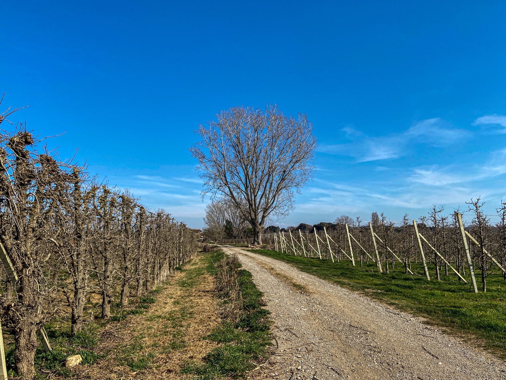

# Canopy management

Canopy management is the deliberate arrangement or removal of a grapevine's
shoots and leaves during the growing season. Shoot thinning, shoot positioning,
leaf removal, hedging, and control of lateral shoots all change the small-scale
environment around leaves and bunches. They can also change how much leaf area
supports the crop. The aim is not simply to expose grapes to as much sun as
possible, but to create a canopy suited to the vine, site, season, and intended
harvest.

This distinction matters because the same opening in a canopy changes several
things at once. It admits light, may expose berries to direct solar heating,
allows wind and spray material to enter more readily, and can shorten the time
that leaves and bunches remain wet. In a cool, humid vineyard those changes may
help fruit ripen and limit disease. In a hot, dry vineyard, retaining shade may
instead protect berries from overheating, sunburn, and dehydration.

## The canopy as a microclimate

Leaves intercept light for photosynthesis, but leaves layered on top of one
another do not contribute equally. A dense canopy shades its interior leaves,
fruit, and the buds that may bear the following year's crop. Crowded shoots also
restrict air movement and spray penetration. Moisture can therefore persist
longer around compact bunches, favouring diseases such as grey rot when the
pathogen, variety, and weather are otherwise conducive. An open canopy does not
prevent infection, but it can make the environment less favourable and improve
the coverage of protective treatments.

Light and heat must not be treated as the same effect. A sunlit berry can become
substantially warmer than the surrounding air, with the difference shaped by
wind, time of day, row direction, and which side of the canopy it occupies. In a
two-season Washington experiment, east-exposed Merlot had more skin anthocyanin
than shaded fruit, while the hotter west-exposed fruit had less than the eastern
fruit. Cooling and heating treatments showed that light promoted some
pigments, whereas excessive berry temperature worked against their
accumulation.[^1] The useful conclusion is a compromise: moderate exposure may
produce a different result from either deep shade or prolonged afternoon sun.

Exposure also changes ripening in more than one dimension. Better-lit leaves
can support sugar accumulation, while warmer berries generally lose malic acid
more quickly. Light and temperature affect pigments, aroma precursors, and
other metabolites through partly separate pathways, so sugar concentration
alone cannot describe the response. Variety matters: red and pale-skinned
grapes do not share the same pigment chemistry, and compounds important to
[Sauvignon Blanc](../grapes/sauvignon-blanc.md) or
[Riesling](../grapes/riesling.md) may respond differently from those in a dark
grape.

## The main interventions

**Shoot thinning** removes surplus shoots early, usually while they are still
easy to detach. It can reduce crowding and separate bunches, but removing
fruitful shoots can also reduce the crop. The remaining shoots may grow more
strongly, so thinning is not merely subtraction. **Shoot positioning** instead
directs growth into the space provided by the training system. In vertical
shoot positioning, catch wires hold shoots upright in a narrow wall; other
systems may direct them downward or divide vigorous growth into separate
curtains. Good positioning spreads leaves and bunches rather than allowing
shoots to cross and form dense pockets.

**Fruit-zone leaf removal** opens the area immediately around the bunches. Its
effect depends especially on timing and degree. Removal after fruit set can
improve light, drying, and spray access without necessarily taking away a large
share of the vine's total leaf area. Removing leaves around bloom is a different
intervention: those leaves are then important sources of carbohydrates for
flowers. A meta-analysis of 59 publications found that pre-bloom removal
reduced fruit set, yield, bunch compactness, and bunch rot on average, while
responses still varied with cultivar, rootstock, and treatment.[^2] Looser
bunches may be the intended result for a rot-prone variety, but the same yield
loss could be undesirable in a low-cropping vineyard.

Late removal can expose berries that developed in shade to abrupt heat. This is
especially risky on the side receiving intense afternoon sun. University of
California guidance therefore couples leaf removal for grey-rot control with a
warning against excessive or late removal in warm districts.[^3] Growers may
open only the cooler or morning-sun side of a row, remove leaves selectively, or
retain more cover during a hot season. Earlier exposure can allow berries to
acclimate, but it does not make them immune to an extreme heat event.

**Hedging**, also called shoot trimming, cuts growth that extends beyond the
planned canopy. It keeps shoots out of alleys, limits renewed shading, and makes
spraying and other work practical. A moderate cut may have little effect on
ripening when ample functional leaf area remains. An early cut can, however,
stimulate lateral shoots and rebuild a denser canopy; a severe or late cut may
remove enough active leaf area to slow sugar accumulation. Laterals can either
crowd the fruit zone or supply useful young leaves, so automatically stripping
all of them is no more universal a rule than automatically hedging.

## Matching practice to conditions

Canopy decisions begin before summer work. Row direction, vine spacing,
training system, pruning, rootstock, water, and nitrogen supply influence how
much growth must later be arranged or removed. A vigorous vine forced into a
narrow canopy may require repeated passes yet quickly refill its shaded
interior. Dividing the canopy or moderating vigour may address the cause more
effectively, while a weak or drought-stressed vine may need its limited leaf
area and protective shade.

Climate supplies the broad constraint, but the current season supplies the
immediate one. A wet flowering period, a disease-susceptible compact bunch, and
a cool site strengthen the case for early opening. Drought, a heatwave, exposed
western fruit, or a variety prone to sunburn strengthen the case for cover.
Crop size and harvest goal matter as well: taking away shoots, leaves, or
clusters changes the balance between photosynthetic source and fruit demand,
not only the bunch microclimate. Effective canopy management is therefore an
iterative adjustment, not a fixed recipe for a region or grape.

[^1]: S. E. Spayd et al., “Separation of Sunlight and Temperature Effects on
    the Composition of *Vitis vinifera* cv. Merlot Berries,” *American Journal
    of Enology and Viticulture* 53 (2002), pp. 171–182,
    <https://doi.org/10.5344/ajev.2002.53.3.171>.
[^2]: Joshua VanderWeide et al., “Impacts of Pre-bloom Leaf Removal on Wine
    Grape Production and Quality Parameters: A Systematic Review and
    Meta-Analysis,” *Frontiers in Plant Science* 11 (2021), article 621585,
    <https://doi.org/10.3389/fpls.2020.621585>.
[^3]: University of California Statewide Integrated Pest Management Program,
    *UC IPM Pest Management Guidelines: Grape*, “Botrytis Bunch Rot,” updated
    August 2023, pp. 99–101.

## Related topics

- [Sauvignon Blanc](../grapes/sauvignon-blanc.md)
- [Riesling](../grapes/riesling.md)
- [Botrytized sweet wine](../styles/botrytized-sweet-wine.md)

## Sources

- Stefano Poni, Tommaso Frioni & Matteo Gatti, [“Summer pruning in
  Mediterranean vineyards: is climate change affecting its perception,
  modalities, and effects?”](https://doi.org/10.3389/fpls.2023.1227628),
  *Frontiers in Plant Science* 14 (2023), article 1227628.
- Peter R. Dry, [“Canopy management for
  fruitfulness”](https://doi.org/10.1111/j.1755-0238.2000.tb00168.x),
  *Australian Journal of Grape and Wine Research* 6 (2000), pp. 109–115.
- S. E. Spayd, J. M. Tarara, D. L. Mee & J. C. Ferguson, [“Separation of
  Sunlight and Temperature Effects on the Composition of *Vitis vinifera* cv.
  Merlot Berries”](https://doi.org/10.5344/ajev.2002.53.3.171), *American
  Journal of Enology and Viticulture* 53 (2002), pp. 171–182.
- Joshua VanderWeide et al., [“Impacts of Pre-bloom Leaf Removal on Wine Grape
  Production and Quality Parameters: A Systematic Review and
  Meta-Analysis”](https://doi.org/10.3389/fpls.2020.621585), *Frontiers in
  Plant Science* 11 (2021), article 621585.
- University of California Statewide Integrated Pest Management Program,
  [*UC IPM Pest Management Guidelines:
  Grape*](https://ipm.ucanr.edu/legacy_assets/pdf/pmg/pmggrape.pdf), “Botrytis
  Bunch Rot,” updated August 2023, pp. 99–101, accessed 1 September 2026.
- William Nail, [“Mature Vine
  Training”](https://grapes.extension.org/mature-vine-training/), eViticulture,
  reviewed by Bruce Bordelon and Patty Skinkis, 2019, accessed 1 September
  2026.
