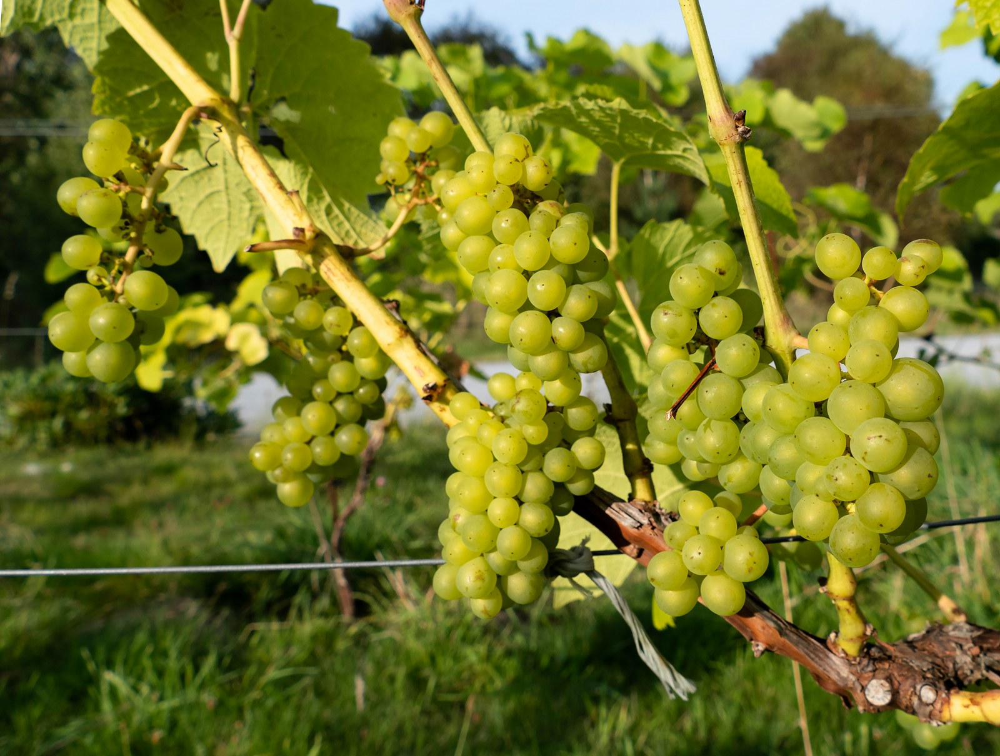

# Hybrid grapes

In winegrowing, *hybrid grapes* usually means varieties whose ancestry combines
more than one grape species. Breeders use these combinations to bring useful
traits from wild vines into grapes suited to wine production. Those traits
can include [winter hardiness](winter-hardiness.md), resistance to diseases,
and adaptation to growing seasons that challenge familiar *Vitis vinifera*
varieties.

## Different problems, different breeding goals

Minnesota's breeding work illustrates the importance of cold survival. Grapes
such as [Frontenac](../grapes/frontenac.md),
[Marquette](../grapes/marquette.md), and
[La Crescent](../grapes/la-crescent.md) combine ancestry from several species.
They allow growers to maintain vineyards in winters that would seriously
injure many conventional wine grapes. Their fruit, growth habits, and disease
susceptibility nevertheless differ substantially.

European breeding has placed particular emphasis on resistance to
[powdery mildew](powdery-mildew.md) and
[downy mildew](downy-mildew.md). Varieties including
[Regent](../grapes/regent.md), [Solaris](../grapes/solaris.md), and
[Souvignier Gris](../grapes/souvignier-gris.md) belong to this continuing work.
The term [PIWI](disease-resistance.md) describes this resistance-oriented
category; it does not identify a single family or wine style.

Pierce's disease presents another breeding problem. Florida's
[Blanc du Bois](../grapes/blanc-du-bois.md) and California's
[Camminare Noir](../grapes/camminare-noir.md) offer different histories of
resistance or tolerance to this bacterial disease. Their adaptation cannot
be inferred from the mildew resistance of other hybrids.

## Regional wines and related grapes

Established hybrids also have continuing regional identities.
[Baco Noir](../grapes/baco-noir.md) has a sustained Ontario presence, while
[Maréchal Foch](../grapes/marechal-foch.md) and
[Léon Millot](../grapes/leon-millot.md) remain part of Canadian red
winemaking. The latter pair makes a useful comparison: related grapes can
differ in both ripening time and winter survival.

Among whites, [Cayuga White](../grapes/cayuga-white.md) and
[Chardonel](../grapes/chardonel.md) share Seyval Blanc as a parent but
provide different combinations of ripening and wine style. Cayuga's
sparkling role in New York and Chardonel's dry Missouri wines illustrate
how cellar practices develop those possibilities.
[Vignoles](../grapes/vignoles.md), used for dry through sweet wines,
adds another lesson: bunch structure and rot risk can constrain a
winemaker's harvest choices even when the vine is regionally adapted.

## An individual variety still matters

Hybrid ancestry alone predicts neither a particular flavour nor immunity to
vineyard problems. University of Minnesota guidance stresses continuing
management of fungal diseases in the humid Upper Midwest, despite the cold
adaptation of its recommended grapes. Growers must match the individual
variety's ripening, vine growth, and fruit composition to their site and
intended wine.

Breeding also differs from [grafting](grafting.md). A cross creates new genetic
offspring. Grafting joins a fruiting variety to a separate root system while
retaining each partner's identity. Both approaches can use traits of different
species, but they do so in fundamentally different ways.

## Sources

- Madeline Wimmer, [“Cold-climate
  grapes”](https://extension.umn.edu/agriculture/specialty-crops/commercial-fruit-production/vineyard-production-and-grape-farming/cold-climate-grapes),
  University of Minnesota Extension, reviewed 2026.
- German Wine Institute, [“PIWIs – pilzwiderstandsfähige
  Reben”](https://www.deutscheweine.de/wein-probieren/387/piwi-pilzwiderstandsf%C3%A4hige-reben),
  breeding overview, accessed 22 September 2026.
- Cornell University, [“Cornell Grape Varieties”](https://blogs.cornell.edu/grapes/production/cornell-grape-varieties/),
  Cayuga White and Chardonel parentage, accessed September 2026.
- University of Georgia Extension, [“Blanc du Bois”](https://fieldreport.caes.uga.edu/publications/C1274/blanc-du-bois/),
  disease-specific tolerance, accessed September 2026. The linked grape
  articles document the regional examples and individual breeding histories.
