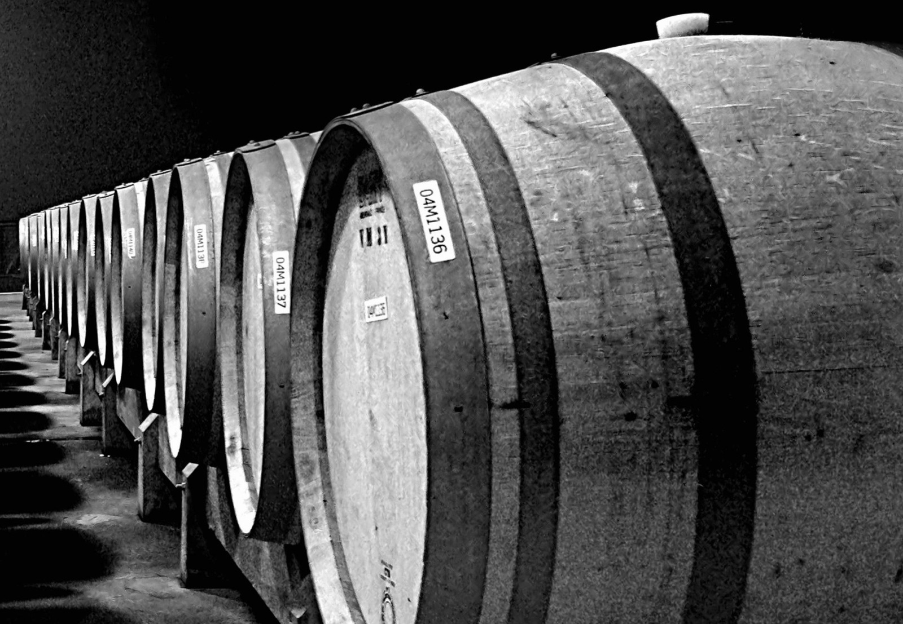

# Oak maturation

Oak maturation means keeping wine in contact with oak after alcoholic
fermentation, often in a barrel or larger cask. Substances move from wood into
wine, small amounts of oxygen enter, and the wine's own pigments, tannins,
aromas, lees, and microbes continue to change.

A wine can ferment in tank and mature in barrel, ferment in barrel and mature
elsewhere, or remain in the same vessel for both stages. Malolactic conversion
and lees contact may overlap with oak maturation, but each has its own causes
and effects.

## Vessel size and oxygen

A smaller barrel has more wood surface for each litre of wine than a larger
cask of similar shape. All else being equal, this increases the opportunity
for wood compounds to be extracted. In a study comparing 225- and 500-litre
barrels, the smaller vessels transferred more oak lactones and vanillin, while
many other measured properties differed little.

Oxygen supply is less predictable than surface area alone. Oxygen can pass
through the wood and through joins, while the bung, stave thickness and
anatomy, degree of wetting, barrel construction, and cellar conditions all
matter. Research on whole barrels shows that wet wood transmits less oxygen
than dry wood and that nominally similar barrels can differ. Topping, stirring,
racking, and the headspace created as wine evaporates add further oxygen
events. A large old cask may consequently contribute little obvious wood aroma
while still acting differently from an airtight steel tank.

Limited oxygen can help reshape red-wine tannins and pigments, sometimes
stabilising colour and changing astringency. These reactions depend on the
wine's starting phenolics, [sulfur dioxide](sulfur-dioxide.md), temperature, and the timing and
amount of exposure. Excessive oxygen can consume protective sulfur dioxide,
diminish fresh aroma, brown a white wine, or support spoilage. Oak maturation
is controlled [oxidation](oxidation.md) only when the vessel and wine are well managed.

## Species, seasoning, and toast

The principal cooperage oaks include European *Quercus petraea* and *Q. robur*
and North American *Q. alba*. Species influence anatomy and the available mix
of ellagitannins, oak lactones, and other extractives. In one controlled
barrel study, for example, wine in new *Q. alba* accumulated substantially
more cis-oak lactone than wine in new *Q. petraea*. Forest, individual tree,
grain, stave selection, seasoning, cooperage, and the wine itself create
variation within each origin.

Before a barrel is assembled, cut staves are seasoned to reduce moisture and
make the wood suitable for cooperage. Outdoor seasoning also changes some
extractives. An experiment following oak through 12, 18, and 24 months found
changes in the wood's composition and in wine exposed to it, but its panel
could not reliably distinguish every seasoning interval. Seasoning effects
depend on wood selection, yard climate, and handling as well as time.

Heat first helps bend the staves and then toasts the barrel's inner surface.
It breaks down wood polymers and changes the balance of extractable compounds:
some ellagitannins decline, while lignin and carbohydrate degradation can form
vanillin, furans, and volatile phenols. The response is not linear. A compound
may reach a maximum and then fall as heating continues, and the temperature
varies with depth in the stave.

## Barrel age and time

A new barrel contains a large, readily accessible pool of wood compounds.
Extraction is often quickest early in the first fill, then slows as the
concentration gradient falls and the surface layers become depleted. Reuse
usually reduces the transfer of aroma-active compounds, especially those
concentrated near the toasted surface. Deposits and previous wine also modify
the wood. An older barrel described as “neutral” contributes little
perceptible new-oak aroma. It can still admit oxygen, hold lees, permit
evaporation, and provide a microbial habitat.

Some volatile compounds accumulate rapidly, are transformed by yeast or
bacteria, adsorb to lees, or later decline. Slower changes in red-wine pigment
and [tannin](tannin.md) can continue after the most conspicuous wood extraction has eased.
Wine composition also affects what dissolves and how it is perceived.

## Fermentation in wood

During [alcoholic fermentation](alcoholic-fermentation.md), active yeast, carbon dioxide, heat, and often
lees change the environment in which wood compounds are extracted and
transformed. Yeast can convert vanillin to much less aromatic vanillic alcohol,
for example, so fermenting in a new barrel need not produce the same wood
impression as transferring finished wine into it. Barrel-fermented white wine
also commonly remains on its fermentation lees, making [lees
aging](lees-aging.md) part of the result unless the wine is promptly racked.

[Malolactic fermentation](malolactic-fermentation.md) can occur in barrel too.
[Chardonnay](../grapes/chardonnay.md) can combine wood, lees, and malolactic
effects in different proportions according to the producer’s choices.

## Related topics

- [Rioja](../regions/rioja.md)

## Sources

- International Organisation of Vine and Wine, [“Ageing in small capacity
  wooden containers”](https://www.oiv.int/standards/international-code-of-oenological-practices/part-ii-oenological-treatments-and-practices/wines/ageing-in-small-capacity-wooden-containers),
  *International Code of Oenological Practices*, II.3.5.12.1, accessed 1
  September 2026.
- María del Alamo-Sanza & Ignacio Nevares, [“Oak wine barrel as an active
  vessel: A critical review of past and current
  knowledge”](https://doi.org/10.1080/10408398.2017.1330250), *Critical Reviews
  in Food Science and Nutrition* 58 (2018), pp. 2711–2726.
- Alexandra Le Floch, Michael Jourdes, Nicolas Mourey, Pierre-Louis Teissedre &
  Thomas Giordanengo, [“Oak wood seasoning: impact on oak wood chemical
  composition and sensory quality of
  wine”](https://ives-openscience.eu/43795/), *IVES Conference Series*,
  Macrowine 2016.
- Encarna Gómez-Plaza, Luis J. Pérez-Prieto, José I. Fernández-Fernández & José
  M. López-Roca, [“The effect of successive uses of oak barrels on the
  extraction of oak-related volatile compounds from
  wine”](https://doi.org/10.1111/j.1365-2621.2004.00890.x), *International
  Journal of Food Science and Technology* 39 (2004), pp. 1069–1078.
- María Reyes González-Centeno, Cécile Thibon, Pierre-Louis Teissedre &
  Kleopatra Chira, [“Does barrel size influence white wine aging
  quality?”](https://doi.org/10.20870/IVES-TR.2020.3305), *IVES Technical
  Reviews* (2020).
- Peter Godden, [“Understanding the effects of lees contact in white
  wine”](https://www.awri.com.au/wp-content/uploads/2020/12/249-December-2020-Technical-Review-Godden.pdf),
  *Australian Wine Research Institute Technical Review* 249 (2020), pp. 4–8.
