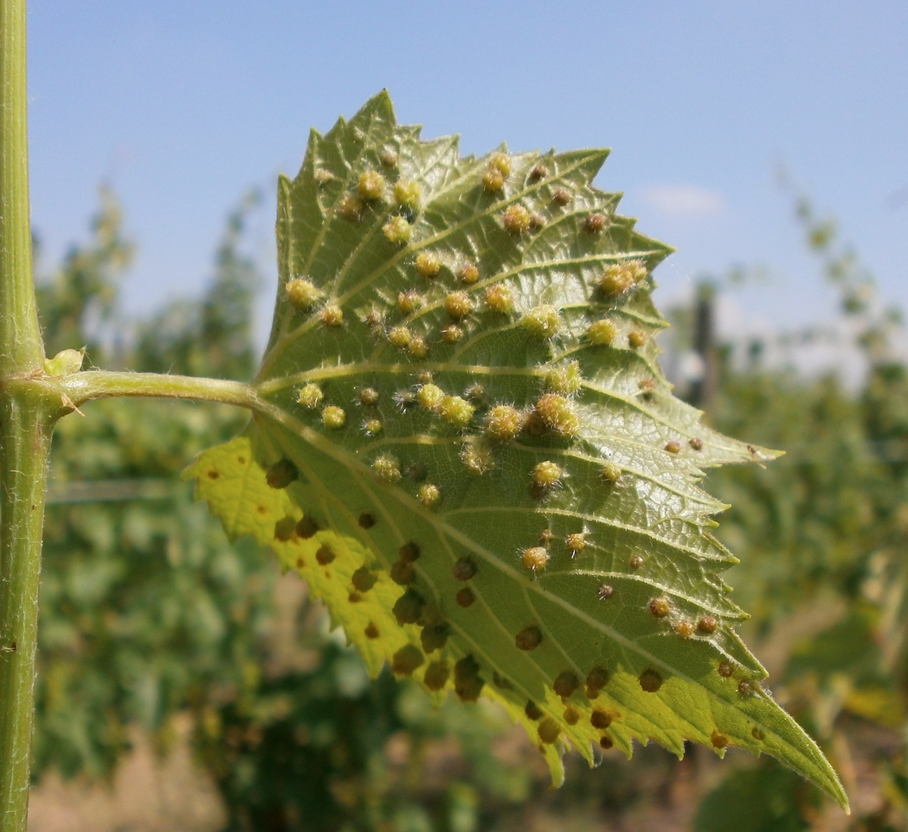

# Phylloxera

Phylloxera, *Daktulosphaira vitifoliae*, is a small, aphid-like insect that feeds
on grapevines. Root-feeding forms can severely damage susceptible vines,
particularly *Vitis vinifera*. The pest's spread during the nineteenth century
helped transform vineyard planting around the world and remains a reason for
[grafting](grafting.md) wine grapes onto resistant rootstocks.

## How roots are damaged

Feeding produces swellings and injured tissue on roots. Secondary infections
can enlarge the damage, killing sections of the root system. The resulting
vine grows less strongly, produces less fruit, and may eventually die.
Severity depends partly on the vine and soil environment.

The insect can move with planting material and contaminated equipment or
footwear, as well as by local dispersal. Preventing movement between vineyards
therefore addresses a different problem from keeping an already infested vine
productive. Leaf-feeding forms also produce visible galls; their prominence
varies geographically and does not directly measure root damage.

## Resistant roots and continued vigilance

Rootstocks derived from resistant grape species allow growers to retain the
fruit of the desired wine variety while changing the vulnerable root system.
Protection depends on the particular combination of rootstock and pest.
University of California guidance cites the failure of AXR#1 under pressure
from a virulent phylloxera population as an important example.[^1]

Vinehealth Australia's historical timeline records outbreaks spreading across
Europe and other wine countries from the nineteenth century onwards. It also
shows the development of quarantine and planting-material controls, including
South Australian restrictions beginning in the 1870s. This history helps
explain why vineyards in different countries adopted different mixtures of
resistant rootstocks and measures to keep the pest out.

A surviving ungrafted vineyard may reflect a favourable soil environment or
absence of the pest. Its existence alone does not establish that the planted
variety has resistant roots.

[^1]: University of California Statewide Integrated Pest Management Program,
    “Grape Phylloxera,” cultural-control section.

## Sources

- University of California Statewide Integrated Pest Management Program,
  [“Grape Phylloxera”](https://ipm.ucanr.edu/agriculture/grape/grape-phylloxera/).
- Vinehealth Australia, [“125th Anniversary
  Gallery”](https://vinehealth.com.au/news/125th-gallery/), historical timeline.
- Jon Traunfeld, [“Growing Grapes in a Home
  Garden”](https://www.extension.umd.edu/resource/growing-grapes-home-garden),
  University of Maryland Extension, phylloxera section, updated 2024.
