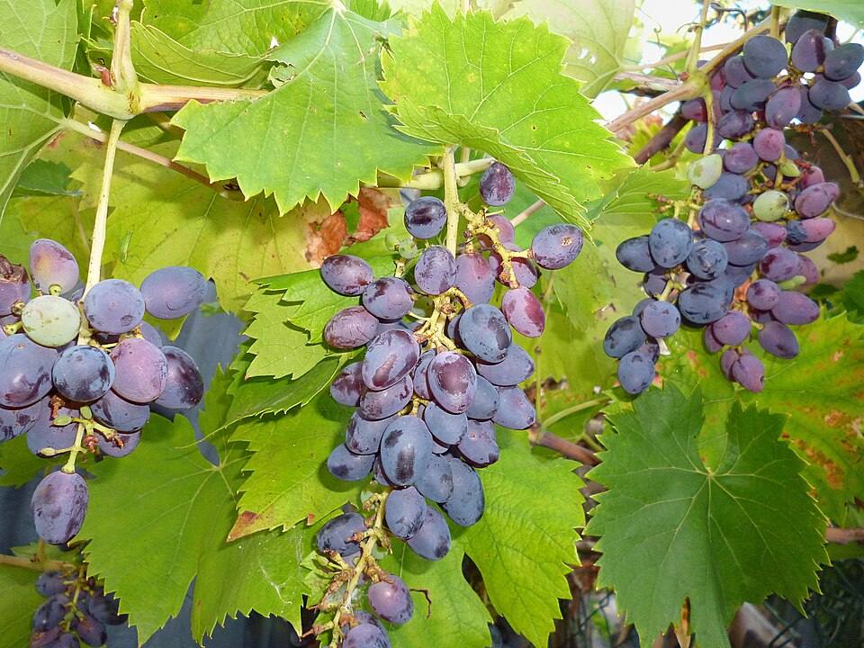

# Véraison

Véraison marks the onset of grape ripening. Berries soften, sugar accumulation
accelerates, and their appearance changes. Dark-skinned varieties begin to
colour as anthocyanin pigments accumulate; white varieties become more
translucent. This is a transition in the berry's development, preceding the
further changes that lead to harvest.

## Several changes happen together

Young berries accumulate organic acids during their earlier growth. As
ripening proceeds, the balance shifts towards increasing sugar concentration
and declining [acidity](acidity.md). Malic acid generally declines more rapidly
than tartaric acid. The skin, pulp, and seeds also change in different ways,
affecting the materials later extracted during
[maceration](maceration.md).

Colour is the most conspicuous sign in a dark-skinned grape, but it is only
one part of the process. Aroma compounds and their precursors also develop,
and the composition most suitable for harvest depends on the intended wine.
The onset of colour therefore does not establish that the fruit is ready to
pick.

## Following ripening towards harvest

Healthy leaves and adequate water remain important after véraison. Severe
water stress can reduce photosynthesis and slow the vine's ability to ripen
its crop. A small berry is consequently not, by itself, evidence of a favourable
balance between growth and fruit production.

Sugar measurements also require interpretation. Water loss can raise the
concentration of soluble solids, commonly measured in degrees Brix, without a
corresponding increase in the amount of sugar within each berry. Joseph
Fiola's Maryland extension account highlights this problem under drought
stress. Following berry condition, acid balance, and flavour alongside sugar
helps distinguish ongoing ripening from concentration caused by dehydration.

Véraison supplies a useful seasonal reference for these observations. The
interval that follows is shaped by variety, weather, vine condition, and the
winemaker's harvest objective.

## Sources

- Anita Oberholster, [*Assessments of
  Ripeness*](https://ucanr.edu/sites/default/files/2020-09/335185.pdf),
  University of California, 27 February 2015.
- Joseph Fiola, [“Drought Stress, Vine Performance, and Grape
  Quality”](https://www.extension.umd.edu/resource/drought-stress-vine-performance-and-grape-quality),
  University of Maryland Extension, updated 2021.
