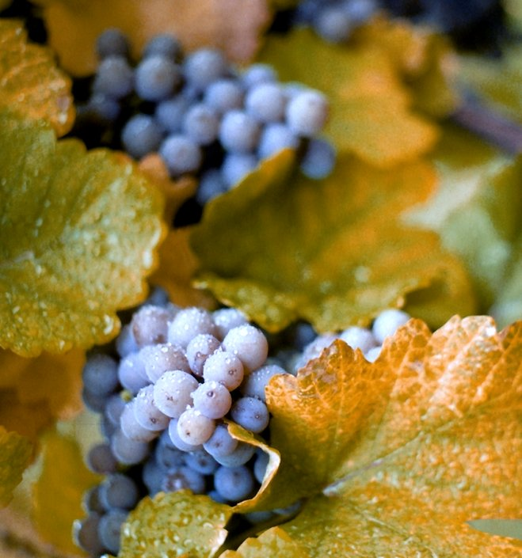

# Concord

Concord is a blue-skinned American grape used for juice, jelly, and wine.
Its conspicuous grapey character makes it familiar well beyond the wine
world. In regional American wine, it often supports a fruit-forward style
that draws on those familiar flavours.

## A cultivated American grape

The Concord Free Public Library's archival account credits Ephraim Wales
Bull with developing the variety at Grapevine Cottage in Concord,
Massachusetts, and records its commercial introduction in 1854.[^1]
Missouri's wine organization describes its large berries and readily
separating skin, the feature called *slip skin*.

The University of Missouri identifies uneven ripening during very hot
weather and susceptibility to [black rot](../concepts/black-rot.md) and phomopsis. Its agricultural
adaptability therefore has limits. A healthy, evenly ripe crop still
requires a site and management suited to the vine.

## Juice and wine regions

The Lake Erie research programme at Penn State maintains Concord alongside
[Niagara](niagara.md) and wine varieties. That continuing research setting helps explain
its place within a regional grape economy that includes more than wine.
Missouri also maintains Concord within its contemporary varietal range.

[Alcoholic fermentation](../concepts/alcoholic-fermentation.md) changes the
fruit's sugar into alcohol; it does not require the finished wine to retain
all the sweetness associated with grape juice. The amount of
[residual sugar](../concepts/residual-sugar.md) is consequently an important
part of reading a Concord bottling.

[^1]: Concord Free Public Library, “Grapevine Cottage Scrapbook, 1880–1958,”
    collection history.

## Sources

- Concord Free Public Library, [“Grapevine Cottage Scrapbook, 1880–1958”](https://concordlibrary.org/special-collections/fin_aids/gvc),
  archival finding aid, 2012.
- Missouri Wine and Grape Board, [“Concord”](https://missouriwine.org/education/learn-the-basics/varietals/concord),
  cultivar account, accessed 22 September 2026.
- University of Missouri Extension, [*Home Fruit Production: Grape Culture*](https://extension.missouri.edu/publications/g6085),
  Concord entry, reviewed March 2026.
- Penn State, [“Grape and Non-grape Crops”](https://agsci.psu.edu/research/centers-facilities/extension/erie/grape-non-grape-crops),
  Lake Erie Regional Grape Research and Extension Center, accessed
  22 September 2026.
