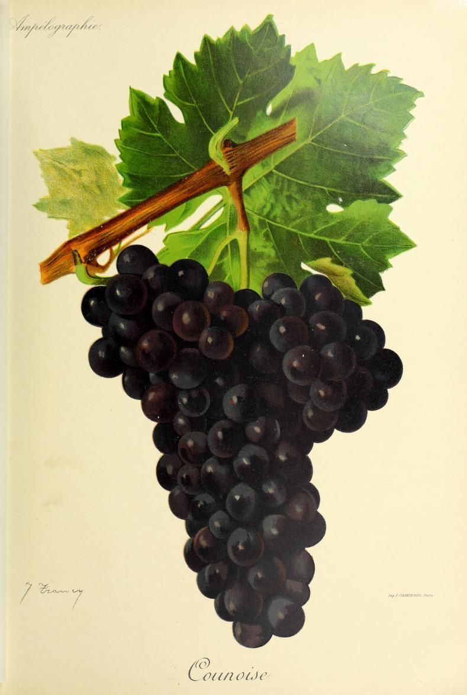

# Counoise

Counoise is a dark-skinned *Vitis vinifera* variety from southern France. It
is a minor grape in the southern Rhône, but its modest color, moderate tannin,
acidity, fruit, and spice give it a distinctive blending role. A small
proportion can make a blend feel more open and lively beside denser varieties
such as [Grenache](grenache.md), [Syrah](syrah.md), and
[Mourvèdre](mourvedre.md).

## History and identity

Plantgrape, France's national vine-variety catalogue, places Counoise's likely
origin in the Vaucluse, while the regional Rhône authority identifies it with
the Rhône Valley. The name Moustardier survives in accounts of older vineyards
in Gigondas and Tavel, but Plantgrape lists no official synonym in France or
elsewhere in the European Union.[^1]

The variety has a long association with Châteauneuf-du-Pape. An account
preserved by Tablas Creek says that a papal officer brought it from Spain to
Pope Urban V when the papacy was based in Avignon in the fourteenth century.
That story is legendary rather than a documented origin. Tablas Creek also
places Counoise in the old vineyards that helped shape the appellation.[^2]

Counoise has nevertheless become scarce in France. Plantgrape records French
plantings falling from 885 hectares in 1988 to 312 hectares in 2018. Inter Rhône
describes it as very little cultivated. Counoise remains a small component of
the region's vineyards.[^1][^3]

## Viticulture

Counoise is vigorous, semi-erect, and productive, with medium bunches and large
berries. It suits short pruning and can be trained as a gobelet, or bush vine.
Plantgrape especially associates it with warm, stony hillsides. Its production
can fluctuate, and Inter Rhône says that full coloring can be difficult to
obtain even when the berries are ripe. That trait helps explain why a healthy,
mature crop may still produce a relatively pale wine.[^3]

Its season is long enough to shape where it works. Plantgrape places budbreak
11 days after Chasselas and maturity three and a half to four weeks after it;
Inter Rhône summarizes the maturity as mid- to late-ripening. Warm, exposed
sites can give the fruit time to finish, while a cool or wet autumn raises the
cost of waiting. Grey rot is a particular concern, even though the variety is
not very sensitive to downy mildew.[^1]

Tablas Creek reports the Perrins' interpretation that Counoise's later ripening
produces wines with intense spice, bright acidity, and modest alcohol. In a
warm southern Rhône blend, that balance can add lift without adding the density
associated with Grenache or the deeper color and structure supplied by Syrah
and Mourvèdre. The effect depends on site, crop, harvest date, and the
proportions used.[^2]

## Wine character and blending

Counoise makes fruity, lightly colored wines with floral and spicy notes. Its
color potential is limited: large berries and incomplete skin pigmentation
mean that it is a poor candidate for deepening a blend's hue. Sources also
describe its tannins as moderate or soft, so the grape usually contributes a
gentler texture than a strongly structured red variety. Extraction, maturity,
and yield can still make a Counoise wine feel more or less substantial.

In the southern Rhône, the grape is most useful as a counterweight. Grenache
can bring ripe fruit and alcohol, Mourvèdre firmer structure, and Syrah darker
color and its own aromatic profile. Counoise adds acidity, fruit, and spice at
a scale that may be more perceptible in the blend's balance than as a distinct
varietal flavor. The adopted Vinsobres specification lists Counoise N as an
accessory grape for red wines.[^4]

It is also suitable for rosé. Limited skin contact makes its pale color an
advantage, while its fruit and acidity can keep the wine from feeling flat. A
varietal red is possible, but the grape's regional identity remains tied to
assemblage: it is a small ingredient whose purpose is often clearest in
relation to the larger blend.

## In the cellar

The first cellar decision is proportion. A little Counoise can adjust a blend's
freshness, fruit, and texture; a larger share makes its light body, pale color,
and spice more obvious.

Skin contact must be judged with the raw material in mind. Longer extraction
can add phenolic weight. Rosé production uses the opposite logic, limiting
contact to preserve its lighter structure. Tablas Creek, which has worked with
the grape in California since importing cuttings from Château de Beaucastel in
1990, reports that its Counoise is prone to oxidation and uses closed
fermenters and foudre aging.[^2]

## California's small revival

California's renewed interest began with Rhône-variety plantings and the work
of Tablas Creek in Paso Robles. Its imported material spent three years in USDA
inspection before multiplication and planting. UC Davis Foundation Plant
Services now lists both the public Counoise 01 selection, taken from a former
UC Davis vineyard, and the French ENTAV-INRA 508 selection. The availability of
clean, identified planting material gives growers a practical route to a grape
that was once difficult to source.[^5]

The revival is real but narrow. The UC Davis *Grapes of Southern France*
report recorded about 60 acres in California in 2019, while Tablas Creek's
current account gives 58 acres in 2025 and says the plantings derive from its
stock. Those figures are approximate and come from different reporting
contexts, so they should not be treated as a continuous official acreage
series. Its late harvest, bright acidity, moderate alcohol, and softer tannin
make sense in warm sites where producers want aromatic complexity in Rhône
blends.[^2][^5]

## Related topics

- [Cinsault](cinsault.md)

[^1]: Institut français de la vigne et du vin, INRAE & Institut Agro Montpellier,
    [“Counoise N”](https://www.plantgrape.fr/en/varieties/fruit-varieties/80/export),
    Plantgrape varietal record, edited 9 June 2026.
[^2]: Tablas Creek Vineyard, [“Counoise”](https://tablascreek.com/story/vineyard_and_winemaking/grapes/counoise),
    accessed 7 September 2026.
[^3]: Inter Rhône, [“Counoise”](https://www.vins-rhone.com/en/counoise-grape-variety),
    accessed 7 September 2026.
[^4]: Ministère de l'Agriculture et de la Souveraineté alimentaire, [“Cahier des
    charges de l'appellation d'origine contrôlée ‘Vinsobres’”](https://info.agriculture.gouv.fr/boagri/document_administratif-a7519cfc-10aa-429d-b9d8-f3c3e0179aa3/telechargement),
    adopted by arrêté of 8 June 2026 and published 18 June 2026, pp. 1–2.
[^5]: Nancy L. Sweet, *Grapes of Southern France*, University of California,
    Davis Foundation Plant Services, revised 23 February 2021,
    [PDF](https://fps.ucdavis.edu/grapebook/Rhone.pdf); Foundation Plant Services,
    [“Grape Variety: Counoise”](https://fps.ucdavis.edu/fgrdetails.cfm?varietyid=2298),
    accessed 7 September 2026.

## Sources

- Institut français de la vigne et du vin, INRAE & Institut Agro Montpellier,
  [“Counoise N”](https://www.plantgrape.fr/en/varieties/fruit-varieties/80/export),
  Plantgrape varietal record, edited 9 June 2026, accessed 7 September 2026.
- Inter Rhône, [“Counoise”](https://www.vins-rhone.com/en/counoise-grape-variety),
  accessed 7 September 2026.
- Nancy L. Sweet, [*Grapes of Southern France*](https://fps.ucdavis.edu/grapebook/Rhone.pdf),
  University of California, Davis Foundation Plant Services, revised 23
  February 2021.
- Foundation Plant Services, [“Grape Variety: Counoise”](https://fps.ucdavis.edu/fgrdetails.cfm?varietyid=2298),
  University of California, Davis, accessed 7 September 2026.
- Tablas Creek Vineyard, [“Counoise”](https://tablascreek.com/story/vineyard_and_winemaking/grapes/counoise),
  accessed 7 September 2026.
- Ministère de l'Agriculture et de la Souveraineté alimentaire, [“Cahier des
  charges de l'appellation d'origine contrôlée ‘Vinsobres’”](https://info.agriculture.gouv.fr/boagri/document_administratif-a7519cfc-10aa-429d-b9d8-f3c3e0179aa3/telechargement),
  adopted by arrêté of 8 June 2026 and published 18 June 2026.
