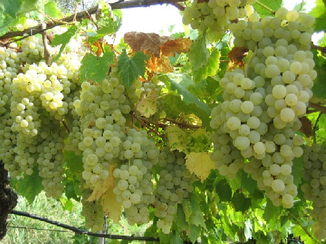

# Durella

Durella is a white grape of the hills between Vicenza and Verona in the
Veneto. Its marked [acidity](../concepts/acidity.md) makes sparkling wine a
particularly important contemporary expression. The Lessini hills provide
its main regional reference point.

## Why sparkling wine matters

Vivai Cooperativi Rauscedo describes a vigorous vine with relatively late
budburst, thick-skinned berries, and a preference for long pruning. Its wine
can retain substantial acidity at modest alcohol. Those characteristics are
useful when a producer needs a fresh base wine for a second fermentation.

Durella's role differs from that of nearby [Garganega](garganega.md), the
principal grape of [Soave](../regions/soave.md): the clearest introduction to
Durella is often a sparkling bottle, where acidity remains central through
fermentation and maturation.

Fongaro's Cuvée provides a concrete example of the [traditional-method](../styles/traditional-method-sparkling-wine.md)
approach. The producer's technical sheet describes Durella blended with a
smaller share of Incrocio Manzoni, followed by at least four years on the
yeasts in bottle. That example illustrates how [lees aging](../concepts/lees-aging.md)
can add texture and bread-like complexity around the grape's fresh core.
The blend and maturation period describe this bottling, rather than a fixed
recipe for all Durella wines.

For readers comparing bottles, the useful questions are how the bubbles
were made, how long the wine matured on its lees, and how much sweetness
remains. Those choices substantially affect how firmly the acidity presents
itself.

## Sources

- Vivai Cooperativi Rauscedo, [“Durella.”](https://www.vivairauscedo.com/en/product-sheet/durella/)
- Fongaro, [“Cuvée: Vino Spumante di Qualità – Metodo Tradizionale Classico,”
  technical
  sheet.](https://www.fongarospumanti.it/wp-content/uploads/2020/07/cuvee_etichettabianca.pdf)
