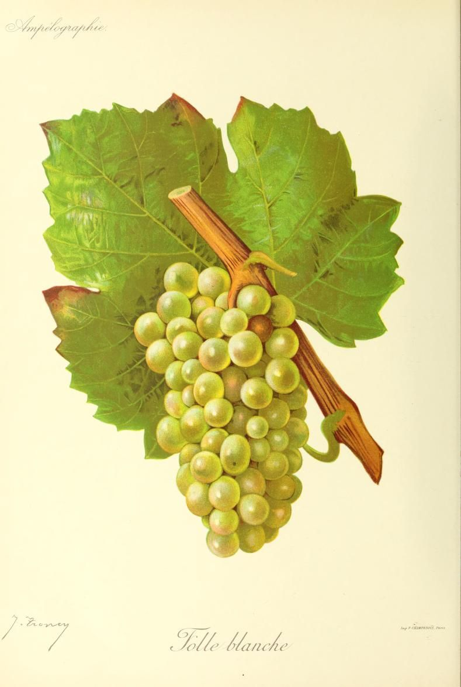

# Folle Blanche

Folle Blanche is a white grape of western France with two enduring roles:
producing sharply fresh dry wine near Nantes and supplying wine for
distillation in Cognac and Armagnac. Its ability to produce relatively low
alcohol with marked [acidity](../concepts/acidity.md) is useful in both
settings. Its susceptibility to rot helps explain why a once-dominant
distilling grape became a much smaller part of those vineyards.

## History and names

Plantgrape places Folle Blanche's likely origin in the Charentes. Near Nantes
it is known as Gros Plant, the name carried by the wine Gros Plant du Pays
nantais. The INAO connects its expansion there with Dutch demand for
distilling wine between the sixteenth and eighteenth centuries. The same
grape later found a durable role in dry table wine.

In Cognac, Folle Blanche was the leading variety before phylloxera. The
Cognac interprofessional body describes increased disease susceptibility
after grafting as a reason for its replacement by
[Ugni Blanc](ugni-blanc.md).[^1] Armagnac's interprofessional body records a
similar decline from a historically dominant position and notes the
difficulty of cultivating grafted Folle Blanche. Its survival is therefore
best understood through the distinctive wine and spirit it can produce,
rather than through acreage or ease of cultivation.

## Viticulture

Folle Blanche is fertile and productive, with an upright habit suited to
short pruning. Early budbreak exposes new growth to spring frost. Its very
compact bunches are especially vulnerable to grey rot, making fruit health
a central concern near the Atlantic and whenever rain coincides with
ripening.

That risk matters particularly for distillation. A wine destined for the
still must start with healthy fruit; high acidity cannot compensate for
damaged or rotten grapes. Plantgrape also identifies susceptibility to
black rot and to downy mildew on bunches. Moving to a warmer site is not a
simple solution, because acidity can fall substantially when the grape
reaches full maturity in southern conditions.

## Still wine and eaux-de-vie

Gros Plant du Pays nantais is a pale, dry white in which acidity is often the
most immediate structural feature. Some examples receive
[lees ageing](../concepts/lees-aging.md), which can modify texture without
turning the wine sweet. The vineyards overlap broadly with those of
[Muscadet](../regions/muscadet.md), but the grapes and appellations are
different: Muscadet is associated with
[Melon de Bourgogne](melon-de-bourgogne.md).

For distilling wine, modest alcohol and retained acidity serve a different
purpose from the balance sought in a finished table wine. The Armagnac
interprofessional body values Folle Blanche for floral eaux-de-vie and
highlights its use in young spirits and unaged Blanche Armagnac. Such aromas
describe the distilled product, whose character also depends on the still,
distillation decisions, and any subsequent wood maturation.

Folle Blanche thus provides a useful comparison with both Melon and Ugni
Blanc. Alongside Melon, it shows how neighbouring Atlantic vineyards can
produce distinct dry whites. Alongside Ugni Blanc, it shows how disease
pressure and grafting history can reshape a region's choice of raw material.

[^1]: Bureau National Interprofessionnel du Cognac, “Grape varieties,”
    Folle Blanche section; Bureau National Interprofessionnel de l'Armagnac,
    “Grape varieties and terroirs.”

## Related topics

- [Ugni Blanc](ugni-blanc.md)
- [Muscadet](../regions/muscadet.md)
- [Grafting](../concepts/grafting.md)

## Sources

- INRAE, IFV & Institut Agro Montpellier, [“Folle
  blanche”](https://www.plantgrape.fr/fr/varietes/varietes-a-fruits/101/export),
  *Plantgrape*, accessed 14 September 2026.
- Institut national de l'origine et de la qualité, [“Gros Plant du Pays
  nantais”](https://www.inao.gouv.fr/node/37819/printable/print), product,
  geographical, and historical overview, accessed 14 September 2026.
- Bureau National Interprofessionnel du Cognac, [“Grape
  varieties”](https://www.cognac.fr/en/discover/the-cognac-region/cognac-grapes-varieties/),
  accessed 14 September 2026.
- Bureau National Interprofessionnel de l'Armagnac, [“Grape varieties and
  terroirs”](https://armagnac.fr/grape-varieties-and-terroirs), accessed
  14 September 2026.
