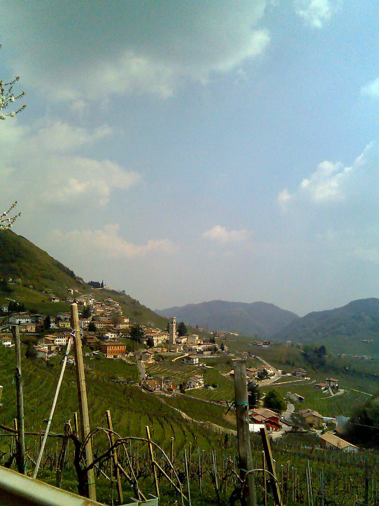

# Glera

Glera is the white grape at the centre of Prosecco, associated especially
with the hills of Conegliano and Valdobbiadene and the wider northeastern
Italian production area. Its relatively delicate fruit and floral aromas,
moderate body, and suitability for sparkling wine help explain its success.
The grape and the geographical wine designation are nevertheless different
things: growing Glera alone does not establish a wine's appellation.

## Names and places

Prosecco was historically used as a grape name; Prosecco Tondo distinguishes
the round-berried variety now called Glera from Glera Lunga, a separate
cultivar. Older use of *Glera* itself could encompass more than one local
variety. A 2009 genetic study documented that complexity in northeastern
Italy, so historical names should be interpreted in context.[^names]

Today, the broad Prosecco DOC production area spans specified provinces of
Veneto and [Friuli Venezia Giulia](../regions/friuli.md). The Conegliano Valdobbiadene hills provide
a more geographically focused context, with the Rive and Cartizze names
directing attention to particular places. Scale and site both matter:
there is no single vineyard landscape behind every bottle called Prosecco.

Under the DOC specification consulted in September 2026, Glera supplies at
least 85% of white Prosecco; other listed varieties may contribute the
balance. Prosecco Rosé combines Glera with red-vinified
[Pinot Noir](pinot-noir.md), rather than requiring a pink form of Glera.[^rules]

## Vineyard behaviour

Vivai Cooperativi Rauscedo describes early budbreak, vigorous growth, and
late ripening. Long shoots and substantial production make
[canopy management](../concepts/canopy-management.md) and
[crop balance](../concepts/crop-load.md) important. Its recommendations
favour long pruning and careful summer work, rather than assuming that a
productive vine needs little attention.

The same profile notes vulnerability to prolonged drought and winter cold.
These limits qualify any simple expectation that warming automatically
improves growing conditions. Managing a long season involves water and
vine health as well as reaching harvest sugar levels.

## How the bubbles change the wine

In the widely used Martinotti or Charmat method, a still base wine undergoes
a second [alcoholic fermentation](../concepts/alcoholic-fermentation.md)
in a closed pressure tank. Retained carbon dioxide supplies the bubbles.
The Conegliano Valdobbiadene consortium explains this method as a way to
preserve the grape's fruit and floral expression. Sweetness remains a
separate choice: [residual sugar](../concepts/residual-sugar.md), acidity,
and pressure jointly shape the impression in the glass.

Bottle refermentation supplies another, still-active tradition. The
consortium's 2026 wine list includes *Sui Lieviti* wines, in which yeast
sediment remains in the bottle, alongside other sparkling styles. Bival's
Costante 08 and Le Manzane's Springo Green appear as examples. This
[lees](../concepts/lees-aging.md) presence gives readers a reason to
distinguish the style from a clear, filtered tank-method wine. It is also
different from automatically assuming the full
[traditional-method](../styles/traditional-method-sparkling-wine.md)
sequence of riddling and disgorgement.

[^names]: M. Crespan et al., “Molecular contribution to the knowledge of two
    ancient varietal populations: 'rabosi' and 'glere',” *Acta Horticulturae*
    827 (2009), abstract.
[^rules]: Consorzio Tutela Prosecco DOC, production specification, article 2,
    accessed September 2026.

## Sources

- M. Crespan et al., [“Molecular contribution to the knowledge of two ancient
  varietal populations: 'rabosi' and 'glere'”](https://www.actahort.org/books/827/827_36.htm),
  *Acta Horticulturae* 827 (2009), pp. 217–220; abstract consulted.
- Vivai Cooperativi Rauscedo,
  [“Glera”](https://www.vivairauscedo.com/en/product-sheet/glera/),
  varietal profile, accessed September 2026.
- Consorzio Tutela Prosecco DOC,
  [production specification](https://www.prosecco.wine/prosecco/disciplinare/),
  accessed September 2026.
- Consorzio Conegliano Valdobbiadene Prosecco Superiore,
  [“Academy”](https://www.prosecco.it/en/academy/), grape and production accounts;
  [*Vinitaly 2026 Wine List*](https://www.prosecco.it/wp-content/uploads/2026/04/Vinitaly-2026-Wine-List-Ultima-Versione.pdf),
  regional categories and Sui Lieviti examples.
