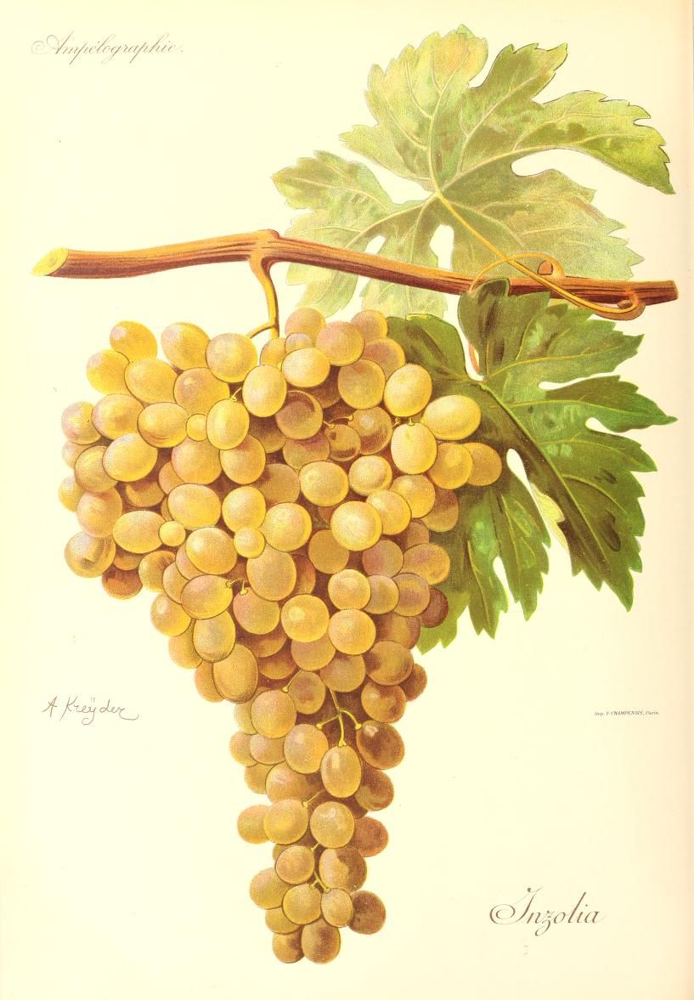

# Inzolia

Inzolia is a white grape of Sicily and coastal Tuscany, where it is usually
called Ansonica. Its Sicilian history includes Marsala and blends with
[Catarratto](catarratto.md) and [Grillo](grillo.md), but dry varietal wines
and Tuscan skin-contact versions are equally useful to understanding it
today. The names identify one grape across different regional traditions.

## Vineyard behaviour

Vivai Cooperativi Rauscedo describes a vigorous vine with large,
relatively loose bunches, substantial golden berries, and thick skins.
Its profile distinguishes reasonable drought tolerance from vulnerability
to extreme summer heat. Those are different stresses: a vine's ability to
cope with limited water does not guarantee that exposed berries or leaves
will tolerate any temperature.

Harvest decisions also help explain the wine's range. Earlier picking and
careful handling can favour a lighter, fresher white; riper fruit and a
different approach to oxygen can lead towards the fuller character long
associated with Marsala. The nursery notes susceptibility to powdery and
downy mildews in conducive seasons, so a warm regional climate does not
remove the need for disease management.

## Sicily: fragrance and freshness

At Sallier de La Tour near Monreale, Tasca d'Almerita emphasizes northern
exposures sheltered from hot scirocco winds. Its 2023 Inzolia was fermented
as a white wine, without malolactic fermentation, and spent four months on
fine lees in steel. This is a useful reference for the fresh dry style:
retaining malic acid and using [lees contact](../concepts/lees-aging.md)
address different aspects of the wine, acidity and texture respectively.

The producer describes orange-blossom and almond associations. These are
helpful pointers to that bottling, not a fixed aromatic test for identifying
all Inzolia. In a blend, the other grapes and their proportions further
change what the drinker perceives.

## Tuscany: Ansonica with its skins

The Grosseto coast provides a second regional context. Vigneti Giole's
Ansonica 1 comes from an old terraced vineyard on Monte Argentario, facing
Giglio. Its published method uses fifteen days of fermentation on skins,
followed by maturation on fine lees in concrete. That is a markedly different
route from pressing before fermentation.

The comparison explains why the grape can appear as either a pale dry white
or a more textured [skin-contact wine](../styles/skin-contact-white-wine.md).
[Pressing](../concepts/pressing.md) determines when juice or wine leaves the
skins; extraction before that separation changes colour and phenolic texture.
The Tuscan name is therefore useful to recognize, but it does not by itself
guarantee skin contact or any single production method.

## Sources

- G. Scalabrelli, C. D'Onofrio, G. Barbagallo & V. Falco,
  [“Ansonica”](https://vitisdb.it/varieties/show/8229), Italian Vitis Database,
  2015.
- Vivai Cooperativi Rauscedo,
  [“Ansonica”](https://www.vivairauscedo.com/en/product-sheet/ansonica/),
  varietal profile, accessed September 2026.
- Tasca d'Almerita, [“Inzolia”](https://tascadalmerita.it/vini/tenuta-sallier-de-la-tour-inzolia/)
  and [2023 technical sheet](https://cdn.tascadalmerita.it/tasca/Tenuta-Sallier-de-La-Tour-Inzolia_2023_ITA.pdf),
  Sallier de La Tour.
- Vigneti Giole, [“Ansonica 1”](https://www.vignetigiole.it/wp-content/uploads/2018/10/scheda-ansonica-1.pdf),
  vineyard and vinification technical sheet.
