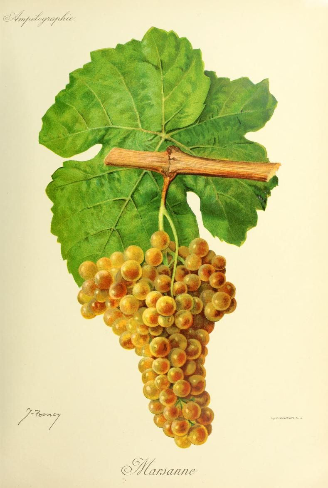

# Marsanne

Marsanne is a white *Vitis vinifera* grape of the northern Rhône. It is valued
for breadth, weight, and a distinctive ability to develop with bottle age, even
though its acidity is usually medium to low rather than sharply refreshing.
That combination makes it useful both as a substantial varietal wine and as
the fuller partner to [Roussanne](roussanne.md) in the region's white-wine
tradition.

## Viticulture

Marsanne is a mid-ripening variety with large clusters and small, golden to
red-tinged berries. It is vigorous, particularly on fertile soils, and performs
well on the warm, rocky sites common in the northern Côtes du Rhône.[^1] Those
traits make the harvest a balance between ripeness and freshness. A warm site
or a late harvest can push the wine toward greater alcohol and
broader texture while leaving less acid to give it lift. Cooler exposure,
water availability, crop level, and the season can shift that balance; the
variety's reputation for softness is a tendency, not a fixed result.

The vine's vigor also matters because the finished wine is not determined by
the grape name alone. Fertile soil can support more vegetative growth and fruit
production, while a poor, stony site may impose a different balance of water
and growth. Canopy, yield, fruit health, and harvest date therefore affect how
much of Marsanne's potential weight becomes useful texture and how much reads
as heaviness. The northern Rhône's rocky slopes provide a regional setting in
which the variety can ripen without losing all structural definition.

## Wine character

Marsanne commonly makes a powerful, medium- to full-bodied white with a broad
palate and a relatively soft acid line. Floral impressions are common in young
wines; the official Rhône description specifically points to a progression
toward hazelnut with ageing and notes that a slight bitterness may appear on
the finish.[^1] These are tendencies rather than a tasting checklist. Picking,
fermentation, lees contact, wood, alcohol, and bottle condition can change the
balance between fruit, texture, freshness, and savoury development.

Its low-to-moderate acidity explains both its appeal and its limits. Acidity is
one source of tension, but body can also come from extract, alcohol, lees, and
the wine's phenolic and colloidal structure. Marsanne can therefore feel
substantial without being aggressively acidic. In a warm vintage or from a
late-picked parcel, that breadth may dominate; in a cooler site or earlier
harvest, the same grape can feel more lifted. This is why “low acid” should not
be read as “short-lived” or “flat” in every bottle.

Age changes the wine rather than merely preserving its youthful aroma. Floral
notes can recede as dried-fruit, nutty, honeyed, or savoury impressions become
more apparent, and the texture may seem more integrated. The direction and
speed of that development depend on vintage, alcohol, acidity, sulfur dioxide,
closure, and storage. The Rhône source describes ageing as especially
important to Marsanne's hazelnut expression, but it does not establish a
universal drinking timetable. A well-made, balanced wine may mature compellingly;
a broad, low-acid wine with poor storage may simply lose freshness.

## Northern Rhône importance

Marsanne's clearest historical and contemporary identity is northern Rhône
white wine. It is central to the white wines of Hermitage, Crozes-Hermitage,
Saint-Joseph, and Saint-Péray. In the Hermitage appellation
rules, white wines are made from Marsanne and Roussanne, and the same two
varieties are permitted for the sweet *vin de paille* style.[^2] Saint-Péray
also uses Marsanne for both still and sparkling white wines.[^1]

This role is not just a matter of regional branding. Marsanne's ripeness and
weight suit the Rhône's sunny, rocky slopes, while its aromatic and structural
development give white wines a style distinct from the region's more perfumed
Viognier. The appellation name still matters: a varietal wine from outside a
Rhône cru may share the grape's broad tendencies without reproducing the same
site, climate, or cellar tradition.

## Marsanne and Roussanne

Marsanne is frequently partnered with Roussanne because the two varieties offer
different kinds of balance. Marsanne contributes power, body, and a hazelnut-leaning
development; Roussanne is described by the Rhône authority as finer, floral,
complex, and capable of long ageing.[^3] A blend can therefore retain
Marsanne's substance while adding aromatic lift and a different structural
shape. The exact result depends on proportion, harvest dates, site,
and whether the grapes are fermented and matured together or separately.

The partnership does not require every bottle to contain both grapes. Hermitage
and other northern Rhône whites may be Marsanne-led or varietal, while the
appellation rules define the permitted grapes rather than a single mandatory
recipe. In practice, a blend can be a way to manage vintage and vineyard
variation, not proof that either grape is incomplete on its own.

## In the cellar

Marsanne's breadth makes oxygen and maturation choices consequential. Fermenting
or ageing in neutral vessels can preserve a clearer view of the fruit and
regional texture; lees contact can add further roundness, while oak can add
aroma and controlled oxygen exposure. New or small barrels can make wood more
obvious, so the choice of vessel should support the wine's balance rather than
assume that more oak will supply freshness. [Oak maturation](../concepts/oak-maturation.md)
and [lees aging](../concepts/lees-aging.md) are separate tools with overlapping
effects, and neither guarantees longevity.

The most important cellar decision is consequently compositional: preserve
enough freshness to carry Marsanne's weight, then let bottle age develop its
nutty and savoury side. Blending with Roussanne, harvesting before full
softness, protecting acidity, or choosing a restrained vessel are different
ways of pursuing that balance.

## Related topics

- [Viognier](viognier.md)

[^1]: Inter Rhône, “Marsanne,” grape-variety profile. The source describes
    Marsanne as mid-ripening, vigorous on fertile soils, suited to warm rocky
    soils, powerful, and medium to low in acidity; it also describes floral
    aromas developing toward hazelnut with ageing.
[^2]: Ministère de l'Agriculture et de la Souveraineté alimentaire, *Cahier des
    charges de l'appellation d'origine contrôlée « Hermitage »*, sections
    III and V.
[^3]: Inter Rhône, “Roussanne,” grape-variety profile. The comparison in the
    article is an editorial interpretation of the two official profiles, not a
    claim that every blend follows the same sensory formula.

## Sources

- Inter Rhône, [“Marsanne”](https://www.vins-rhone.com/en/marsanne-grape-variety),
  grape-variety profile, accessed 7 September 2026.
- Ministère de l'Agriculture et de la Souveraineté alimentaire, [*Cahier des
  charges de l'appellation d'origine contrôlée « Hermitage »*](https://info.agriculture.gouv.fr/boagri/document_administratif-44a11782-ba80-4c0e-85ef-6acd35675371/telechargement),
  adopted 10 December 2024 and published 12 December 2024, sections III and V.
- Inter Rhône, [“Roussanne”](https://www.vins-rhone.com/en/roussanne-grape-variety),
  grape-variety profile, accessed 7 September 2026.
- University of California, Davis Foundation Plant Services, [*Rhone*](https://fps.ucdavis.edu/grapebook/Rhone.pdf),
  grape-variety reference, revised 23 February 2021, pp. 68–70.
