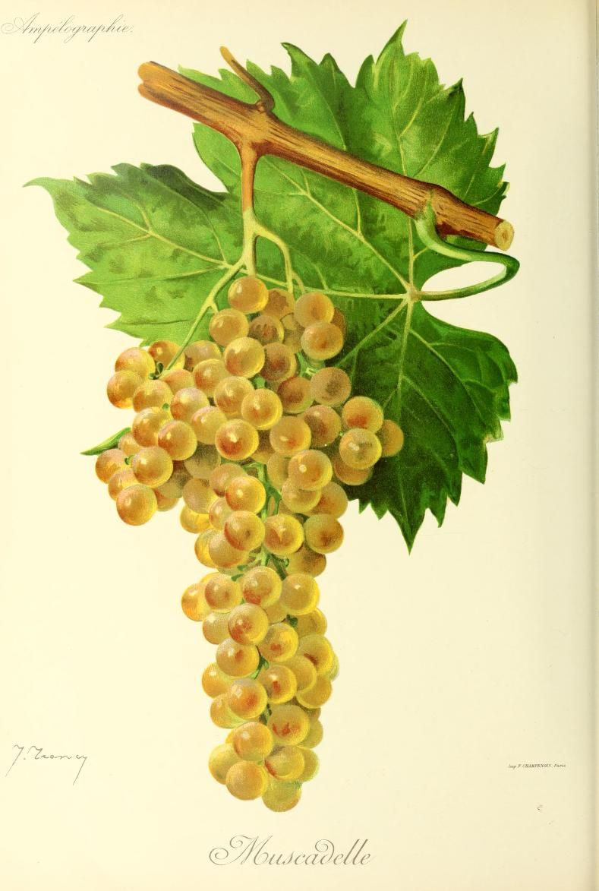

# Muscadelle

Muscadelle is a white grape associated with the floral component of Bordeaux
blends and the concentrated fortified wines of Rutherglen in Australia. Those
uses draw on different qualities: perfume in a supporting role in Bordeaux,
and the capacity to develop sweetness and mature in wood in Rutherglen.

Despite the similar name, it is a distinct variety from
[Muscat Blanc à Petits Grains](muscat-blanc-a-petits-grains.md). The distinction
matters particularly in Rutherglen, where Muscat and Muscadelle make separate
families of fortified wine.

## History and identity

Plantgrape places Muscadelle's probable origin in southwestern France and
describes it as a probable descendant of Gouais Blanc. Neither statement
establishes the location or date of the original seedling.[^1]

Australia formerly called its Muscadelle-based fortified wine Tokay. That wine
name was replaced by Topaque, with the Australian phaseout of Tokay completed
in 2020. Topaque identifies an Australian fortified-wine tradition; it should
not be read as evidence of a connection with Hungarian Tokaji.[^2]

## Viticulture

Muscadelle is vigorous and particularly susceptible to grey rot. A well-exposed
site and a canopy that avoids crowding help reduce that risk, although they
cannot remove the effects of a wet harvest. Powdery mildew and damage from
insects add to the demands of keeping fruit sound.

Susceptibility to botrytis has different consequences according to the weather.
Where conditions support [noble rot](../styles/botrytized-sweet-wine.md), the
fungus can help concentrate fruit for sweet wine. Persistent wet conditions
can instead produce destructive rot. Growers therefore need suitable weather
and selective harvesting to turn susceptibility into an advantage.

## Wine character and regional uses

In Bordeaux, Muscadelle commonly accompanies [Sémillon](semillon.md) and
[Sauvignon Blanc](sauvignon-blanc.md) in both dry and sweet white wines. Its
floral aroma and rounded contribution can be perceptible in a modest share of
the blend. Its relatively modest [acidity](../concepts/acidity.md) makes the balance supplied by the
other grapes useful. Ripeness and the proportion used matter more than the
mere presence of Muscadelle on a technical sheet.

Rutherglen's warm days and long, generally dry autumns allow growers to leave
fruit on the vine to concentrate. Autumn rain can interrupt that process.
For Topaque, fermentation is stopped by
[fortification](../concepts/fortification.md), retaining grape sugar before
maturation in oak. Producers differ in whether they ferment with skins or
work with juice alone.

The local growers' association describes Topaque through honey, toffee,
candied fruit, and cold-tea characters. It traditionally has a finer, lighter
profile than Rutherglen Muscat, though the age and concentration of the blend
can substantially change that comparison. Extended wood maturation makes
fresh-grape perfume only one part of the finished wine's character.

## Sources

- [Plantgrape,
  “Muscadelle”](https://www.plantgrape.fr/en/varieties/fruit-varieties/181/export),
  origin, growing characteristics, and wine properties.
- [Conseil Interprofessionnel du Vin de Bordeaux,
  “Muscadelle”](https://www.bordeaux.com/fr/cepages/muscadelle/), its role in
  Bordeaux white blends.
- [Winemakers of Rutherglen, “Varietal Spotlight: Rutherglen
  Topaque”](https://winemakers.com.au/topaque-of-rutherglen/), production and
  regional wine character.
- [Wine Australia,
  “Rutherglen”](https://www.wineaustralia.com/market-insights/regions-and-varieties/victoria-wines/rutherglen),
  regional climate and varieties.
- [Wine Australia, “Additional labelling
  terms”](https://www.wineaustralia.com/labelling/additional-labelling-terms),
  the Tokay phaseout and Topaque designation; accessed September 2026.

[^1]: Plantgrape qualifies both the southwestern French origin and the Gouais
    Blanc relationship; the pedigree should remain qualified.
[^2]: Wine Australia's labelling guidance gives 1 September 2020 as the end of
    the Tokay phaseout and explains the Topaque certification mark.
