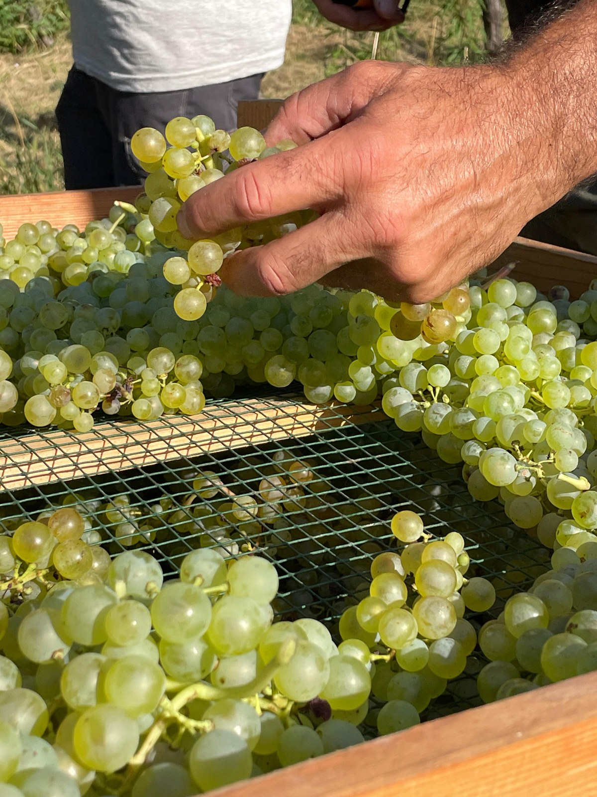

# Nosiola

Nosiola is a white grape of Trentino, grown around the Valle dei Laghi and on
the hills above the Adige valley, including Pressano. Its wines range from
restrained, dry whites to the concentrated sweet Vino Santo of the Valle dei
Laghi. That contrast makes it particularly useful for understanding how drying
the fruit changes a grape's expression.

## Dry wine and Vino Santo

In dry wine, Nosiola generally has a quieter aromatic profile than
[Gewürztraminer](gewurztraminer.md). A delicate hazelnut association recurs in
regional descriptions, alongside freshness and a relatively light frame.
The regional consortium describes both pergola and Guyot training, and
identifies the Ora breeze from Lake Garda as an important feature of the
Valle dei Laghi's growing environment.

For Vino Santo, growers set aside fruit for prolonged [drying after harvest](../concepts/appassimento.md).
Cantina Toblino describes laying its Nosiola on racks called *arèle* until
Holy Week, followed by pressing, slow fermentation, and years in oak. This is
a specific local tradition: the similar name Vin Santo also appears on wines
from other Italian regions, made from different grapes.

Water loss concentrates the juice before fermentation. The resulting wine's
sweetness comes from [residual sugar](../concepts/residual-sugar.md), while
its dried-fruit character and fuller texture reflect a much longer sequence
of drying and maturation than the dry white receives. A dry Nosiola and a
Valle dei Laghi Vino Santo therefore show two complementary uses of the
same regional grape.

## Sources

- Consorzio Vini del Trentino, [“Nosiola.”](https://vinideltrentino.com/en/portfolio/nosiola-2/)
- Cantina Toblino, [“La Nosiola” and “Vino Santo Trentino DOC.”](https://www.toblino.it/)
