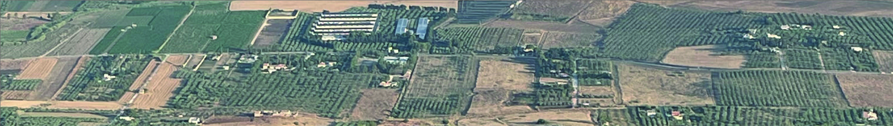

# Perricone

Perricone is a dark-skinned Sicilian grape whose present revival is centred
on the island's west and centre. Also called Pignatello, it can make
substantial, spicy reds, but contemporary producers also use it for
[rosé](../styles/rose.md). Its interest lies partly in that range: restoring
a local variety need not mean reproducing only its old wine styles.

## Decline and recovery

The Sicilian regional wine institute, IRVO, describes Perricone as a major
red variety in nineteenth-century Trapani and Palermo, followed by a sharp
twentieth-century contraction. Its December 2024 report records a recovery
from about 264 hectares in 2012 to 584 hectares in 2021.[^area] These are
dated vineyard figures, rather than a claim about today's precise area,
but they show that the revival includes replanting as well as publicity.

Pignatello is particularly associated with Trapani. Guarnaccio is the name
used at Tasca d'Almerita's Regaleali estate, where the producer reports
growing Perricone since 1959. Local names therefore connect the variety to
different parts of its continuing Sicilian history.

## Grapes and wine styles

Mandrarossa describes compact bunches with thick-skinned, dark berries and
relatively pale juice. Red colour consequently depends on extracting
pigment from the skins during [maceration](../concepts/maceration.md).
Its account of the red wine emphasizes body, fruit, and spice; it also
explains that small-scale trials led the estate to develop a Perricone rosé.
Shorter skin contact offers a different use for the same fruit, rather than
requiring a separate pink-grape variety.

Regaleali's Guarnaccio provides a contrasting reference. The estate's 2023
technical information describes fruit from an inland vineyard at about
480 metres, stainless-steel fermentation, completed
[malolactic fermentation](../concepts/malolactic-fermentation.md), and about
a year in previously used French oak barrels. That sequence separates
several influences on the finished wine: ripe fruit supplies the material,
malolactic conversion changes the acid balance, and
[oak maturation](../concepts/oak-maturation.md) develops texture and aroma
without making new-wood flavour the sole point of the wine.

## Where to place it in Sicily

Perricone's contemporary significance is especially clear in central-western
Sicily: inland Regaleali and the Menfi area offer different settings and
cellar interpretations. It belongs alongside the island's better-known
[Nero d'Avola](nero-davola.md) in an account of Sicilian reds, while retaining
its own identity. A regional blend and a varietal bottling answer different
questions; neither alone defines the grape's full character.

[^area]: IRVO, *Il vitigno Perricone*, December 2024, pp. 1–2, using regional
    vineyard-inventory data through 2021.

## Sources

- Istituto Regionale del Vino e dell'Olio,
  [*Il vitigno Perricone*](https://www.irvos.it/wp-content/uploads/2021/02/PROGETTO-PERRICONE.pdf),
  December 2024.
- Mandrarossa, [“Perricone”](https://www.mandrarossa.it/perricone),
  grape profile and rosé development, accessed September 2026.
- Tasca d'Almerita, [“Guarnaccio”](https://tascadalmerita.it/vini/tenuta-regaleali-guarnaccio/),
  Regaleali history and 2023 technical information, accessed September 2026.
