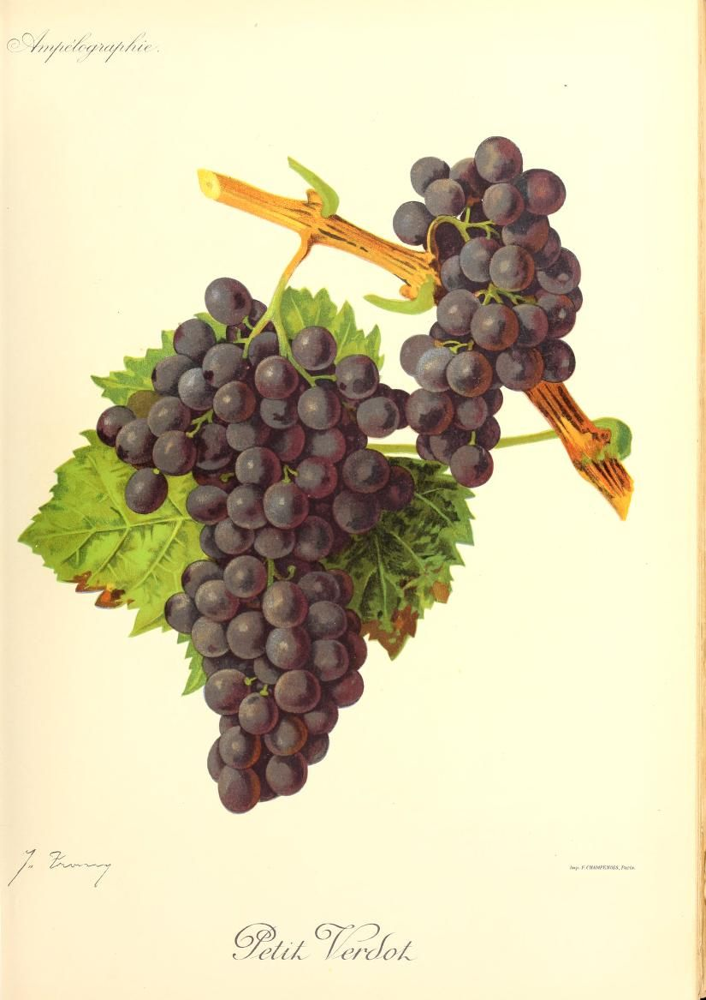

# Petit Verdot

Petit Verdot is a red southwestern French grape that contributes colour,
[tannin](../concepts/tannin.md), and acidity to Bordeaux blends. Its relatively
late ripening helps explain its limited role there and its wider possibilities
in warmer growing regions. Where it matures reliably, it can also make a
varietal wine with considerable structure.

## Growing season and water supply

Petit Verdot combines relatively early budbreak with late harvest. The two
ends of that season expose it to different hazards: spring frost can damage
new growth, while a cool or wet autumn can limit the maturity of the crop.
Site selection therefore needs to account for spring and autumn conditions
as well as summer warmth.

Warm conditions improve the chances of ripening, but Petit Verdot should not
be assumed to tolerate any hot, dry site. Plantgrape specifically stresses
regular water supply in southern growing regions. It also describes fragile
shoot bases and shoots that tend to spread horizontally, making support and
training important practical considerations.

California observations show why yield claims need context. UC viticulturist
Matthew Fidelibus reports substantial differences among clones and sites:
material that was productive in the San Joaquin Valley differed from
lower-yielding selections observed at Lodi. Yield expectations therefore need to
be matched to the clone and site.

The same account reports good colour development under hot conditions but
also sunburn risk where fruit becomes overexposed. Canopy architecture and
trellising can protect berries while allowing the vine to ripen its crop.
Heat sufficient for maturity and excessive direct exposure are separate
management questions.

## Wine character and blending

Plantgrape describes ripe Petit Verdot as capable of combining substantial
sugar with acidity, deep colour, and powerful tannins. These properties make
it useful in small proportions: a modest addition can change a blend's
structure without requiring Petit Verdot to supply most of its volume.

In Bordeaux it commonly accompanies [Cabernet Sauvignon](cabernet-sauvignon.md)
and [Merlot](merlot.md). The useful proportion depends on the maturity and
balance of all the components. Its concentration and firmness have to fit the
rest of the blend.

For a varietal bottling, that firmness becomes a central cellar consideration.
[Maceration](../concepts/maceration.md) determines how much skin and seed
material enters the wine. A deeply coloured crop does not in itself call for
maximal extraction, especially when the intended wine should be approachable
relatively young.

## Where it is grown

Within Bordeaux, Petit Verdot is particularly associated with the Médoc and
Graves. The Bordeaux wine council identifies warmth and adequate water as
important to its success and notes the opportunities a warmer climate can
offer this late variety. Those opportunities remain dependent on the site and
season.

California provides examples of cultivation in warm inland conditions.
Australia also uses the grape in blends and varietal wines. Wine Australia's
2025 snapshot places most reported Australian Petit Verdot crush in the
Riverland, followed by the Riverina, showing how strongly production is
associated with those warm inland regions.[^1]

## Sources

- [Plantgrape, “Petit
  Verdot”](https://www.plantgrape.fr/en/varieties/fruit-varieties/213/export),
  cultivation, water requirements, and wine properties.
- [Conseil Interprofessionnel du Vin de Bordeaux, “Petit
  Verdot”](https://www.bordeaux.com/fr/cepages/petit-verdot/), its Bordeaux
  distribution and blending role.
- [Matthew Fidelibus, “Petit
  Verdot”](https://grapevarieties.info/grape-variety/petit-verdot/), University
  of California grape-variety resource, updated 2023; California observations on
  phenology, clones, yield, and sunburn.
- [Wine Australia, “Petit Verdot: Variety Snapshot
  2025”](https://www.wineaustralia.com/getmedia/b2f9ecd0-19a9-42cb-b6dd-a585f4368cbb/MI-Petit-Verdot-snapshot-2024-25.pdf),
  September 2025, crush distribution and wine-label categories.

[^1]: The snapshot's regional crush data refer to 2025. Its vineyard-area
    figures come from an older survey and should not be treated as a 2025
    planting census.
