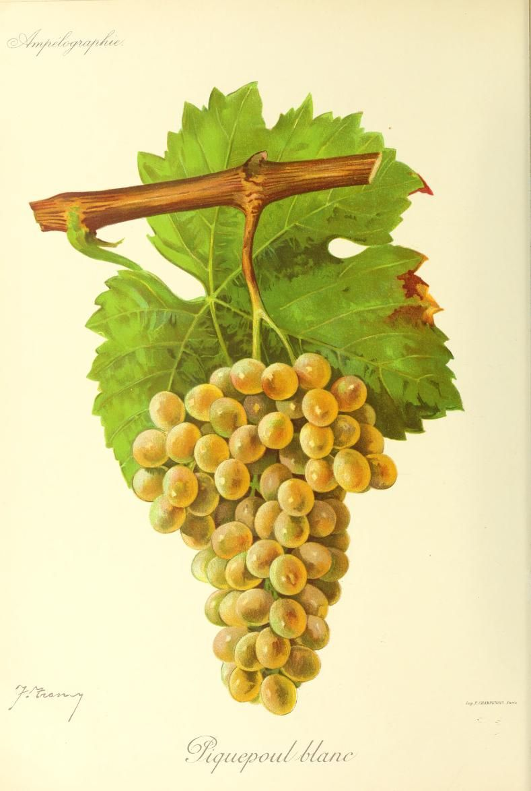

# Picpoul Blanc

Picpoul Blanc, also written Piquepoul blanc, is a white *Vitis vinifera* grape
of southern France. It is best known through Picpoul de Pinet, the appellation
in the Hérault that makes white wine exclusively from this variety, but the
grape also has a smaller, useful place in southern Rhône vineyards. Its
importance comes from a combination that can be valuable in Mediterranean
conditions: it ripens relatively late yet can retain a distinctly fresh,
tangy line in the finished wine.

## Names and identity

*Piquepoul* is the spelling used in the Rhône Valley, while *Picpoul* is common
in Languedoc and in the name Picpoul de Pinet. Other regional forms include
Picapoll, Picpouille, Avillo, and Picapulla. Picapoll Blanco, however, is a
distinct variety from Piquepoul/Picpoul blanc, despite the similar name.[^1]
Piquepoul gris and Piquepoul noir are colour forms of the Piquepoul group.
Plantgrape identifies Blanc as a white mutation of Noir.[^2]

Inter Rhône gives a Langue d'Oc explanation in which *Piquepoul* refers to a
place with a rocky peak. The etymology remains a regional tradition.

## Viticulture in a Mediterranean climate

Picpoul Blanc is relatively late-ripening, vigorous, and productive. Its
clusters are medium-sized and compact; short pruning is recommended, and very
fertile soils are best avoided. Crop level, water supply, exposure, disease
pressure, and the season influence when a parcel reaches useful ripeness.

Late ripening can be an advantage in a hot, sunny region when the site has
enough time and water to carry the fruit to maturity. The Picpoul de Pinet
specification describes the area north of the Étang de Thau as relatively dry,
with deep, draining soils and humid maritime influence. In its account, those
conditions help the late variety mature while preserving the floral, citrus, and
fresh qualities associated with the appellation.

The grape's high apparent [acidity](../concepts/acidity.md) is therefore partly a harvest and site
question. Warmth can increase sugar and reduce acid in grapes generally, but a
late variety harvested at a suitable point may retain enough acid to make a dry
wine feel lively rather than broad. The result also depends on crop load, water
status, the season, and the balance between ripeness and freshness.

## Wine character and cellar choices

Picpoul Blanc usually makes dry, still white wine. Inter Rhône describes the
wine as relatively neutral, with discreet citrus and floral notes, and values it
for tangy freshness and finesse in blends. The appellation specification for
Picpoul de Pinet similarly describes pale, youthful wines with floral and citrus
notes and a characteristic acidic edge. Pressing, fermentation, vessel, lees
contact, and harvest date can change the balance of fruit, texture, and
freshness.

The main cellar decision is how to preserve the grape's point of difference
while bringing it to adequate ripeness. The Picpoul de Pinet rules emphasise
careful transport and pressing to preserve finesse and balance, and the wines
are generally released young. That makes sense for a wine whose appeal depends
on freshness, while oxygen exposure, oak, lees contact, or [malolactic
fermentation](../concepts/malolactic-fermentation.md) can produce fuller interpretations.

## Picpoul de Pinet

Picpoul de Pinet is a protected geographical name, not a synonym for every
wine made from Picpoul Blanc. Under the current specification,[^3] it is reserved
for still white wine from a delimited area covering Castelnau-de-Guers,
Florensac, Mèze, Montagnac, Pinet, and Pomerols, with a permitted nearby area
for vinification. The wine must come exclusively from Piquepoul B—the French
catalogue's notation for the white-berried variety.

The association is historically strong because the appellation's identity was
preserved through changes in French regional appellation structures, and because
the growers built a clone conservatory for the local material. The legal name
therefore joins place, grape, and production rules. A bottle labelled Picpoul
de Pinet tells the reader more than “Picpoul Blanc”: it identifies a regulated
origin and a specific, single-variety white-wine tradition.

## Southern Rhône blends

In the southern Rhône, Picpoul Blanc is a supporting grape rather than one of
the region's dominant white varieties. The current Côtes du Rhône rules list
it among the accessory white grapes, alongside the principal group of
[Bourboulenc](bourboulenc.md), [Clairette](clairette-blanche.md), [Grenache Blanc](grenache-blanc.md),
[Marsanne](marsanne.md), [Roussanne](roussanne.md), and [Viognier](viognier.md).
The white wines must be based mainly
on the principal varieties, so Picpoul can contribute without defining the
appellation's blend. The same rules also list it as an accessory option in red
and [rosé](../styles/rose.md) wines, subject to the applicable blending limits.[^4]

That legal position matches the grape's practical role. In a warm blend, Picpoul
can supply a sharper acid impression and a light, discreetly aromatic freshness,
countering varieties that contribute more alcohol, body, or ripe fruit.
Proportions, harvest dates, fermentation, and maturation determine the final
balance.

## Sources

- Foundation Plant Services, University of California, Davis, [“Grape Variety:
  Piquepoul blanc”](https://fps.ucdavis.edu/FGRfamilies.cfm?varietyid=3394),
  accessed 7 September 2026.
- Institut français de la vigne et du vin, INRAE & Institut Agro Montpellier,
  [“Piquepoul blanc B”](https://www.plantgrape.fr/en/varieties/fruit-varieties/219/export),
  Plantgrape varietal record, accessed 7 September 2026.
- Inter Rhône, [“Piquepoul blanc”](https://www.vins-rhone.com/en/piquepoul-blanc-grape-variety),
  grape-variety profile, accessed 7 September 2026.
- Institut national de l'origine et de la qualité, [“Picpoul de Pinet”](https://www.inao.gouv.fr/produit/picpoul-de-pinet-20966),
  appellation record, accessed 7 September 2026.
- Ministère de l'Agriculture et de la Souveraineté alimentaire, *Cahier des
  charges de l'appellation d'origine protégée « Picpoul de Pinet »*, homologated
  by order of 9 December 2024, published 19 December 2024,
  [adopted specification](https://info.agriculture.gouv.fr/boagri/document_administratif-dc09ed16-3b99-45bc-b1f4-9a5fceebd3ec/telechargement).
- Ministère de l'Agriculture et de la Souveraineté alimentaire, *Cahier des
  charges de l'appellation d'origine contrôlée « Côtes du Rhône »*, homologated
  10 December 2024,
  [PDF](https://info.agriculture.gouv.fr/boagri/document_administratif-0a35319f-f582-456a-bc41-dad3dd4ceb28/telechargement).

[^1]: Foundation Plant Services, University of California, Davis, “Grape
    Variety: Piquepoul blanc,” noting that recent DNA analysis distinguishes
    Picapoll blanco from Piquepoul/Picpoul blanc:
    <https://fps.ucdavis.edu/FGRfamilies.cfm?varietyid=3394>.
[^2]: Plantgrape, “Piquepoul blanc B,” identifying Piquepoul blanc as the white
    mutation of Piquepoul noir:
    <https://www.plantgrape.fr/en/varieties/fruit-varieties/219/export>.
[^3]: Ministère de l'Agriculture et de la Souveraineté alimentaire, *Cahier des
    charges de l'appellation d'origine protégée « Picpoul de Pinet »*, I, III,
    IV and V, adopted December 2024:
    <https://info.agriculture.gouv.fr/boagri/document_administratif-dc09ed16-3b99-45bc-b1f4-9a5fceebd3ec/telechargement>.
[^4]: Ministère de l'Agriculture et de la Souveraineté alimentaire, *Cahier des
    charges de l'appellation d'origine contrôlée « Côtes du Rhône »*, V and IX,
    adopted December 2024:
    <https://info.agriculture.gouv.fr/boagri/document_administratif-0a35319f-f582-456a-bc41-dad3dd4ceb28/telechargement>.
