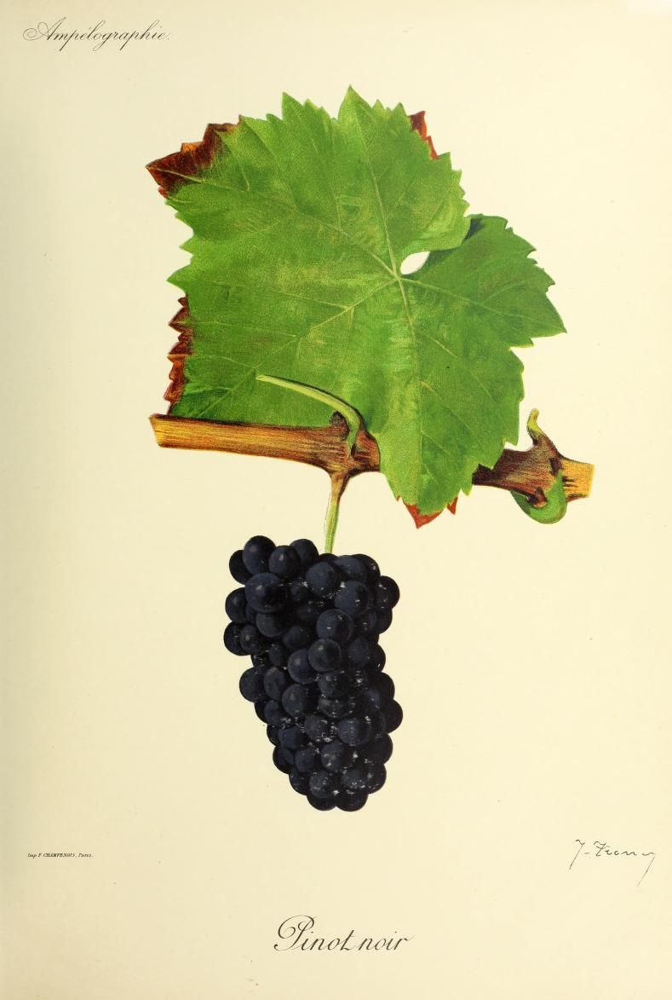

# Pinot Noir

Pinot Noir is a dark-skinned *Vitis vinifera* variety with an early ripening
season and an unusually long history of vegetative propagation. Burgundy is its
principal historical association. In Champagne, it is a major sparkling-wine
grape. The same fruit can become still red or rosé wine, or be pressed quickly
to give pale juice for sparkling wine.

Pinot Noir's sensitivity has a physical and genetic basis. Small berries with
relatively thin skins often sit in compact bunches; its old clonal population
varies in yield, bunch form, ripening, and composition; and modest changes in
heat, water, exposure, crop, or harvest date can alter the balance of sugar,
acidity, and phenolics. Those interactions help explain why Pinot Noir ranges
from light, brisk wines to much deeper and firmer reds even within the broad
category of cool-climate wine.

## History and clonal diversity

Pinot Noir is clearly old, but its exact birthplace and its identity in
antiquity are not securely documented. A historical study places the earliest
known use of *pinot* as a grape name near Auxerre in 1366; other late
fourteenth-century records connect Pinot wine with Burgundy and its trade. The
often-repeated claim that Philip the Bold's 1395 ordinance explicitly required
Pinot is too neat: the surviving text condemns [Gamay](gamay.md) and orders its
removal but does not name a preferred replacement.[^1]

Genetics extends the history without resolving the birthplace. A 2026 study of
ancient DNA matched a grape pip from fifteenth-century Valenciennes to modern
Pinot Noir, evidence that the present genetic lineage has continued for nearly
six centuries. Earlier Roman pips found in France are closely related to Pinot
Noir but have not been shown to be the same variety. The evidence supports an
old, widely connected lineage but cannot establish a continuous record of
modern Pinot in Burgundy since Roman times.[^1]

Growers normally propagate vines by cuttings or grafting, not by seed. Each new
vine begins with its parent's identity, but mutations in growing tissue can be
preserved in later cuttings. Repeated over centuries, this process has made
Pinot especially diverse within the variety. France currently certifies 48
Pinot Noir clones, while conservatory collections established in Alsace,
Burgundy, and Champagne hold nearly 800 accessions. A clone is not a different
grape or a guaranteed style: clonal material can differ in crop, bunch
compactness, berry size, ripening, and phenolic potential, and its performance
still depends on site and season.[^2]

Genetic work indicates that Pinot Blanc and [Pinot Gris](pinot-gris.md) arose
independently from Pinot Noir through different mutations affecting berry
colour. They are maintained as distinct cultivated forms, not synonyms for the
dark-skinned grape. Spätburgunder, Blauburgunder, and Pinot Nero, by contrast,
are regional names for Pinot Noir itself.[^2]

## Viticulture and site sensitivity

Pinot Noir both buds and ripens early. Early budbreak exposes young growth to
spring frost, while early maturity lets the fruit complete ripening in places
where later grapes may struggle. In hot conditions, ripening can proceed very
quickly, acidity can fall, and overripe berries can shrivel; in a cold or wet
season, waiting for sugar and skin development can increase exposure to rot. A
cool climate can therefore provide a longer, more gradual season but cannot
guarantee balanced grapes.

Its small berries commonly form compact clusters, compounding the disease risk.
Damaged fruit, trapped moisture, and limited air movement within them favor
grey rot. Microscopy of Champagne fruit found thinner skin cell walls in Pinot
Noir than in [Chardonnay](chardonnay.md), while other work shows that skin
structure, cuticle, cluster compactness, maturity, and weather interact in
disease susceptibility. Looser-clustered clones, canopy management, crop level,
and an open, well-drained site can reduce some pressure. The variety remains
susceptible under those measures.

Pinot Noir's site sensitivity reflects its linked responses to the vineyard
environment. Aspect, elevation, wind, soil depth and water supply, canopy shade,
and crop load change the heat, light, and water experienced by the fruit. In
one controlled study, researchers harvested the same clone from twelve
vineyards between California and Oregon and made the wines with a standard
protocol. The wines differed in sensory and chemical composition, and many
differences persisted with ageing.[^3] The result shows that place affects the
grapes but cannot isolate the cause. The experiment covered one clone and one
vintage across a large distance, while latitude and longitude also stand in for
many climatic and management variables. Clone, rootstock, vintage, farming, and
harvest date can strengthen or blur any site pattern.

## Wine character and cellar choices

Pinot Noir often gives less deeply coloured wine than many dark-skinned
varieties. Its grapes tend to contain relatively modest phenolics and lack the
acylated anthocyanins that help stabilize colour in some other red grapes.
Small berries can still provide substantial skin relative to juice. Tannin and
pigment are different parts of the phenolic composition, and extraction
determines how much of each enters the wine.

For red wine, harvest date sets a range of potential alcohol, acidity, fruit
condition, and phenolic maturity. Fermenting crushed berries on their
skins supplies colour and tannin; the duration and force of extraction can keep
the result delicate or make it firmer. Including whole clusters introduces
stems as well as intact berries and can change tannin, aroma, and the course of
fermentation. Destemming, vessel choice, oxygen exposure, new or older oak,
and bottle age add further variation. Younger wines often suggest red fruit and
flowers, while savoury character can become more apparent with age.

Rapid pressing offers another path. Because most pigment is in the skin and the
pulp is pale, dark grapes can yield a light base wine when skin contact is
minimized. This is central to white sparkling wines made partly or wholly from
Pinot Noir. Shorter contact can give rosé; longer contact produces red wine.
Harvest and skin contact begin shaping the style before fermentation.

## Where it is grown

Burgundy gives the clearest demonstration of Pinot Noir as still red wine tied
to named places. Across the Côte d'Or and other Burgundian districts, exposure,
soil depth, elevation, vintage, crop, and cellar practice can produce wines of
very different weight and tannic shape. Wines from each named place still vary
by producer and vintage.

Champagne uses Pinot Noir for another purpose: fruit from the cool Montagne de
Reims and Côte des Bar commonly enters sparkling blends, rosé Champagne, and
white *blanc de noirs*. Picking for sparkling base wine generally prioritizes
lower potential alcohol and retained acidity, while gentle pressing limits
colour. Burgundy and Champagne thus apply different harvest and cellar goals
to the same early-ripening grape.

In Germany, Spätburgunder is important in Baden, the Pfalz, Rheinhessen,
Württemberg, the Rheingau, and the Ahr. The German Wine Institute distinguishes
an older pattern of pale, mild wines from a more recent pattern with deeper
colour, more tannin, and small-barrel maturation. Those are changing production
choices, not two biological types, and German Pinot is also used for sparkling
wine.

Beyond Europe, the Willamette Valley and cool parts of coastal California have
become major American centres. New Zealand grows Pinot Noir principally in its
cooler southerly regions, including Marlborough, Central Otago, Wairarapa, and
North Canterbury; differences within those regions can be as important as the
national label. Tasmania, Victoria's cooler districts, coastal Chile, South
Africa's cooler sites, Canada, and England add further still and sparkling
interpretations. Across this geography, “cool climate” covers maritime,
continental, dry, and wet growing seasons that produce varied Pinot Noir
styles.

[^1]: Guillaume Grillon, Jean-Pierre Garcia & Thomas Labbé, “Le « très loyal
    pinot » : itinéraire d'un cépage mythique de la Bourgogne,” *Crescentis*
    (2019), <https://doi.org/10.58335/crescentis.1003>; Rémi Noraz et al.,
    “Ancient DNA reveals 4000 years of grapevine diversity, viticulture and
    clonal propagation in France,” *Nature Communications* 17 (2026), article
    2494, <https://doi.org/10.1038/s41467-026-70166-z>.
[^2]: Grégory Carrier et al., “Transposable Elements Are a Major Cause of
    Somatic Polymorphism in *Vitis vinifera* L.,” *PLOS ONE* 7 (2012), e32973,
    <https://doi.org/10.1371/journal.pone.0032973>; Silvia Vezzulli et al.,
    “Pinot blanc and Pinot gris arose as independent somatic mutations of Pinot
    noir,” *Journal of Experimental Botany* 63 (2012), pp. 6359–6369,
    <https://doi.org/10.1093/jxb/ers290>.
[^3]: Annegret Cantu et al., “Investigating the impact of regionality on the
    sensorial and chemical aging characteristics of Pinot noir grown throughout
    the U.S. West coast,” *Food Chemistry* 337 (2021), article 127720,
    <https://doi.org/10.1016/j.foodchem.2020.127720>.

## Sources

- Institut français de la vigne et du vin, INRAE & Institut Agro Montpellier,
  [“Pinot noir N”](https://www.plantgrape.fr/en/varieties/fruit-varieties/218/export),
  Plantgrape varietal record, edited 28 August 2026, accessed 1 September 2026.
- Guillaume Grillon, Jean-Pierre Garcia & Thomas Labbé, [“Le « très loyal
  pinot » : itinéraire d'un cépage mythique de la
  Bourgogne”](https://doi.org/10.58335/crescentis.1003), *Crescentis*, 2019.
- Rémi Noraz et al., [“Ancient DNA reveals 4000 years of grapevine diversity,
  viticulture and clonal propagation in
  France”](https://doi.org/10.1038/s41467-026-70166-z), *Nature
  Communications* 17 (2026), article 2494.
- Grégory Carrier et al., [“Transposable Elements Are a Major Cause of Somatic
  Polymorphism in *Vitis vinifera*
  L.”](https://doi.org/10.1371/journal.pone.0032973), *PLOS ONE* 7 (2012),
  e32973.
- Silvia Vezzulli et al., [“Pinot blanc and Pinot gris arose as independent
  somatic mutations of Pinot noir”](https://doi.org/10.1093/jxb/ers290),
  *Journal of Experimental Botany* 63 (2012), pp. 6359–6369.
- Paul F. W. Mawdsley, Jean Catherine Dodson Peterson & L. Federico Casassa,
  [“Agronomical and Chemical Effects of the Timing of Cluster Thinning on Pinot
  Noir (Clone 115) Grapes and
  Wines”](https://doi.org/10.3390/fermentation4030060), *Fermentation* 4
  (2018), article 60.
- Alice André et al., [“Physical, Anatomical, and Biochemical Composition of
  Skins Cell Walls from Two Grapevine Cultivars (*Vitis vinifera*) of Champagne
  Region Related to Their Susceptibility to *Botrytis cinerea* during
  Ripening”](https://doi.org/10.3390/horticulturae7100413), *Horticulturae* 7
  (2021), article 413.
- Annegret Cantu et al., [“Investigating the impact of regionality on the
  sensorial and chemical aging characteristics of Pinot noir grown throughout
  the U.S. West coast”](https://doi.org/10.1016/j.foodchem.2020.127720), *Food
  Chemistry* 337 (2021), article 127720.
- Comité Champagne, [“Champagne and its grape
  varieties”](https://www.champagne.fr/en/about-champagne/a-great-blended-wine/champagne-and-its-grape-varieties),
  accessed 1 September 2026.
- Deutsches Weininstitut,
  [“Spätburgunder”](https://www.deutscheweine.de/rebsorte/94/sp%C3%A4tburgunder/),
  accessed 1 September 2026.
- New Zealand Winegrowers, [*Pinot
  Noir*](https://www.nzwine.com/media/19391/pinot-noir.pdf), regional overview,
  accessed 1 September 2026.
