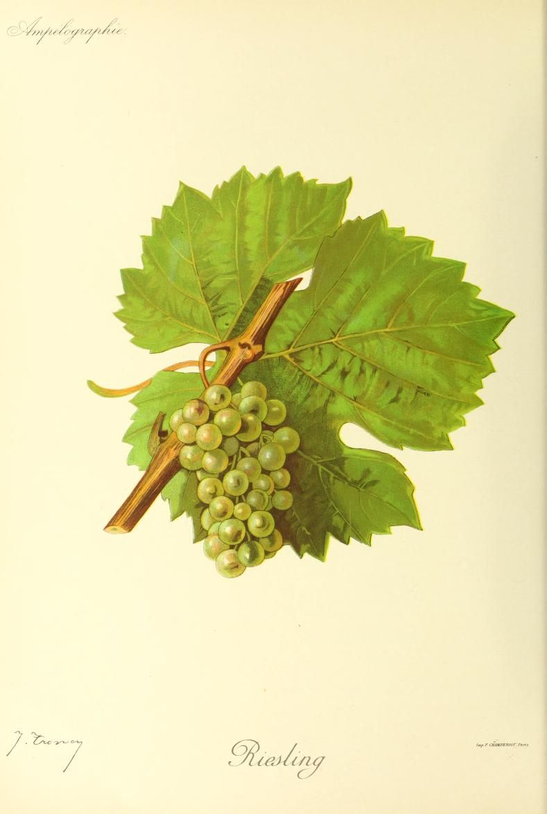

# Riesling

Riesling is a white *Vitis vinifera* variety historically centred on the Rhine
and its tributaries. It combines pronounced natural acidity with an aromatic
character that develops during ripening and in the bottle. Those properties
support wines from fully dry to intensely sweet. Sweetness reflects harvest and
fermentation.

Sugar, acids, and aroma precursors develop at different rates. Harvest timing
sets their starting balance; fermentation determines how much sugar becomes
alcohol and how much remains.

## History and identity

Plantgrape places Riesling's probable origin near the Rhine and, based on
published genetic analyses, describes it as a probable descendant of Gouais
blanc. The original seedling's site and date remain unknown, and the other side
of its parentage is less securely established.[^1]
A Rheingau document from 1435 is widely cited as an early record of the name.
Later fifteenth-century references show the variety spreading through western
German vineyards.

White Riesling, Weißer Riesling, and Rhine Riesling denote this variety.
Welschriesling, despite its name and importance in Austria and central Europe,
is a different grape. Schwarzriesling is the German name for
[Meunier](pinot-meunier.md), a separate variety.

## Ripening and acidity

Riesling ripens relatively late—about three weeks after Chasselas in the French
reference collection. Actual dates vary with latitude, elevation, aspect,
season, crop, and canopy. A long season can extend ripening while leaving its
small bunches exposed to autumn rain and grey rot.

In a three-year comparison at matched ripening stages, Riesling berries
contained more tartaric acid than
[Gewürztraminer](gewurztraminer.md) and, during later sampling, more malic acid
as well.[^2] After *véraison*, tartaric acid per berry remains comparatively
stable, while malic acid is consumed in berry metabolism. Warmth hastens malic
loss, though Riesling's tartaric-acid potential can preserve useful acidity
after sugar has accumulated.

Earlier picking generally preserves more acid and gives less potential alcohol.
Waiting may bring sugar, aroma development, shrivelling, or [noble
rot](../styles/botrytized-sweet-wine.md), together with greater risks of acid
loss and unhealthy rot. Exposure, water status, crop, and weather alter that
balance.

## Aroma and bottle development

Monoterpenes such as linalool, geraniol, and nerol contribute to Riesling's young
perfume, though less directly than in [Muscat Blanc à Petits
Grains](muscat-blanc-a-petits-grains.md). Some occur freely in the berry; others
are bound in precursors that can later release aroma. Clone, sunlight, harvest,
fermentation, and bottle age determine what becomes perceptible.[^3]

A controlled study found that excluding light reduced free monoterpenoids,
whereas reducing sugar import did not produce the same decline in their total
free and bound concentration.[^3] Aroma development can therefore diverge from
sugar accumulation. Intense exposure may also increase sunburn.

The best-known aged note is associated with
1,1,6-trimethyl-1,2-dihydronaphthalene (TDN), often described as petrol or
kerosene. TDN develops from non-volatile, carotenoid-derived precursors through
reactions during wine storage. Research has isolated several such precursors
from Riesling wine.[^4] Bunch exposure and warmth can increase its potential,
while bottle age and storage temperature affect its release. Depending on
concentration and drinking culture, it may register as mature character or an
obtrusive fault.

## Sweetness and cellar choices

Dry wine results when yeast ferments nearly all available grape sugar. Cooling,
filtration, and sulfur dioxide can arrest fermentation and preserve some;
concentrated must may also stop fermenting. Noble rot or dehydration concentrates
the starting fruit enough to support intensely sweet wine.

Acidity changes the perception of residual sugar without changing its amount.
Alcohol, extract, temperature, and carbonation matter too, so a lightly sweet,
acid-driven Riesling may taste drier than its sugar figure suggests. Riesling's
acid retention gives winemakers room to stop fermentation at different points,
much as it does for [Chenin Blanc](chenin-blanc.md).

Most still Riesling is pressed promptly and matured in steel or neutral vessels.
Large old casks remain important in Germany and Alsace, while some producers use
[skin contact](../styles/skin-contact-white-wine.md), lees, or smaller wood for
texture. [Malolactic fermentation](../concepts/malolactic-fermentation.md) is
often limited to retain malic acidity.

## Regional traditions

Germany displays the sweetness range most explicitly. [Mosel](../regions/mosel.md),
Rheingau, Nahe, Rheinhessen, and Pfalz all produce dry Riesling as well as wines
with residual sugar. Prädikat terms such as Kabinett, Spätlese, and Auslese refer
primarily to grape maturity and minimum must weight, so examples can be dry or
sweet. *Trocken* describes finished sugar, while *feinherb* is commonly used but
not legally defined.[^5]

Alsace has a more strongly dry convention for ordinary varietal Riesling. Its
current appellation rules cap fermentable sugar after fermentation for wine
labelled Riesling, with allowances tied to acidity. Separate *vendanges
tardives* and *sélection de grains nobles* categories use hand-harvested,
sugar-rich grapes under specific conditions.[^6]

In Austria, Riesling is concentrated in the Danube regions of Lower Austria,
including Wachau, Kremstal, and Kamptal. Dry wine predominates: Kremstal DAC
Riesling must meet the legal definition of *trocken*, while Kamptal DAC limits
residual sugar by titratable acidity.[^7] Sweet Austrian Prädikat wines also
exist.

Clare and Eden valleys are Australia's principal references, usually for dry
wine in neutral vessels. New Zealand and cooler parts of North America span dry,
off-dry, late-harvest, and sweet forms. Autumn weather, sunlight, and local
traditions create distinct balances among acidity, aroma, sugar, and TDN.

[^1]: Institut français de la vigne et du vin, INRAE & Institut Agro
    Montpellier, “Riesling B,” Plantgrape, edited 19 August 2026.
[^2]: Eric Duchêne et al., “Genetic variability of descriptors for grapevine
    berry acidity in Riesling, Gewürztraminer and their progeny,” *Australian
    Journal of Grape and Wine Research* 20 (2014), pp. 91–99,
    <https://doi.org/10.1111/ajgw.12051>.
[^3]: Joshua VanderWeide et al., “Free monoterpenoid accumulation in ‘Riesling’
    (*Vitis vinifera* L.) is light-sensitive and uncoupled from grape hexose
    accumulation,” *Plant Physiology and Biochemistry* 219 (2025), article
    109212, <https://doi.org/10.1016/j.plaphy.2024.109212>.
[^4]: Recep Gök et al., “Target-Guided Isolation of Progenitors of
    1,1,6-Trimethyl-1,2-dihydronaphthalene (TDN) from Riesling Wine by
    High-Performance Countercurrent Chromatography,” *Molecules* 27 (2022),
    article 5378, <https://doi.org/10.3390/molecules27175378>.
[^5]: Deutsches Weininstitut, “Prädikate” and “Geschmacksrichtungen,” accessed
    1 September 2026. The institute defines the Prädikat categories by grape
    must weight and gives separate finished-wine thresholds for *trocken* and
    *halbtrocken*; it describes *feinherb* as legally undefined.
[^6]: Ministère de l'Agriculture et de la Souveraineté alimentaire, *Cahier des
    charges de l'appellation d'origine contrôlée “Alsace” ou “Vin d'Alsace”*,
    modified 29 December 2025, pp. 9–15.
[^7]: Austrian Federal Ministry of Agriculture and Forestry, Climate and
    Environmental Protection, Regions and Water Management, *DAC-Verordnung
    “Kremstal”*, consolidated 18 September 2024, § 1; *DAC-Verordnung
    “Kamptal”*, in force 17 September 2024, § 3.

## Sources

- Institut français de la vigne et du vin, INRAE & Institut Agro Montpellier,
  [“Riesling B”](https://www.plantgrape.fr/fr/varietes/varietes-a-fruits/236/export),
  Plantgrape varietal record, edited 19 August 2026, accessed 1 September 2026.
- Eric Duchêne, Valérie Dumas, Gaëlle Jaegli, François Merdinoglu & Didier
  Migneret, [“Genetic variability of descriptors for grapevine berry acidity in
  Riesling, Gewürztraminer and their
  progeny”](https://doi.org/10.1111/ajgw.12051), *Australian Journal of Grape and
  Wine Research* 20 (2014), pp. 91–99.
- Aroma-chemistry sources: Jerry Lin, Mélanie Massonnet & Dario Cantu, [“The
  genetic basis of grape and wine
  aroma”](https://doi.org/10.1038/s41438-019-0163-1), *Horticulture Research* 6
  (2019), article 81; Joshua VanderWeide et al., [“Free monoterpenoid
  accumulation in ‘Riesling’
  (*Vitis vinifera* L.) is light-sensitive and uncoupled from grape hexose
  accumulation”](https://doi.org/10.1016/j.plaphy.2024.109212), *Plant
  Physiology and Biochemistry* 219 (2025), article 109212; and Recep Gök et al.,
  [“Target-Guided Isolation of Progenitors of
  1,1,6-Trimethyl-1,2-dihydronaphthalene (TDN) from Riesling Wine by
  High-Performance Countercurrent
  Chromatography”](https://doi.org/10.3390/molecules27175378), *Molecules* 27
  (2022), article 5378.
- Deutsches Weininstitut, [“Riesling”](https://www.deutscheweine.de/rebsorte/105/riesling),
  [“Prädikate”](https://www.deutscheweine.de/wein-speise/449/pr%C3%A4dikat-categories),
  and [“Geschmacksrichtungen”](https://www.deutscheweine.de/wein-speise/195/levels-of-sweetness-in-german-wines/),
  accessed 1 September 2026.
- Ministère de l'Agriculture et de la Souveraineté alimentaire, [*Cahier des
  charges de l'appellation d'origine contrôlée “Alsace” ou “Vin
  d'Alsace”*](https://info.agriculture.gouv.fr/boagri/document_administratif-6fe90f2b-ac49-4fec-a13f-309ce19ef3e7/telechargement),
  modified 29 December 2025 and published 15 January 2026.
- Austrian Federal Ministry of Agriculture and Forestry, Climate and
  Environmental Protection, Regions and Water Management, [*DAC-Verordnung
  “Kremstal”*](https://www.bundeskellereiinspektion.at/downloads/dac_vo/dac_vo_kremstal.pdf),
  consolidated 18 September 2024, and [*DAC-Verordnung
  “Kamptal”*](https://www.ris.bka.gv.at/Dokumente/Bundesnormen/NOR40265239/NOR40265239.pdf),
  in force 17 September 2024.
