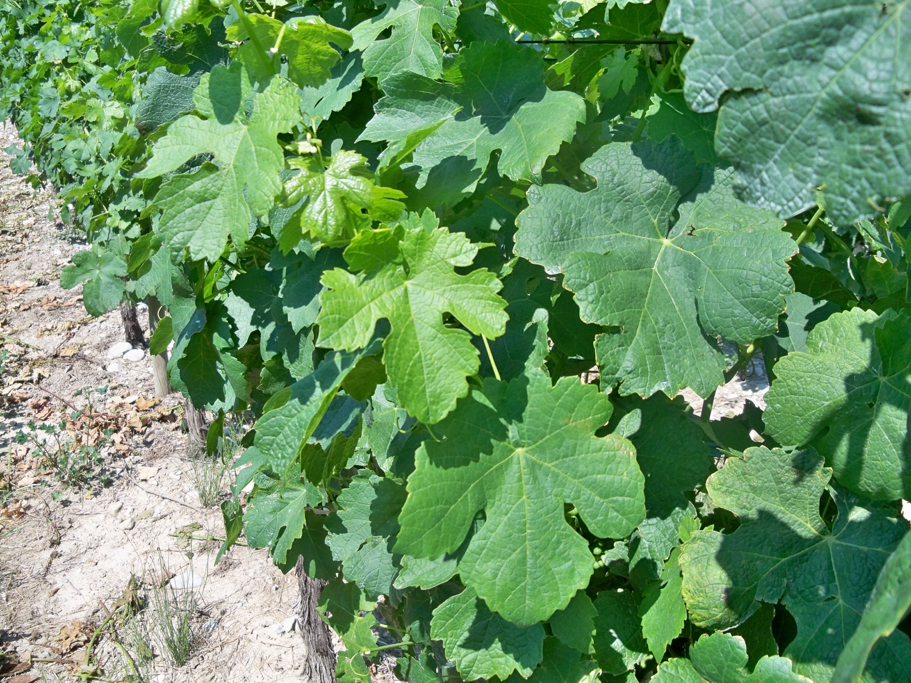

# Roussanne

Roussanne is a white *Vitis vinifera* grape of the Rhône Valley. Its name is
often connected with the russet or reddish-gold colour of ripe berries, and
that colour change is a useful vineyard sign. The variety matters because it
can combine perfume, a broad texture, and a firm line of acidity. It is also a
capricious vine: ripening and yields can be irregular, disease pressure is
important, and a late harvest can trade freshness for alcohol and softness.

## Viticulture

Roussanne is suited to warm, stony, well-drained sites, including lean hillside
soils and stony loam-limestone. Inter Rhône describes it as a medium-vigour
variety with good longevity, but also notes its sensitivity to powdery mildew
and grey rot.[^1] Maturity classifications differ: Inter Rhône places Roussanne
in the early-to-mid-ripening range, while a 2022 Plantgrape record calls it
mid-season. Specialist wine writing describes late and uneven ripening in some
settings, alongside irregular yields and poor tolerance of some disease
pressure.[^2][^7] Clone, site, season, canopy, and crop level all change the
risk.

The harvest decision is unusually important. Roussanne needs enough time for its
characteristic aroma and texture to develop, yet fruit that hangs too long can
lose acid balance. In a warm site or season, picking may therefore be a choice
between a more developed, fuller wine and a fresher one with less weight.
Sorting and gentle handling matter in the winery as well. Roussanne juice can
oxidise readily, so protection from unnecessary oxygen is one practical cellar
choice, especially when the aim is to keep floral aromas and a pale colour.[^2]

## Wine character

Young wines can show honeysuckle, iris, and other floral notes, with stone fruit
and peach-like impressions. With ripeness and age, dried fruit, honey, and nutty
tones become more prominent. Inter Rhône describes wines that are fine, complex,
structured, and capable of ageing.[^1]

Roussanne can give white wine a rounded, almost creamy breadth, but its acidity
can keep that weight from becoming merely soft when the fruit was harvested in
balance. The result depends on climate, crop level, harvest date, blending,
fermentation, and maturation. Lees contact or oak can make the texture seem
broader and add their own flavours; a cooler site, earlier harvest, or a less
conspicuous vessel can leave more room for the grape's perfume and freshness.

## Northern Rhône

In the northern Rhône, Roussanne is most often understood alongside
[Marsanne](marsanne.md) in white wines. Adopted specifications name Marsanne and
Roussanne as the white-wine varieties for Hermitage, Crozes-Hermitage,
Saint-Joseph, and Saint-Péray; Saint-Péray uses the pair for still and sparkling
wines.[^8][^9][^10][^11] Roussanne can appear on its own in practice, alongside
the regional blending tradition.

Hermitage shows the grape in a site where richness and development are central
to the style. The appellation's white wines are made from Marsanne and
Roussanne, and the regional body describes them as smooth, creamy, and honeyed,
with the capacity to develop further aromas over time.[^3] Crozes-Hermitage
offers a broader set of sites and a generally more accessible expression: its
white wines are dry and full-bodied, with floral and dried-fruit notes.[^4]
Saint-Péray gives the pairing a distinct sparkling role as well as still wines,
using the grapes' texture and aroma in both forms.

A parcel's climate, soil, exposure, and water supply affect ripening, while the
proportion of each grape and the cellar regime change the balance between
Marsanne's weight and Roussanne's perfume, texture, and freshness.

## Southern Rhône

Farther south, Roussanne is one member of a larger white-grape vocabulary. The
current Côtes du Rhône description lists it among the principal white varieties
alongside [Bourboulenc](bourboulenc.md), [Clairette](clairette-blanche.md), Grenache Blanc,
Marsanne, and [Viognier](viognier.md), with
blending used to combine aroma and freshness.[^5] In the warmer southern
climate, that role is practical: Roussanne can bring fragrance and structure to
blends whose other components supply different kinds of fruit, acidity, or
weight.

[Grenache Blanc](grenache-blanc.md) and Roussanne are among the principal grapes
in white Châteauneuf-du-Pape, where the
regional body describes the wines as ample, expressive, and aromatically fresh.
The appellation permits a much wider group of grapes than the northern crus,
so Roussanne's contribution varies substantially from one blend to another.[^6]

[^1]: Inter Rhône, [“Roussanne”](https://www.vins-rhone.com/en/roussanne-grape-variety),
    accessed 7 September 2026.
[^2]: [Decanter, “Roussanne”](https://www.decanter.com/wine/grape-varieties/roussanne/),
    accessed 7 September 2026.
[^7]: Institut français de la vigne et du vin, INRAE & Institut Agro
    Montpellier, [“Roussanne B”](https://advico.co.za/wp-content/uploads/2022/02/Rousanne.pdf),
    Plantgrape varietal record, edited 12 January 2022, pp. 1–2.
[^8]: Ministère de l'Agriculture et de la Souveraineté alimentaire, [*Cahier des
    charges de l'appellation d'origine contrôlée « Hermitage »*](https://info.agriculture.gouv.fr/boagri/document_administratif-44a11782-ba80-4c0e-85ef-6acd35675371/telechargement).
[^9]: Ministère de l'Agriculture et de la Souveraineté alimentaire, [*Cahier des
    charges de l'appellation d'origine contrôlée « Crozes-Hermitage »*](https://info.agriculture.gouv.fr/boagri/document_administratif-7496da98-e980-4e30-8de0-2cc072fbb0fe/telechargement).
[^10]: Ministère de l'Agriculture et de la Souveraineté alimentaire, [*Cahier des
    charges de l'appellation d'origine contrôlée « Saint-Joseph »*](https://info.agriculture.gouv.fr/boagri/document_administratif-20ed76a6-b4c3-43a1-8cfd-e8b40379c325/telechargement).
[^11]: Ministère de l'Agriculture et de la Souveraineté alimentaire, [*Cahier des
    charges de l'appellation d'origine contrôlée « Saint-Péray »*](https://info.agriculture.gouv.fr/boagri/document_administratif-92cacf89-c2f6-44ec-ba2c-9b155ca87795/telechargement).
[^3]: Inter Rhône, [“Côtes du Rhône Cru AOC
    Hermitage”](https://www.vins-rhone.com/en/cotes-du-rhone-cru-aoc-hermitage),
    accessed 7 September 2026.
[^4]: Inter Rhône, [“Côtes du Rhône Cru AOC
    Crozes-Hermitage”](https://www.vins-rhone.com/en/cotes-du-rhone-cru-aoc-crozes-hermitage),
    accessed 7 September 2026.
[^5]: Inter Rhône, [“AOC Côtes du Rhône”](https://www.vins-rhone.com/fr/vignobles-de-la-vallee-du-rhone/les-appellations/aoc-cotes-du-rhone),
    accessed 7 September 2026.
[^6]: Inter Rhône, [“Côtes du Rhône Cru AOC Châteauneuf-du-Pape”](https://www.vins-rhone.com/en/cotes-du-rhone-cru-aoc-chateauneuf-du-pape),
    accessed 7 September 2026.

## Sources

- Inter Rhône, [“Roussanne”](https://www.vins-rhone.com/en/roussanne-grape-variety),
  accessed 7 September 2026.
- Decanter, [“Roussanne”](https://www.decanter.com/wine/grape-varieties/roussanne/),
  accessed 7 September 2026.
- Inter Rhône, [“Côtes du Rhône Cru AOC
  Hermitage”](https://www.vins-rhone.com/en/cotes-du-rhone-cru-aoc-hermitage),
  accessed 7 September 2026.
- Inter Rhône, [“Côtes du Rhône Cru AOC
  Crozes-Hermitage”](https://www.vins-rhone.com/en/cotes-du-rhone-cru-aoc-crozes-hermitage),
  accessed 7 September 2026.
- Inter Rhône, [“AOC Côtes du Rhône”](https://www.vins-rhone.com/fr/vignobles-de-la-vallee-du-rhone/les-appellations/aoc-cotes-du-rhone),
  accessed 7 September 2026.
- Inter Rhône, [“Côtes du Rhône Cru AOC Châteauneuf-du-Pape”](https://www.vins-rhone.com/en/cotes-du-rhone-cru-aoc-chateauneuf-du-pape),
  accessed 7 September 2026.
- Institut français de la vigne et du vin, INRAE & Institut Agro Montpellier,
  [“Roussanne B”](https://advico.co.za/wp-content/uploads/2022/02/Rousanne.pdf),
  Plantgrape varietal record, edited 12 January 2022.
- Ministère de l'Agriculture et de la Souveraineté alimentaire, [*Cahier des
  charges de l'appellation d'origine contrôlée « Hermitage »*](https://info.agriculture.gouv.fr/boagri/document_administratif-44a11782-ba80-4c0e-85ef-6acd35675371/telechargement).
- Ministère de l'Agriculture et de la Souveraineté alimentaire, [*Cahier des
  charges de l'appellation d'origine contrôlée « Crozes-Hermitage »*](https://info.agriculture.gouv.fr/boagri/document_administratif-7496da98-e980-4e30-8de0-2cc072fbb0fe/telechargement).
- Ministère de l'Agriculture et de la Souveraineté alimentaire, [*Cahier des
  charges de l'appellation d'origine contrôlée « Saint-Joseph »*](https://info.agriculture.gouv.fr/boagri/document_administratif-20ed76a6-b4c3-43a1-8cfd-e8b40379c325/telechargement).
- Ministère de l'Agriculture et de la Souveraineté alimentaire, [*Cahier des
  charges de l'appellation d'origine contrôlée « Saint-Péray »*](https://info.agriculture.gouv.fr/boagri/document_administratif-92cacf89-c2f6-44ec-ba2c-9b155ca87795/telechargement).
