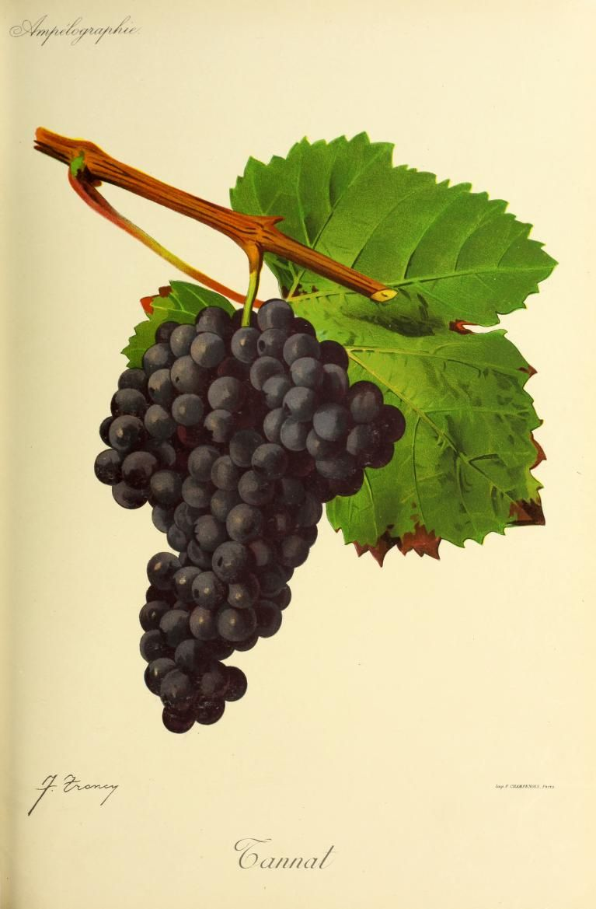

# Tannat

Tannat is a red grape from southwestern France whose main associations are
Madiran and Uruguay. It supplies substantial colour, [tannin](../concepts/tannin.md),
and acidity. Those properties give winemakers considerable material to work
with, from firm wines intended for maturation to gentler, earlier-drinking
expressions.

## From the Pyrenees to Uruguay

Plantgrape locates Tannat's origin in the Pyrenean vineyards. Madiran remains
its best-known French setting, alongside cultivation in neighbouring
southwestern districts. Here it is made both as a varietal wine and in blends,
including with [Cabernet Franc](cabernet-franc.md).

Uruguay's wine institute credits the nineteenth-century immigrant Pascual
Harriague with establishing and spreading Tannat in the country.[^1] Its
adoption gave Uruguay a durable varietal identity, while France retained
the grape within a culture more commonly organized around appellation names.
Both countries therefore provide useful contexts for understanding it.

Uruguayan production includes substantial dry reds, but also rosé and
sparkling interpretations. The wine institute's account emphasizes differences
among regions and families in blending and maturation. A national label alone
is consequently a poor guide to how firm or soft a particular Tannat will be.

## Growing and ripening

Tannat has large bunches and small to medium berries. Plantgrape describes
a fairly vigorous vine usually trained on a trellis and pruned long. It
reaches mid-season maturity in the catalogue's comparative observations.

Vineyard behaviour varies. California trials summarized by the University of
California's Grape Varieties in the USA project found useful productivity
with spur pruning, and reported different levels of vigour among sites and
plant selections. The authors suggest that clonal differences may help
explain the contrast.[^2] French guidance should therefore be read as regional
experience, not a universal pruning prescription.

The California observations also document strong colour and tannin potential
in warm growing conditions. That evidence supports Tannat's interest beyond
its French and Uruguayan strongholds. It does not establish that the vine
will behave identically in a humid Atlantic vineyard or under water shortage.
Plantgrape identifies some susceptibility to grey rot, as well as problems
with mites and leafhoppers.

## Managing structure in the cellar

The quantity of tannin in the grape is only the beginning. During
[maceration](../concepts/maceration.md), skins and seeds release tannins at
different rates. Prolonged contact can increase seed-derived extraction, and
temperature changes the result. For a tannin-rich variety, the decision to
press is therefore an important part of designing the wine's texture.

Maturation changes the extracted material through further reactions.
Winemakers can use wood, blending, oxygen exposure, and sometimes
[fining](../concepts/wine-fining.md) to shape the finished wine. These
operations affect tannin composition as well as concentration, so a supple
Tannat need not have started with unusually tannin-poor fruit.

Madiran provides a documented example of deliberate oxygen management.
The appellation body's description of Château Peyros records
micro-oxygenation, the controlled introduction of small quantities of oxygen,
alongside conventional extraction for its Tannat-led Tradition wine.[^3]
This illustrates a cellar practice without making it a requirement for the
grape or appellation. The Australian Wine Research Institute's review stresses
that micro-oxygenation outcomes vary and can be difficult to predict.[^4]

[Oak maturation](../concepts/oak-maturation.md) can add its own aroma and
texture. Fruit, extraction, blend, and time together determine whether the
result feels compact and drying or broad and rounded. Ageing potential is
useful when the rest of the wine supports the tannin; substantial tannin by
itself gives no fixed drinking window.

[^1]: Instituto Nacional de Vitivinicultura, Uruguay Wine, “Varieties,”
    historical account of Tannat and Pascual Harriague.
[^2]: Grape Varieties in the USA, “Tannat,” 2023, sections on vine traits,
    vineyard considerations, and California trials.
[^3]: Maison des Vins de Madiran et Pacherenc du Vic-Bilh, “Château Peyros,”
    Tradition wine description, accessed 14 September 2026.
[^4]: Paul Smith, Jacqui McRae & Keren Bindon, “Impacts of winemaking
    practices on tannin in red wines,” 2016.

## Sources

- IFV, INRAE & L'Institut Agro Montpellier,
  [“Tannat N”](https://www.plantgrape.fr/en/varieties/fruit-varieties/268/export),
  Plantgrape varietal record, accessed 14 September 2026.
- Grape Varieties in the USA,
  [“Tannat”](https://grapevarieties.info/grape-variety/tannat/),
  University of California viticultural extension resource, 19 January 2023.
- Instituto Nacional de Vitivinicultura, Uruguay Wine,
  [“Varieties”](https://uruguay.wine/en/varieties/) and
  [“Tannat Day: Celebrating part of Uruguayan culture for 150 years”](https://uruguay.wine/en/journal/tannat-day-celebrating-part-of-uruguayan-culture-for-150-years/),
  accessed 14 September 2026.
- Maison des Vins de Madiran et Pacherenc du Vic-Bilh,
  [“Château Peyros”](https://madiran-pacherenc.com/site/chateau-peyros/),
  producer and wine descriptions, accessed 14 September 2026.
- Paul Smith, Jacqui McRae & Keren Bindon,
  [“Impacts of winemaking practices on tannin in red wines”](https://www.awri.com.au/wp-content/uploads/2011/07/Technical_Review_Issue_222_Smith.pdf),
  Australian Wine Research Institute, *Technical Review* 222 (June 2016),
  pp. 8–11.
