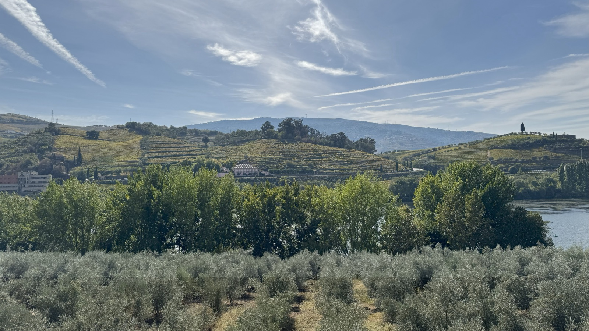

# Touriga Franca

Touriga Franca is a dark-skinned Portuguese grape. In the
[Douro](../regions/douro.md) it is more widely planted than [Touriga
Nacional](touriga-nacional.md) and a major component of both
[Port](../styles/port.md) and dry red blends. Its value is practical as well as
sensory: the vine crops more regularly than Touriga Nacional, its fruit copes
well with the Douro's heat, and its wines can add colour, [tannin](../concepts/tannin.md), fruit, and a
distinctly floral lift.

A blend may contain either Touriga in a leading or supporting proportion, and
site, crop level, harvest date, extraction, and maturation all change the
result. Touriga Franca is also bottled alone, but its large area and affinity
with other Douro grapes make blending its central regional role.

## History and identity

Touriga Franca was officially called Touriga Francesa until Portugal's 2000
list of wine grapes adopted the present name. The older name did not establish
a French origin. A Portuguese varietal reference places the grape in northern
Portugal, while warning that early mentions of vaguely named Tourigas cannot
confidently be assigned to the modern variety. The first secure history is
therefore less clear and probably more recent than the broad Touriga name
suggests.

Microsatellite analysis identified Touriga Franca as an offspring of Touriga
Nacional and Marufo, and later single-nucleotide polymorphism analysis confirmed
the parentage.[^1] Sexual reproduction combines genetic material from two
parents and creates a new variety; cuttings then preserve that new individual.
Touriga Franca consequently shares ancestry and some family resemblances with
Touriga Nacional while retaining its own genetic identity, vine morphology, and
growing behaviour.

The visible differences are substantial. Touriga Franca generally has medium
berries in medium to large, fairly compact bunches, whereas Touriga Nacional
typically has smaller berries and smaller bunches. Franca is usually more
productive and regular in its fruit set. Nacional's smaller, thick-skinned
berries can give a high ratio of skin to juice and make it especially useful for
concentrated colour, tannin, and aroma; Franca can supply more dependable volume
with its own colour and aroma.

## Viticulture in a hot region

Touriga Franca has a medium-to-long growing cycle and reaches satisfactory
ripeness in warm conditions. Its bunches resist heat damage relatively well,
and the vine tolerates strong sunlight, helping explain its suitability for
warm, exposed Douro slopes. This is heat tolerance in a practical vineyard
sense: berries can remain sound while accumulating sugar and phenolic maturity
under conditions that can shrivel more vulnerable grapes.

Water supply affects berry growth, bunch compactness, photosynthesis, and the
pace of ripening. In a three-season trial on Touriga Franca in the hot Douro
Superior, rainfed vines generally performed less well than vines under moderate
deficit irrigation, although irrigation effects on yield and berry composition
were inconsistent from year to year.[^2] Rootstock, soil depth, exposure, canopy
shade, crop, and the timing of water stress influence the outcome. Severe stress
can slow ripening or dehydrate fruit.

The compact bunches bring a different risk in damp conditions: grey rot can
develop, and humid or fertile sites may trade greater production for weaker
ripening.

## Floral character and structure

Floral character, often compared to roses or wild flowers, is one of Touriga
Franca's most recognizable contributions to a blend. A Douro analysis recorded
free terpenes including nerol, geraniol, and citronellol in the variety,
compounds associated with floral aromas.[^3] Their concentration varies with
season and site, and fermentation, blending, oxygen exposure, and maturation can
preserve, transform, or mask their aromas.

Fruit character and firm tannin commonly accompany that perfume. Skin pigments
and phenolic material can give substantial colour and structure, but neither is
constant; the specialist varietal record reports especially large year-to-year
variation in colour intensity. Extraction choices matter as well. A short,
vigorous extraction before Port is fortified expresses the raw material
differently from a complete dry fermentation or an extended [maceration](../concepts/maceration.md).

## Its place in the Douro blend

Official 2023 vineyard data put Touriga Franca at 10,727 hectares, or 25.0% of
the Douro's planted area. It was the region's most planted variety, well ahead
of [Tinta Roriz](tempranillo.md) at 14.3% and Touriga Nacional at 10.3%.[^4]

Franca's scale follows from the way its traits fit the regional system. Regular
crops give growers a more dependable supply; heat-resistant fruit suits many
warm parcels; and colour, tannin, fruit, and floral aroma remain useful in both
fortified and dry wines. Touriga Nacional may contribute a different aromatic
intensity and more concentrated skin material, while Tinta Roriz, Tinta Barroca,
Tinto Cão, and numerous older field-blend varieties alter ripening, [acidity](../concepts/acidity.md),
texture, or volume. Douro and Port rules allow a much broader set of grapes.

Outside the Douro, Touriga Franca is grown elsewhere in Portugal, including
warmer southern regions.

[^1]: Isaura Castro, Juan Pedro Martín, José M. Ortiz & Olinda Pinto-Carnide,
    “Varietal discrimination and genetic relationships of *Vitis vinifera* L.
    cultivars from two major Controlled Appellation (DOC) regions in
    Portugal,” *Scientia Horticulturae* 127 (2011), pp. 507–514,
    <https://doi.org/10.1016/j.scienta.2010.11.018>; Diana Augusto et al.,
    “Grapevine Diversity and Genetic Relationships in Northeast Portugal Old
    Vineyards,” *Plants* 10 (2021), 2755,
    <https://doi.org/10.3390/plants10122755>.
[^2]: Inês L. Cabral, Anabela Carneiro, Tiago Nogueira & Jorge Queiroz,
    “Regulated Deficit Irrigation and Its Effects on Yield and Quality of
    *Vitis vinifera* L., Touriga Francesa in a Hot Climate Area (Douro Region,
    Portugal),” *Agriculture* 11 (2021), 774,
    <https://doi.org/10.3390/agriculture11080774>.
[^3]: Vine to Wine Circle, “Touriga-Franca (PT),” including a 2003 Douro aroma
    analysis, <https://www.vinetowinecircle.com/castas_post/touriga-franca/>.
[^4]: Instituto dos Vinhos do Douro e do Porto, “Castas,” 2023 vineyard data,
    <https://www.ivdp.pt/pt/vinha/castas/>.

## Sources

- Instituto dos Vinhos do Douro e do Porto,
  [“Castas”](https://www.ivdp.pt/pt/vinha/castas/), including 2023 planting
  data and the institute's Touriga Franca varietal summary, and
  [“Vinificação”](https://www.ivdp.pt/pt/vinhos/vinhos-do-porto/vinificacao/),
  accessed 1 September 2026.
- Vine to Wine Circle,
  [“Touriga-Franca (PT)”](https://www.vinetowinecircle.com/castas_post/touriga-franca/),
  varietal record, accessed 1 September 2026.
- Isaura Castro, Juan Pedro Martín, José M. Ortiz & Olinda Pinto-Carnide,
  [“Varietal discrimination and genetic relationships of *Vitis vinifera* L.
  cultivars from two major Controlled Appellation (DOC) regions in
  Portugal”](https://doi.org/10.1016/j.scienta.2010.11.018), *Scientia
  Horticulturae* 127 (2011), pp. 507–514.
- Diana Augusto et al., [“Grapevine Diversity and Genetic Relationships in
  Northeast Portugal Old
  Vineyards”](https://doi.org/10.3390/plants10122755), *Plants* 10 (2021),
  2755.
- Inês L. Cabral, Anabela Carneiro, Tiago Nogueira & Jorge Queiroz,
  [“Regulated Deficit Irrigation and Its Effects on Yield and Quality of
  *Vitis vinifera* L., Touriga Francesa in a Hot Climate Area (Douro Region,
  Portugal)”](https://doi.org/10.3390/agriculture11080774), *Agriculture* 11
  (2021), 774.
