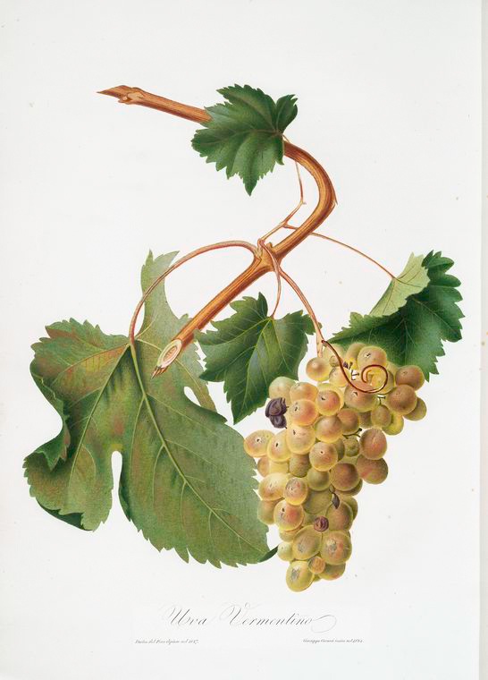

# Vermentino

Vermentino is a pale-skinned *Vitis vinifera* grape of the western
Mediterranean. It is strongly associated with Sardinia, Liguria, Tuscany,
Corsica, and Provence, although national catalogues also list it in Bulgaria,
Malta, and Spain.

Names complicate the map. French propagation material may be sold under the
names Rolle, Garbesso, or Vermentinu; Italian catalogues recognize Favorita and
Pigato as names for Vermentino. These are catalogue-level synonymies, while
local names still carry regional context.[^1]

## Rolle, Pigato, and identity

The French name Rolle is especially familiar in Provence, while Vermentinu is
used in Corsica. Pigato is associated with Liguria and Favorita with parts of
north-western Italy, as regional names for the variety. Plantgrape's varietal
record treats these names as official designations of Vermentino in their
respective national systems.[^1]

A 2010 record in Italy's CNR research repository likewise describes the synonymy
of Vermentino, Pigato, and Favorita as established and reports selections from
Sardinia, Tuscany, and Liguria. It also notes distinctive clonal traits within
the cultivar.[^2]

## A Mediterranean distribution

Plantgrape describes Vermentino as long established in Corsica and Provence and
suggests an Italian origin, while stopping short of presenting a settled
historical birthplace. The CNR record places important Italian cultivation in
Sardinia, Tuscany, and Liguria. These records place its cultivation history on
islands and the western Italian and French coasts.[^1][^2]

The distribution is also broader than the best-known coastal regions. Its
appearance in the catalogues of Bulgaria, Italy, Malta, and Spain shows that the
variety has travelled within Europe, with local planted areas varying. Within
Italy alone, Sardinian, Ligurian, and Tuscan examples sit in different climates
and wine cultures.

## Agronomy

Plantgrape calls Vermentino a southern variety adapted to hot areas and dry,
relatively infertile terroirs. It describes the vine as vigorous and rather
productive, with short pruning and [careful training](../concepts/canopy-management.md) recommended to keep the
vegetation in order. It also reports some sensitivity to grey rot and sour rot,
and considerable sensitivity to powdery mildew.[^1]

## Wine character

Plantgrape describes Vermentino's wines as balanced and full-bodied, with
aromatic richness that includes floral and pear-like associations, though they
can sometimes lack acidity.[^1] Local selection and growing conditions influence
that balance.

[^1]: Institut français de la vigne et du vin, INRAE & Institut Agro
    Montpellier, “Vermentino B,” Plantgrape varietal record, accessed 7
    September 2026, <https://www.plantgrape.fr/en/varieties/fruit-varieties/285/export>.
[^2]: F. Mannini, “Il Vermentino un vitigno mediterraneo: l'origine e la
    selezione clonale,” CNR Institutional Research Information System, 2010,
    <https://iris.cnr.it/handle/20.500.14243/69137>.

## Sources

- Institut français de la vigne et du vin, INRAE & Institut Agro Montpellier,
  [“Vermentino B”](https://www.plantgrape.fr/en/varieties/fruit-varieties/285/export),
  Plantgrape varietal record, accessed 7 September 2026.
- F. Mannini, [“Il Vermentino un vitigno mediterraneo: l'origine e la
  selezione clonale”](https://iris.cnr.it/handle/20.500.14243/69137), CNR
  Institutional Research Information System, 2010.
