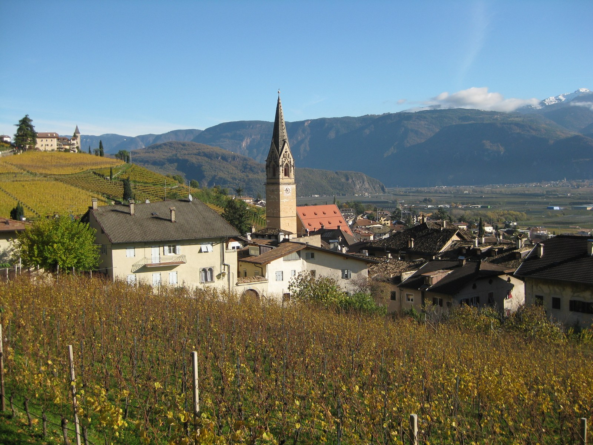

# Alto Adige

Alto Adige, also known as Südtirol or South Tyrol, is a wine region in
Italy's far north. Vineyards occupy valleys and mountain slopes around
Bolzano and beyond. Its range of elevations and exposures supports both
fresh whites and ripe reds within a relatively small area.

## Matching grape and site

The regional consortium's 2026 presentation places vineyards broadly between
200 and 1,000 metres above sea level. [Altitude](../concepts/altitude.md)
interacts with slope direction, shelter, and air movement: a warm valley
site and a high hillside can offer quite different ripening conditions.

The Valle Isarco, or Eisacktal, is particularly associated with whites such
as [Kerner](../grapes/kerner.md), [Silvaner](../grapes/silvaner.md), and
[Riesling](../grapes/riesling.md). Elsewhere,
[Pinot Blanc](../grapes/pinot-blanc.md),
[Chardonnay](../grapes/chardonnay.md), and
[Gewürztraminer](../grapes/gewurztraminer.md) are important reference points.
Local red identities include Schiava, also called Vernatsch, and Lagrein,
alongside [Pinot Noir](../grapes/pinot-noir.md).

## How to approach the wines

Coöperative wineries account for a substantial part of production, alongside
estates and independent growers. They provide a way for many small vineyard
holdings to support wines made with considerable specialization in the cellar.

A varietal label is a useful starting point, but the origin within Alto Adige
adds essential context. Comparing one grape across elevations and producers
can reveal differences in ripeness, [acidity](../concepts/acidity.md), and texture. Comparing different
grapes from the same area asks another question: how growers match each
variety's season and requirements to the available sites.

## Sources

- Consorzio Alto Adige Wines, [*Winegrowing Region of Alto Adige/Südtirol*,
  2026
  presentation.](https://www.altoadigewines.com/images/publikationen/2026_ppp_suedtirolwein_en_neu.pdf)
- Consorzio Alto Adige Wines, [regional overview.](https://www.altoadigewines.com/en)
