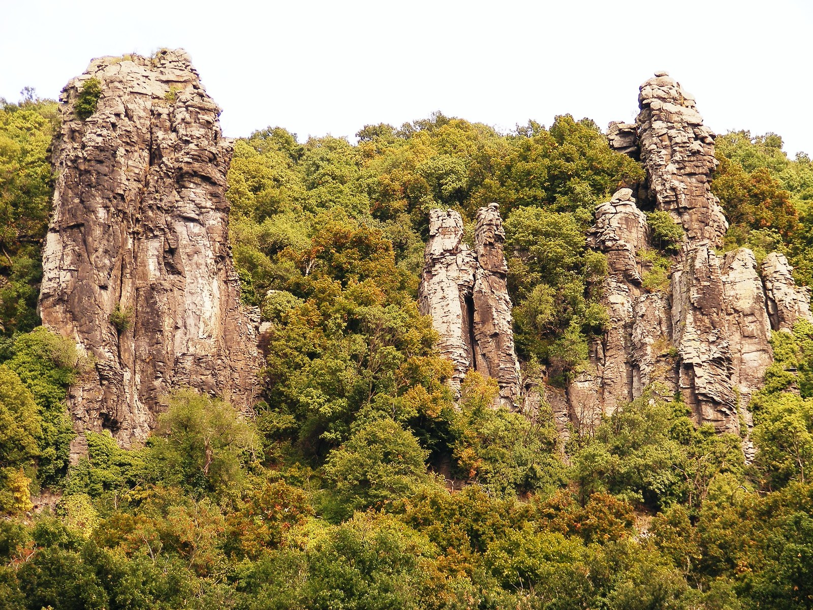

# Badacsony

Badacsony is a Hungarian wine district on and near the northern shore of
Lake [Balaton](balaton.md). Its volcanic hills and white wines make it a distinct part of
the broader Balaton landscape. The district includes several hills and
villages; Badacsony is also the name of the conspicuous flat-topped hill that
gives the area its name.

## Lake, hills, and white grapes

The lake and surrounding uplands influence growing conditions, while slopes
provide different exposures. Basalt records the area's volcanic past, but
vineyards occupy soils with varying depths and composition. A hill or vineyard
name therefore helps locate a wine within a more varied landscape than the
single word “volcanic” conveys.

[Olaszrizling](../grapes/olaszrizling.md) connects Badacsony with neighbouring
Balaton districts. [Pinot Gris](../grapes/pinot-gris.md), locally called
Szürkebarát, is another established white grape. Kéknyelű gives the region a
more localized point of reference: its continuing cultivation is an important
part of Badacsony's varietal identity.

## Continuity through cultivation

The Kéknyelű Winery's account, published by the regional wine-route association,
describes vineyards on Badacsony's southern slopes planted with Kéknyelű,
Budai Zöld, Olaszrizling, and Pinot Gris. The family also records propagating
Kéknyelű from its registered source vineyard. This is a concrete example of
how a local grape survives through maintaining and multiplying planting
material.

The same account describes wooden-barrel maturation before bottling. Alongside
grape choice and site, this introduces another reason for differences among
the district's white wines. Comparing Badacsony with
[Csopak](csopak.md) through Olaszrizling, or exploring its local grapes, offers
two complementary routes into the region.

## Sources

- Hungarian Tourism Agency, [*Personally: Hungarian
  Wine*](https://visithungary.com/documents/8/81/818/818d7ef5ba17893df0caf80b9e4a1c65ee03147.pdf),
  Balaton section.
- Badacsony Tourism and Wine Route Association, [“Kéknyelű
  Winery”](https://badacsony.com/public/index.php/en/services/gastronomy/8802-keknyelu-winery),
  producer account and regional navigation, accessed 22 September 2026.
