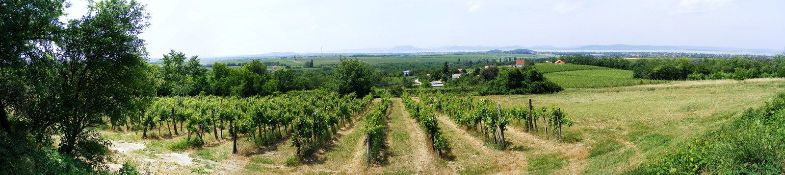

# Balaton

Balaton is a broad Hungarian wine region named for Lake Balaton. It groups
six wine districts: Badacsony, Balatonfüred-Csopak, Balaton Highlands,
Balatonboglár, Zala, and Somló. The shared regional name therefore reaches
beyond the lakeshore, including vineyards with different landforms and
individual identities.

[Olaszrizling](../grapes/olaszrizling.md) provides a connection across this
territory. Its role includes approachable wines intended for relatively early
drinking and more narrowly sourced bottlings that emphasize a village or
vineyard.

## Reading the regional names

[Badacsony](badacsony.md) and [Csopak](csopak.md) are useful starting points
on the northern side of the lake. [Somló](somlo.md), farther inland to the
north, has its own volcanic hill and close association with
[Juhfark](../grapes/juhfark.md). Balatonboglár occupies the southern side of
the lake, while Zala extends westwards. A wine described broadly as Balaton
may consequently have a quite different geographical context from another
bottle carrying the same regional reference.

These layers of naming also distinguish a place from a shared commercial
project. BalatonBor is a specific collective wine identity within the broader
region.

## Olaszrizling as a common language

Balatoni Kör and Rizling Generáció established BalatonBor around Olaszrizling
and a recognizable, fresh style. The project's account describes both
production criteria and a tasting assessment for participating wines. Its
purpose includes connecting local growers with restaurants and other outlets
around the lake.

This coöperation gives a widely planted grape a collective identity while
leaving room for individual estates to make other wines. Comparing a
BalatonBor with a producer's village or vineyard Olaszrizling can help explain
the difference between a shared regional style and a more specific statement
of origin.

## Sources

- Hungarian Wine Marketing Agency, [“Wine
  regions”](https://bor.hu/en/wine-regions/), regional grouping and map,
  accessed 22 September 2026.
- Balatoni Kör, [“BalatonBor”](https://balatonikor.hu/balatonbor/),
  project account, accessed 22 September 2026.
