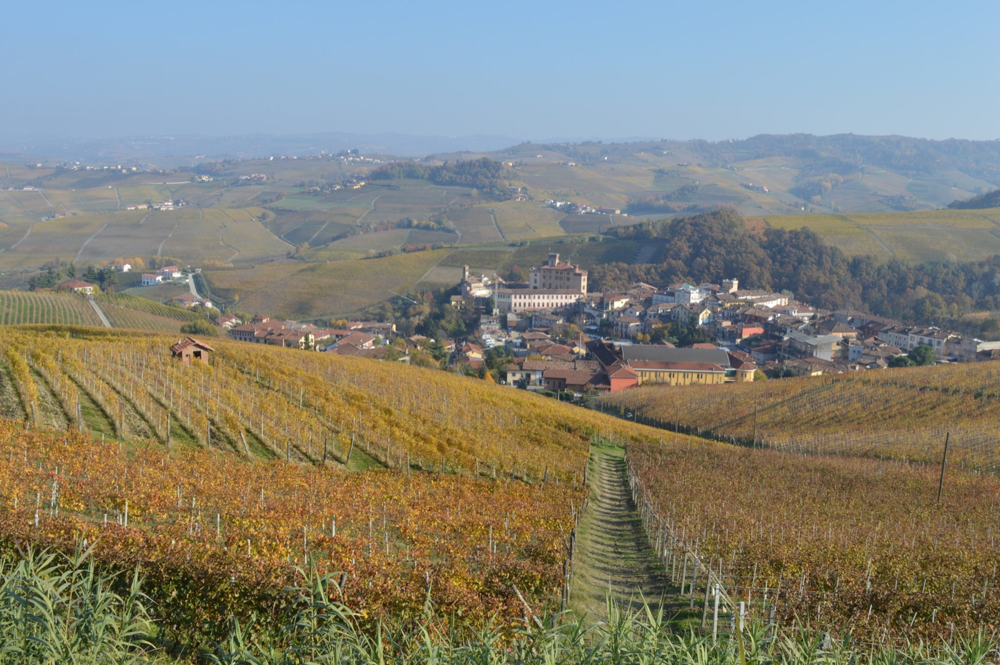

# Barolo

Barolo is a red-wine appellation in the Langhe hills of Piedmont, south of
Alba, and the name of the wine made under its rules. It is not a synonym for a
grape or a general style of Italian red. Current Barolo Denominazione di
Origine Controllata e Garantita (DOCG) rules require vineyards planted
exclusively to [Nebbiolo](../grapes/nebbiolo.md), grapes from a delimited zone,
and specified production and maturation. Nebbiolo grown elsewhere is not
Barolo, while Barolo itself varies substantially with site, season, farming,
and cellar decisions.

## Geography and growing conditions

The zone occupies a set of ridges in the southwestern Langhe, within the
province of Cuneo. It includes all of the communes of Barolo, Castiglione
Falletto, and Serralunga d'Alba, and designated parts of La Morra, Monforte
d'Alba, Novello, Verduno, Grinzane Cavour, Diano d'Alba, Cherasco, and Roddi.
The rules admit only hillside vineyards between 170 and 540 metres above sea
level; valley floors and insufficiently sunny sites are excluded, as are
directly north-facing slopes for new plantings.[^1]

The hills developed from layered marine sediments, but “calcareous marl” is
only a useful starting point. The Lequio Formation, with alternating marl and
sandstone, appears in central and southern Serralunga and eastern Monforte.
Sant'Agata Fossili marls spread through several central and western areas,
while Diano sandstones occur in parts of Monforte, Castiglione Falletto,
Barolo, and Diano d'Alba; gravel, gypsum-bearing strata, and other formations
add further local differences. Geological boundaries therefore do not match
commune boundaries neatly.

Elevation, slope, and aspect change sunlight, temperature, wind, and water
movement over short distances. A study using weather records from 1996–2019
found that maximum temperatures and the Huglin heat index declined
consistently with elevation across the topographically complex zone, while
minimum temperatures behaved differently.[^2] These relationships matter for
late-ripening Nebbiolo, but they do not make altitude or any one soil type a
stand-alone measure of quality. Soil depth, water availability, canopy and
crop management, harvest date, and vintage can alter the result.

## Communes and named sites

Commune names are useful coordinates, not official grades or dependable style
categories. Broad descriptions of, for example, La Morra, Serralunga d'Alba,
or Monforte d'Alba can orient a reader, but each contains different elevations,
exposures, soils, and producers. Some geological formations also continue
from one commune into another. A commune-wide character is consequently a
tendency inferred from many wines, not a rule every bottle must follow.

Since the 2010 vintage, the regulations have defined *menzioni geografiche
aggiuntive* (additional geographical mentions, commonly abbreviated MGA).
These include commune-wide mentions and smaller named areas such as Cannubi,
Bussia, and Monvigliero. An MGA states where the grapes came from; it does not
rank the place, guarantee a uniform soil or exposure, or prescribe a cellar
method. A producer may instead use the unqualified Barolo name for wine that
does not claim one of these narrower origins. The further term *vigna*,
followed by a registered vineyard name, may appear only together with an MGA
and brings additional traceability and production conditions.[^1]

This system makes origin more legible without turning the appellation into a
pyramid. An MGA can contain multiple parcels and producers, and two wines from
the same named area can differ through vine age, farming, harvest decisions,
fermentation, extraction, maturation vessel, and blending choices. Conversely,
a Barolo assembled from several sites can express a deliberate balance rather
than an absence of place.

## Wine and maturation

Nebbiolo can combine relatively modest colour with substantial acidity and
tannin. In Barolo, the long growing season makes the balance among sugar,
acidity, and skin and seed maturity especially dependent on site and year.
Maceration and extraction then determine how the cellar handles the grape's
phenolic material. No appellation rule fixes maceration length, fermentation
vessel, or a single sensory profile.

The current rules require ordinary Barolo to mature for at least 38 months
from 1 November of the harvest year, including 18 months in wood; release is
permitted from 1 January of the fourth year after harvest. *Riserva* requires
at least 62 months in total, again with 18 months in wood, and may be released
from 1 January of the sixth year.[^1] These are minimum periods, not a recipe.
The rules do not specify barrel size, the age of the wood, or how the remaining
time must be divided among vessel and bottle.

Large, seasoned casks and smaller or newer barrels can therefore both produce
legal Barolo, as can different approaches to extraction and blending. Wood can
moderate and reshape tannin through time and oxygen exposure, but compulsory
wood ageing does not require an obvious oak flavour. Bottle development can
further soften texture and change aroma after legal release, though longevity
varies by site, vintage, producer, storage, and the individual wine. “Barolo”
on a label defines origin and compliance first; it does not promise one
weight, flavour set, or drinking window.

## Historical development

Winegrowing around the village long predates the modern appellation, but old
references do not necessarily describe today's wine. A documented Turin notice
offered bottled *vino di Barolo* for sale in 1828, and a Genoa advertisement
used *vino Barolo* in 1833; neither establishes the precise grape composition
or production method.[^3]

During the nineteenth century, landowners and technicians changed both
vineyard organization and cellar practice. Camillo Benso di Cavour brought
Paolo Francesco Staglieno to Grinzane in 1836 to direct harvest and
fermentation work, and Staglieno described his methods in an 1837 manual.
Giulia and Tancredi Falletti, Cavour, the Savoy estates, Staglieno, and later
Louis Oudart all belong to the documented development and wider circulation of
Langhe Nebbiolo wines. The familiar story in which Oudart alone transformed a
uniformly sweet local wine into dry Barolo is too simple: the evidence points
to overlapping experiments, improving control of fermentation and wine
stability, and a gradual emergence of the modern dry wine.[^4]

Legal definition came later. The present specification traces the delimited
zone to a 1933 ministerial decree; Barolo received DOC status in 1966 and DOCG
status in 1980. The 2010 amendments formally delimited the additional
geographical mentions now seen on labels.[^1] These stages progressively fixed
the relationship among name, grape, place, and production rules. They did not
freeze Barolo into one cellar style, nor did they convert its communes and
sites into a legal quality ranking.

[^1]: Ministero dell'agricoltura, della sovranità alimentare e delle foreste,
    *Disciplinare di produzione della DOCG Barolo*, consolidated 4 March 2026,
    articles 1–5 and 8.
[^2]: Alena Wilson, Silvia Guidoni & Vittorino Novello, “Geospatial trends of
    bioclimatic indexes in the topographically complex region of Barolo DOCG,”
    *IVES Conference Series*, Terclim 2022.
[^3]: Debora de Fazio, “Deonimici di-vini,” *Treccani Lingua Italiana*, 11
    August 2023, citing the 29 November 1828 *Gazzetta Piemontese* and 26
    October 1833 *Gazzetta di Genova* notices.
[^4]: Paola Gullino, “Dalla teoria alla sperimentazione: successi e
    inconvenienti,” in Silvia Cavicchioli, ed., *Camillo Cavour e
    l'agricoltura*, 2011, pp. 173–74; Kerin O'Keefe, *Barolo and Barbaresco:
    The King and Queen of Italian Wine*, 2014.

## Related topics

- [Nebbiolo](../grapes/nebbiolo.md)

## Sources

- Ministero dell'agricoltura, della sovranità alimentare e delle foreste,
  [*Disciplinare di produzione della DOCG
  Barolo*](https://www.masaf.gov.it/flex/cm/pages/ServeBLOB.php/L/IT/IDPagina/24322),
  consolidated 4 March 2026, accessed 1 September 2026.
- Consorzio di Tutela Barolo Barbaresco Alba Langhe e Dogliani, [official
  Barolo additional geographical mentions
  map](https://www.langhevini.it/wp-content/uploads/2019/07/MeGa-Barolo.pdf),
  reflecting the 2010 production rules, accessed 1 September 2026.
- Consorzio di Tutela Barolo Barbaresco Alba Langhe e Dogliani, [“Climate &
  Geology”](https://www.langhevini.it/en/clima/), accessed 1 September 2026.
- Alena Wilson, Silvia Guidoni & Vittorino Novello, [“Geospatial trends of
  bioclimatic indexes in the topographically complex region of Barolo
  DOCG”](https://ives-openscience.eu/12711/), *IVES Conference Series*,
  Terclim 2022.
- Paola Gullino, [“Dalla teoria alla sperimentazione: successi e
  inconvenienti”](https://iris.unito.it/bitstream/2318/1659931/1/Cavour_-_Gullino%20stampato.pdf),
  in Silvia Cavicchioli, ed., *Camillo Cavour e l'agricoltura*, Istituto per
  la Storia del Risorgimento Italiano, 2011.
- Debora de Fazio, [“Deonimici di-vini”](https://www.treccani.it/magazine/lingua_italiana/articoli/parole/deonimici17.html),
  *Treccani Lingua Italiana*, 11 August 2023.
- Kerin O'Keefe, [*Barolo and Barbaresco: The King and Queen of Italian
  Wine*](https://www.ucpress.edu/books/barolo-and-barbaresco/epub-pdf),
  University of California Press, 2014.
