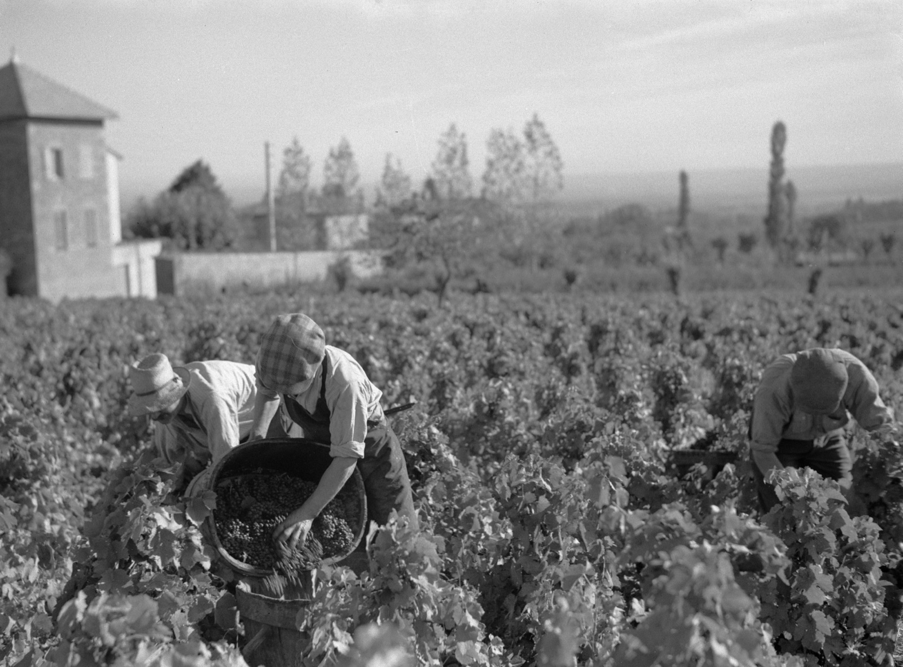

# Beaujolais

Beaujolais is a wine region on the eastern edge of the Massif Central, between
Lyon and Mâcon, and the name of its broad regional appellation. It is closely
identified with [Gamay](../grapes/gamay.md), Beaujolais Nouveau, and
[carbonic maceration](../concepts/carbonic-maceration.md). None is an adequate
definition on its own. The region also produces non-nouveau red and rosé wine,
white wine from [Chardonnay](../grapes/chardonnay.md), Beaujolais carrying the
*Villages* mention, and the red wines of ten separate cru appellations.

Understanding that range requires two distinctions. Beaujolais contains
contrasting land rather than a single granitic terroir, and its appellation
names identify different delimited origins and production rules rather than a
dependable ladder of taste or quality.

## Geography and a mosaic of soils

The vineyard runs for about 55 kilometres along the slopes between the Monts
du Beaujolais to the west and the Saône plain to the east. Most sites face east
or south, but elevation, slope, and exposure change substantially within this
narrow strip. The mountains reduce the direct influence of westerly weather,
while the Saône valley channels warmer air from the south. Continental,
oceanic, and southern influences therefore meet in a landscape where storms,
summer heat, rainfall, wind, and harvest conditions can differ over short
distances.[^1]

The useful first approximation is a north–south geological contrast. In the
north, old Paleozoic granites, porphyries, schists, diorites, and
volcano-sedimentary rocks weather into soils that may be sandy or clay-rich and
are generally acidic. Farther south, younger Triassic and Jurassic limestone
formations more often underlie deeper, more clay-rich soils. This is not a
clean dividing line. Ancient river terraces, slope deposits, and alluvial fans
cover the bedrock in many places, while metamorphic and volcanic formations
interrupt any simple map of granite in the north and limestone in the south.

A regional soil survey conducted from 2009 to 2017 distinguished, among its
common groups, soils formed from granite, the mixed formations locally called
*pierres bleues*, hard limestone, clay with chert, and older clay-rich or
sandy alluvio-colluvial deposits. It also found substantial variation within
these groups.[^2] Rock name alone consequently says little about soil depth,
texture, water storage, rooting, or vine management. Even within granitic
Fleurie, for example, steep upper slopes can have shallow sandy soils and
exposed bedrock, while colluvium downslope produces deeper soils with more clay
and fine material.

These differences matter through vine water supply, drainage, temperature,
and the timing of ripening, but they do not transmit a fixed flavour or quality
rank from rock to wine. An observatory of Gamay sites in Beaujolais found
strong vintage and site effects; appellation explained the timing of ripening
poorly, and measured soil composition had only a weak relationship with the
grape and wine characteristics studied.[^3] That result does not make geology
irrelevant. It places geology among interacting conditions that also include
topography, weather, farming, crop level, and harvest date.

## Gamay and the region's other wines

Gamay is the principal variety for red and rosé Beaujolais and for the ten
crus. Its fertility makes pruning and crop management consequential, while its
compact bunches make fruit health and harvest handling important in wet years.
The combination of site, season, crop, and extraction helps explain why Gamay
here can yield both immediately supple wines and firmer wines capable of
developing in bottle.

The legal position is slightly less absolute than the phrase “Gamay region”
suggests. Current regional rules permit limited accessory varieties in red and
rosé vineyards, some only as mixed plants within a parcel. The cru rules also
center Gamay but preserve a narrow allowance for mixed plantings: under
the current Fleurie specification, for example, Aligoté, Chardonnay, and Melon
may together occupy no more than 15 percent of a parcel and must be interplanted
with the principal variety.[^4] In practice, Gamay remains the defining red
grape, but “100 percent Gamay” should not be treated as a universal legal rule.

For white Beaujolais—including wine carrying the *Villages* mention—the
current regional specification requires Chardonnay alone. Rosé and white wine
are less central to the region's public image, yet their existence is another
reason not to equate Beaujolais with one red winemaking method.

## Appellation names without a ladder

The broad Beaujolais appellation covers red, rosé, and white still wine. Within
its own specification, *Villages* is a supplementary geographical mention for
wine from a delimited group of northern communes; qualifying wines may instead
carry the approved commune name. *Beaujolais Supérieur* is a red-only mention
defined by production conditions including lower permitted yield and greater
minimum grape ripeness. It is not a separate place-name or an official verdict
that every such wine is superior in the glass.[^5]

The ten crus—Brouilly, Chénas, Chiroubles, Côte de Brouilly, Fleurie, Juliénas,
Morgon, Moulin-à-Vent, Régnié, and Saint-Amour—are different. Each is a
separately delimited appellation for red wine, with its own specification. A
cru name tells the reader where the grapes qualified to come from; it does not
prescribe a single cellar method or rank that cru against the other nine.

Nor is each cru geologically uniform. Chiroubles and Fleurie are strongly
associated with weathered pink granite, yet depth and texture change down their
slopes. Côte de Brouilly wraps around steep Mont Brouilly and combines the
so-called blue-rock formations with granite and slope debris. Juliénas
includes schist, diorite, sandstone, and clay, while Saint-Amour includes
granite, schist, clay, limestone, and piedmont deposits. Broadly granitic
Brouilly still contains blue-rock, sedimentary, piedmont, and colluvial ground.
Differences also occur within a named lieu-dit, and two producers can farm and
vinify neighbouring parcels differently.

The categories therefore overlap without forming a simple pyramid. A producer
may use a broader appellation when eligible wine is not claimed under a
narrower one, and a blend of sites can be as deliberate as a single-parcel
bottling. Current cru rules permit a cadastral lieu-dit on the label, but that
does not make the site a classified tier. As of September 2026, the Fleurie
specification contains no *premier cru* category: the Institut national de
l'origine et de la qualité (INAO) describes proposed Fleurie lieux-dits as
candidates, not recognized premiers crus.[^6]

## Production choices and Nouveau

Traditional Beaujolais vinification is usually semi-carbonic rather than a
pure application of [carbonic
maceration](../concepts/carbonic-maceration.md). Whole bunches fill the vat;
berries near the bottom break and begin an ordinary yeast fermentation, whose carbon
dioxide creates anaerobic conditions for intact berries above. Intracellular
metabolism and yeast fermentation thus proceed together. The proportion of
whole fruit, temperature, vatting time, pumping over, cap management, pressing,
and the treatment of free-run and press wine all change the result.

Producers are not confined to that approach. They may extend maceration and
work the cap for greater extraction, destem some or all of the crop, or mature
wine in concrete, steel, large cask, or smaller barrel. Semi-carbonic practice
can produce a cru intended to age, while destemmed vinification can make a
relatively accessible wine. Appellation, vessel, and technique each answer a
different question; none determines the finished character by itself.[^7]

*Nouveau* and *primeur* are regulated early-release mentions, not methods and
not synonyms for the region. Under the current Beaujolais specification, they
apply only to red or rosé Beaujolais, with or without the *Villages* mention.
The wine must come from that year's harvest, remain in vat for no more than ten
days, and be packaged before the end of the harvest year. The permitted
production calculation excludes land delimited for the ten crus. These rules
encourage rapid vinification and an immediately approachable wine, but they do
not require one precise carbonic recipe.[^5]

Nouveau's international visibility made a seasonal category stand for the
whole region. Reading Beaujolais by place, however, reveals a broader picture:
Gamay grown across contrasting slopes and soils, regional and village names
with specific legal meanings, ten geographically varied crus, and production
choices that can emphasize either immediacy or development without assigning
either aim an automatic quality rank.

[^1]: French Ministry of Agriculture, *Cahier des charges de l'appellation
    d'origine contrôlée « Beaujolais »*, approved 5 August 2026, sections
    IV and X.1.a.
[^2]: Jean-Yves Cahurel et al., “Soil quality in Beaujolais vineyard:
    Importance of pedology and cultural practices,” *IVES Conference Series*,
    Terclim 2022; Inter Beaujolais, “Discovering the Beaujolais terroirs,” on
    the 2009–2018 SIGALES survey.
[^3]: V. Lempereur, S. Preys & J.-Y. Cahurel, “Etude des effets millésime,
    situation et sol à partir d'un observatoire du Gamay en beaujolais,”
    *IVES Conference Series*, Terroir 2010.
[^4]: French Ministry of Agriculture, current Beaujolais specification,
    section V; *Cahier des charges de l'appellation d'origine contrôlée
    « Fleurie »*, approved 20 February 2024, section V.
[^5]: French Ministry of Agriculture, current Beaujolais specification,
    sections II, III, VII–IX, and XII.
[^6]: French Ministry of Agriculture, current Fleurie specification, sections
    II and XII; INAO, “Séance itinérante du CRINAO
    Bourgogne-Beaujolais-Savoie-Jura dans le Beaujolais,” 21 May 2025.
[^7]: International Organisation of Vine and Wine, “Carbonic maceration,”
    *International Code of Oenological Practices*, II.1.7; Inter Beaujolais,
    “The Grower's Work”; James Lawther, “Beaujolais: revival of the fittest,”
    *Decanter*, updated 17 October 2016.

## Related topics

- [Gamay](../grapes/gamay.md)
- [Carbonic maceration](../concepts/carbonic-maceration.md)
- [Chardonnay](../grapes/chardonnay.md)

## Sources

- French Ministry of Agriculture, [*Cahier des charges de l'appellation
  d'origine contrôlée «
  Beaujolais »*](https://info.agriculture.gouv.fr/boagri/document_administratif-587d5ea5-ef21-44d1-ad87-80a5851ec807/telechargement),
  approved 5 August 2026 and published 20 August 2026, accessed 1 September
  2026.
- French Ministry of Agriculture, [*Cahier des charges de l'appellation
  d'origine contrôlée «
  Fleurie »*](https://info.agriculture.gouv.fr/gedei/site/bo-agri/document_administratif-ae856647-fb0e-4e7f-ab5c-5f019d04abf7/telechargement),
  approved 20 February 2024, accessed 1 September 2026.
- *Légifrance*, [*Décret n° 2009-1343 du 29 octobre 2009 relatif aux
  appellations d'origine contrôlées « Brouilly », « Chénas », « Chiroubles »,
  « Côte de Brouilly », « Fleurie », « Juliénas », « Morgon »,
  « Moulin-à-Vent », « Saint-Amour » et
  « Régnié »*](https://www.legifrance.gouv.fr/loda/id/JORFTEXT000021218278/),
  consolidated through 20 September 2023, accessed 1 September 2026.
- Institut national de l'origine et de la qualité, [“Séance itinérante du
  CRINAO Bourgogne-Beaujolais-Savoie-Jura dans le
  Beaujolais”](https://www.inao.gouv.fr/crinao-bbsj-mai-2025), 21 May 2025,
  accessed 1 September 2026.
- Jean-Yves Cahurel et al., [“Soil quality in Beaujolais vineyard: Importance
  of pedology and cultural
  practices”](https://ives-openscience.eu/wp-content/uploads/2022/06/C3-oral-CahurelJY_ok.pdf),
  *IVES Conference Series*, Terclim 2022.
- V. Lempereur, S. Preys & J.-Y. Cahurel, [“Etude des effets millésime,
  situation et sol à partir d'un observatoire du Gamay en
  beaujolais”](https://ives-openscience.eu/6037/), *IVES Conference Series*,
  Terroir 2010.
- Inter Beaujolais, [“Discovering the Beaujolais
  terroirs”](https://www.beaujolais.com/en/2020/09/22/discovering-the-beaujolais-terroirs/),
  [“Our 12
  appellations”](https://www.beaujolais.com/decouvrir/nos-12-appellations/),
  and [“The Grower's
  Work”](https://www.beaujolais.com/en/discover/know-how/the-grower-s-work/),
  accessed 1 September 2026.
- International Organisation of Vine and Wine, [“Carbonic
  maceration”](https://www.oiv.int/standards/international-code-of-oenological-practices/part-ii-oenological-treatments-and-practices/grapes/carbonic-maceration),
  *International Code of Oenological Practices*, II.1.7, accessed 1 September
  2026.
- James Lawther, [“Beaujolais: revival of the
  fittest”](https://www.decanter.com/features/beaujolais-revival-of-the-fittest-245534/),
  *Decanter*, updated 17 October 2016.
