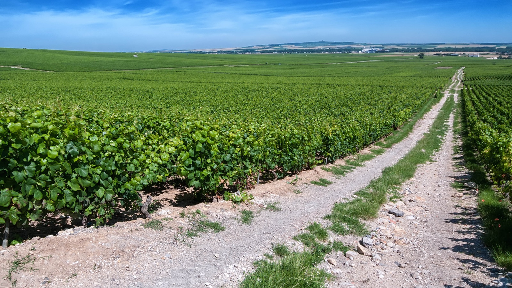

# Champagne

Champagne is a delimited wine appellation in northeastern France and the name
reserved for its white and rosé sparkling wines. It is not a generic term for
bottle-fermented wine: grapes must come from approved parcels, and growing,
pressing, winemaking, ageing, and release are governed by the appellation's
rules. Within that shared framework, Champagne can differ markedly with place,
grape, harvest, blending, reserve wine, fermentation, lees ageing, and dosage.

## Geography and climate

The appellation's vineyards are dispersed around Reims, Épernay, and farther
south. Its precisely delimited parcels lie across communes in the
Marne, Aube, Aisne, Haute-Marne, and Seine-et-Marne departments. Most vines
occupy slopes cut into the eastern edge of the Paris Basin. Chalk is important,
especially in the central districts, while marl, harder limestone, sand, and
overlying slope deposits alter drainage,
water supply, and vine behaviour from one sector to another.[^1]

Champagne's northern position and combined oceanic and continental influences
have historically produced a relatively cool growing season. Regular rain can
support vine growth but also raises disease pressure, while continental weather
brings useful summer sunshine as well as damaging frost. Slopes and exposure
help fruit receive enough light and shed excess water; differences in aspect,
soil depth, and shelter can nevertheless change ripening over short distances.
Retained acidity is valuable in a base wine that will undergo a second
fermentation. Growers balance it against sugar, fruit health, and maturity.
The Comité Champagne reports increasingly early harvest
starts as the climate warms, alongside continuing frost and weather risks.

## Subregions and grapes

Four broad names provide a useful first map: Montagne de Reims, Vallée de la
Marne, Côte des Blancs, and Côte des Bar. They are not separate appellations or
uniform style zones. The Montagne de Reims is strongly associated with [Pinot
Noir](../grapes/pinot-noir.md), yet its north- and south-facing slopes ripen
differently, and Chardonnay and [Meunier](../grapes/pinot-meunier.md) also have important sites. The long
Vallée de la Marne contains more clay-rich as well as chalky and sandy ground;
Meunier is particularly important toward the west, while Pinot Noir is more
prominent in parts nearer Épernay.

The chalk slopes of the Côte des Blancs are dominated by
[Chardonnay](../grapes/chardonnay.md). Farther south, the Côte des Bar is a
discontinuous landscape of valleys, with more marl and limestone and a strong
Pinot Noir majority. Even this four-part description leaves out meaningful
districts such as the Côte de Sézanne, Vitryat, and Montgueux.

Chardonnay, Pinot Noir, and Meunier account for nearly all current plantings.
Chardonnay can retain acidity while ripening gradually; Pinot Noir ripens early
and can contribute phenolic structure even when pressed without prolonged skin
contact. Meunier buds later than the other two, which can reduce exposure to
spring frost, and is well established in cooler or more clay-influenced sites.
Each grape can also be bottled alone. Current rules additionally name Arbane,
Petit Meslier, [Pinot Blanc](../grapes/pinot-blanc.md), [Pinot Gris](../grapes/pinot-gris.md), and
Chardonnay Rose; Voltis has tightly
limited status as a variety of interest for climate adaptation.[^1]

## Production, reserve wines, and blending

Whole bunches are harvested by hand and taken intact to the press. Controlled
pressing limits colour and coarse extraction, allowing pale base wines to be
made from dark-skinned Pinot Noir and Meunier as well as Chardonnay. Juice
fractions are separated, and producers may then keep parcels, villages, grapes,
and press fractions apart. Fermentation in steel or wood, the use or avoidance
of [malolactic fermentation](../concepts/malolactic-fermentation.md), and oxygen management give the blender base wines
with different properties.

Blending may cross grapes and origins, but it need not: Champagne can come from
one variety, one village, or a single parcel. A non-vintage cuvée may also
combine the current harvest with reserve wines—still base wines retained from
earlier years. Reserves can supply maturity and continuity or become part of a
deliberately changing blend; their proportion, age, storage vessel, and
oxidative history all matter. “Reserve wine” here names a blending component,
not a general quality rank. Vintage Champagne, by contrast, must derive its base
wines from the year shown and cannot include earlier reserve wines.[^2]

After blending, the [traditional method](../styles/traditional-method-sparkling-wine.md)
creates the bubbles. The base wine is bottled with yeast and tirage liqueur for
a second fermentation in that bottle. It then matures on the yeast deposit
before riddling moves the sediment to the neck, disgorgement removes it, and
dosage may adjust the final balance. Rosé can be made through skin contact or by
blending red and white base wines before tirage; *blanc de blancs* and *blanc de
noirs* identify white Champagne from white or dark grapes respectively.

## Ageing and variation

Disgorgement may not occur until at least 12 months after tirage, during which
the wine must remain continuously in bottle. Release to consumers requires at
least 15 months from tirage for Champagne without a vintage indication and 36
months for vintage Champagne.[^2] Producers may keep wines on their lees or in
cellar longer.

Lees contact can change texture, foam, and aroma as yeast cells break down, yet
the result also depends on the base wine, temperature, oxygen, and duration.
Disgorgement and dosage establish a new stage of development under the final
closure. A young multi-vintage blend built around fresh base wines, an
oxidatively handled blend with old reserves, and a long-aged single-vineyard
vintage wine may all satisfy the same appellation.

## Benchmark producers

**Bollinger** is a useful reference for Pinot Noir-led blending and the role
of mature reserves. Its Special Cuvée combines the latest harvest with a
majority of reserve wines, including a portion kept for years in magnums under
cork. Those reserves contribute a developed aromatic component before the
finished blend begins its own bottle ageing. Independent coverage has singled
out this reserve-wine contribution to the house's broad, mature style.[^3]

**Pierre Péters**, based in Le Mesnil-sur-Oger, offers a grower's perspective
on Côte des Blancs Chardonnay. Small steel tanks preserve separate origins
and press fractions before blending. Cuvée de Réserve draws on several
harvests, while Les Chétillons is a vintage wine from a single vineyard in
Le Mesnil. The contrast makes Péters useful for comparing a sustained
blending tradition with a more tightly defined origin, within one estate's
Blanc de Blancs range.[^4]

[^1]: French Ministry of Agriculture, *Cahier des charges de l'appellation
    d'origine contrôlée « Champagne »*, approved 31 July 2025, sections IV–V
    and X.
[^2]: Ibid., sections IX.2 and IX.5. Vintage base wines must come from the
    stated harvest, apart from authorized winemaking products and the contents
    of tirage or expedition liqueurs.
[^3]: *La Revue du vin de France*, “Champagne : Bollinger, Special Cuvée”;
    Champagne Bollinger, current “Special Cuvée” and “Reserve magnums” pages,
    accessed 14 September 2026.
[^4]: *Le Figaro Vin*, “Pierre Péters”; Champagne Pierre Péters, current
    estate, winemaking, and wine-range pages, accessed 14 September 2026.

## Related topics

- [Traditional-method sparkling wine](../styles/traditional-method-sparkling-wine.md)
- [Chardonnay](../grapes/chardonnay.md)
- [Pinot Noir](../grapes/pinot-noir.md)

## Sources

- Ministère de l'Agriculture et de la Souveraineté alimentaire,
  [*Cahier des charges de l'appellation d'origine contrôlée
  « Champagne »*](https://info.agriculture.gouv.fr/boagri/document_administratif-677d59b2-d392-4220-9fa3-e65dbc723244/telechargement),
  approved 31 July 2025 and published 7 August 2025, accessed 1 September 2026.
- Comité Champagne, [“The Champagne
  region”](https://www.champagne.fr/en/about-champagne/a-great-blended-wine/the-champagne-region),
  [“Champagne and its
  climate”](https://www.champagne.fr/en/about-champagne/the-champagne-terroir/champagne-and-its-climate),
  and [“Grape
  varieties”](https://www.champagne.fr/en/about-champagne/a-great-blended-wine/champagne-and-its-grape-varieties),
  accessed 1 September 2026.
- Comité Champagne, [“Blending”](https://www.champagne.fr/en/about-champagne/how-champagne-is-made/blending-champagne),
  [“Bottling and second
  fermentation”](https://www.champagne.fr/en/about-champagne/how-champagne-is-made/bottling-and-second-fermentation),
  and [“Maturation on
  lees”](https://www.champagne.fr/en/about-champagne/how-champagne-is-made/maturation),
  accessed 1 September 2026.
- Tom Hewson, [“Champagne Report: The two faces of the Montagne de
  Reims”](https://www.decanter.com/wine/wine-regions/champagne-report-the-two-faces-of-the-montagne-de-reims/),
  *Decanter*, 13 April 2026.
- *La Revue du vin de France*, [“Champagne : Bollinger, Special
  Cuvée”](https://www.larvf.com/,vin-champagne-bollinger-special-cuvee,4510618.asp),
  accessed 14 September 2026.
- Champagne Bollinger,
  [“Special Cuvée”](https://www.champagne-bollinger.com/en/wine/special-cuvee/)
  and [“Reserve
  magnums”](https://www.champagne-bollinger.com/en/news/reserve-magnums/),
  accessed 14 September 2026.
- *Le Figaro Vin*, [“Pierre
  Péters”](https://avis-vin.lefigaro.fr/vins-champagne/champagne/d10783-pierre-peters),
  accessed 14 September 2026.
- Champagne Pierre Péters, [estate overview](https://champagne-peters.com/en/home),
  [“Winemaking”](https://champagne-peters.com/en/winemaking), and
  [wine range](https://champagne-peters.com/en/vintage), accessed
  14 September 2026.
