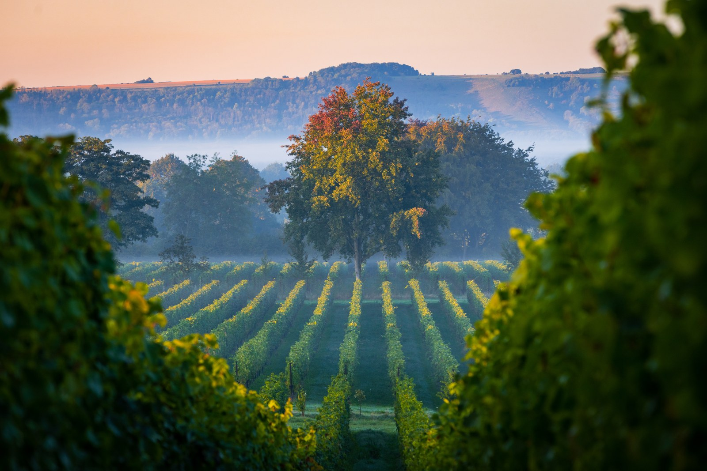

# England

England is an established contemporary winegrowing country whose production
includes [traditional-method sparkling wine](../styles/traditional-method-sparkling-wine.md) and an increasingly varied range
of still wines. [Chardonnay](../grapes/chardonnay.md),
[Pinot Noir](../grapes/pinot-noir.md), and
[Meunier](../grapes/pinot-meunier.md) are central to the sparkling tradition;
[Bacchus](../grapes/bacchus.md) provides another distinctive route into its
white wines.

## Regional differences

Southern and southeastern England contain much of the industry's vineyard
base. Sussex and Hampshire are important sparkling-wine reference points,
while Kent supports both sparkling and still production. Essex, especially
the Crouch Valley, has become important for still Chardonnay and Pinot Noir.
These county names provide orientation, though soils and growing conditions
also vary within their boundaries.

Chalk is part of the landscape, alongside greensand, clay, and other soils.
A shared rock type with [Champagne](champagne.md) can help frame a geological
comparison, but English vineyards have their own exposures, weather, and
production histories.

## Warming and continuing risk

Warmer growing seasons have expanded opportunities for commercially important
grapes. A 2023 study by Kate Elizabeth Gannon and colleagues nevertheless
emphasizes continuing exposure to [spring frost](../concepts/spring-frost.md), growing-season rainfall, and
large variation between vintages.[^1] The industry has grown through both
changing conditions and active adaptation by growers and businesses.

The distinction between sparkling and still wine matters here. Grapes chosen
for a sparkling base need a different balance from fruit intended for a
concentrated still wine. Producers can respond through vineyard selection,
harvest timing, grape choice, and the styles they make, while retaining the
need for sound fruit and reliable ripening.

England's enduring relevance is therefore broader than a warming-climate
prediction. It already supports several wine styles, and its regional
identities continue to develop through sustained production.

[^1]: Kate Elizabeth Gannon et al., “Adaptation to climate change in the UK
    wine sector,” *Climate Risk Management* 42 (2023), 100572.

## Sources

- WineGB, [“Wine regions,” regional production and grape overview.](https://winegb.co.uk/wines/regions/)
- Kate Elizabeth Gannon et al., [“Adaptation to climate change in the UK wine
  sector,” *Climate Risk Management* 42 (2023),
  100572.](https://ueaeprints.uea.ac.uk/id/eprint/93698/1/1_s2.0_S2212096323000980_main.pdf)
