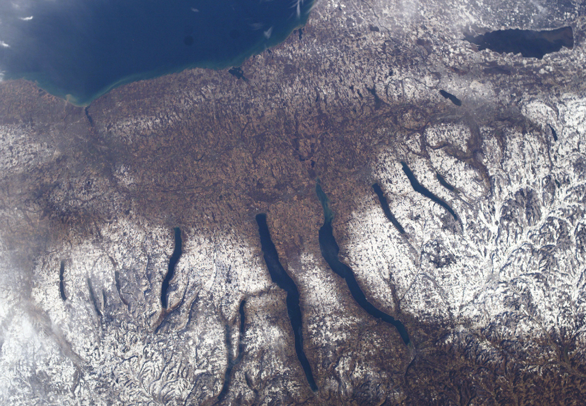

# Finger Lakes

The Finger Lakes is a wine region in west-central New York and an American
viticultural area (AVA), the United States legal category for a delimited
grape-growing region distinguished by geographic features. The AVA was
established in 1982. Its name refers to the long, narrow lakes left in valleys
shaped and deepened by Pleistocene glaciation, and vineyards occupy different
slopes, elevations, exposures,
and distances from the water, and those differences matter in a cold climate.

[Riesling](../grapes/riesling.md) is the region's best-known wine grape, yet the Finger Lakes also
produces [Chardonnay](../grapes/chardonnay.md), [Pinot Noir](../grapes/pinot-noir.md),
[Cabernet Franc](../grapes/cabernet-franc.md), [Gewürztraminer](../grapes/gewurztraminer.md), [Grüner Veltliner](../grapes/gruner-veltliner.md),
and hybrid grapes such as Cayuga White. That range reflects a
central fact about the region: its lakes make vinifera possible in many sites,
but they do not remove winter injury, spring frost, or the challenge of
ripening later varieties.

## Lakes, slopes, and climate

The larger Finger Lakes occupy deep glacial troughs. Cornell's Finger Lakes
Grape Program identifies Canandaigua, Keuka, Seneca, and Cayuga as roughly 300
to 650 feet deep and says they rarely freeze. Their water stores heat and
releases it slowly, moderating nearby winter lows and summer heat. In spring,
cool water can delay budbreak; in autumn, the relatively warm lakes can delay
the first frost. Hillsides add a second mechanism: cold air drains downhill,
so a vineyard partway up a slope may avoid the coldest air that settles on the
valley floor.[^1]

The lake effect varies with location. Cornell advises growers to
evaluate macroclimate together with elevation, topography, and proximity to a
body of water. A site a few miles from a deep lake, on a suitable slope, may
have a different frost and winter-injury risk from a site at the same latitude
on a high or poorly drained position.

The region's history as a legal AVA reflects this geography. In its 1982 final
rule, the Bureau of Alcohol, Tobacco and Firearms adopted boundaries closer to
the eleven Finger Lakes than the much larger area first petitioned. The agency
accepted the combination of lake moderation, air drainage, and a relatively
uniform growing season as evidence of a distinct grape-growing area, while
distinguishing the AVA from New York's broader tourism and statistical
boundaries.[^2]

## Winter and ripening constraints

New York's growing-season temperatures can resemble those of northern Europe,
but its winter lows are more severe. Cornell lists extreme winter cold, late
spring frosts, and insufficient heat among the limits that affect vine survival,
yield, and consistent ripening. Variety choice therefore joins site selection:
grapes differ in both cold tolerance and the length of season they need to
ripen.[^1]

The lakes help in several seasons, but a sudden deep freeze can still injure
buds and trunks. Winter hardiness also depends on how fully vines acclimated
before the cold arrived. In the growing season, growers must balance the
desire to leave fruit hanging for more maturity against autumn rain, rot, and
the risk that a late crop will not ripen evenly. A warm site may support
Cabernet Franc or Pinot Noir in a favorable year, while a cooler or more
exposed site may favor an earlier-ripening grape or a hybrid bred for regional
conditions.

The region is changing as well as varying from site to site. Cornell reported
that growing degree days in the Finger Lakes rose from about 2,400 in 2000 to
2,700 in 2020, while warmer winters have encouraged earlier budbreak and
greater exposure to spring frost. More heat can improve ripening in some years,
including for red grapes, but it also changes harvest timing and the balance
between sugar, [acidity](../concepts/acidity.md), fruit health, and alcohol.[^3]

## Grapes and wine styles

Riesling fits the region's long, cool ripening season because it can retain
acidity while accumulating flavor and sugar. It appears as dry, off-dry, and
sweet wine, and as sparkling wine; harvest date and fermentation endpoint are
more useful guides to style than the regional name alone. Cool conditions can
preserve freshness, but the final wine also reflects crop level, picking date,
fruit health, yeast and fermentation choices, and maturation.

The wider grape mix shows how growers respond to the climate. Chardonnay and
Pinot Noir can make still or sparkling wines where the site and vintage allow
them to ripen. Cabernet Franc is an important red-wine option, while other
vinifera, including Gewürztraminer and Grüner Veltliner, occupy suitable sites.
Hybrids such as Cayuga White combine *Vitis vinifera* ancestry with genes from
other grape species and have a place in the region because cold tolerance,
reliable cropping, and ripening are practical concerns.

## The regional AVA and the lake AVAs

“Finger Lakes” and “Seneca Lake” or “Cayuga Lake” are related but distinct
appellations of origin. The Cayuga Lake AVA was established in 1988 within the
Finger Lakes AVA.[^6] Its federal description places it in Seneca, Tompkins, and
Cayuga counties around Cayuga Lake. The Seneca Lake AVA was established in
2003 and surrounds Seneca Lake across portions of Schuyler, Yates, Ontario,
and Seneca counties.[^7] The current eCFR lists Cayuga Lake at § 9.127 and
Seneca Lake at § 9.128 as separate approved American viticultural areas.[^5]

## Sources

- Bureau of Alcohol, Tobacco and Firearms, [“Finger Lakes,” Federal Register,
  1 September 1982](https://www.ttb.gov/system/files/images/pdfs/Finger_Lakes_final_rule.pdf),
  final rule establishing 27 CFR § 9.34.
- Bureau of Alcohol, Tobacco and Firearms, [“Cayuga Lake Viticultural Area,
  NY,” Federal Register, 25 March 1988](https://www.ttb.gov/system/files/images/pdfs/Cayuga_Lake_final_rule.pdf),
  final rule establishing 27 CFR § 9.127.
- Bureau of Alcohol, Tobacco and Firearms, [“Seneca Lake Viticultural Area,”
  Federal Register, 3 July 2003](https://www.ttb.gov/media/72003/download?inline=),
  final rule establishing 27 CFR § 9.128.
- Cornell Cooperative Extension Finger Lakes Grape Program, [“Site
  Selection”](https://flgp.cce.cornell.edu/timeline.php?id=6), current
  extension guidance on climate limitations, lake moderation, and mesoclimate,
  accessed 7 September 2026.
- Cornell University, [“Climate change brings challenges, and opportunities to
  Finger Lakes wineries”](https://news.cornell.edu/stories/2024/10/climate-change-brings-challenges-and-opportunities-finger-lakes-wineries),
  *Cornell Chronicle*, 16 October 2024.
- Electronic Code of Federal Regulations, [27 CFR § 9.127, Cayuga
  Lake](https://www.ecfr.gov/current/title-27/chapter-I/subchapter-A/part-9/subpart-C/section-9.127)
  and [27 CFR § 9.128, Seneca
  Lake](https://www.ecfr.gov/current/title-27/chapter-I/subchapter-A/part-9/subpart-C/section-9.128),
  current approved American viticultural area regulations, accessed 7 September
  2026.

[^1]: Cornell Cooperative Extension Finger Lakes Grape Program, “Site
    Selection.”
[^2]: Bureau of Alcohol, Tobacco and Firearms, “Finger Lakes,” Federal
    Register, 1 September 1982, especially the sections on boundaries and
    geographical evidence.
[^3]: Cornell University, “Climate change brings challenges, and opportunities
    to Finger Lakes wineries,” 16 October 2024.
[^6]: Bureau of Alcohol, Tobacco and Firearms, [“Cayuga Lake Viticultural
    Area, NY”](https://www.ttb.gov/system/files/images/pdfs/Cayuga_Lake_final_rule.pdf),
    *Federal Register*, 25 March 1988, final rule.
[^7]: Bureau of Alcohol, Tobacco and Firearms, [“Seneca Lake Viticultural
    Area”](https://www.ttb.gov/media/72003/download?inline=), *Federal Register*,
    3 July 2003, final rule.
[^5]: Electronic Code of Federal Regulations, [27 CFR § 9.127](https://www.ecfr.gov/current/title-27/chapter-I/subchapter-A/part-9/subpart-C/section-9.127)
    and [27 CFR § 9.128](https://www.ecfr.gov/current/title-27/chapter-I/subchapter-A/part-9/subpart-C/section-9.128).
