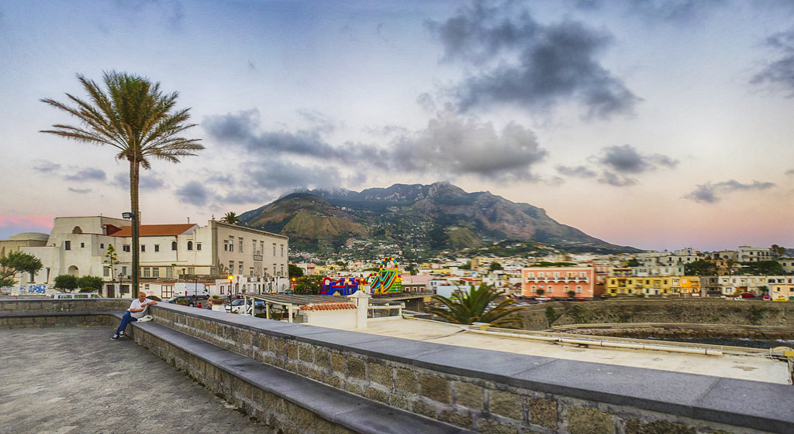

# Ischia

Ischia is a volcanic island in the Gulf of Naples, where winegrowing shares
steep, densely settled terrain with a substantial tourism economy. Its
white grapes [Biancolella](../grapes/biancolella.md) and
[Forastera](../grapes/forastera.md) appear both in blends and in separately
named wines. The island also produces reds, including
[Piedirosso](../grapes/piedirosso.md).

The vineyards are essential to understanding these wines. Terraces, retaining
walls and difficult access make cultivation a continuing investment in the
island's agricultural landscape.

## Farming above the sea

Ischia's relief creates substantial differences in elevation and exposure
over short distances. The sea forms the wider climatic setting, while
individual hillsides determine how much sunlight reaches the vines and how
easily growers can work them. Loose volcanic soils and stone-built terraces
are characteristic parts of this landscape.

Casa D'Ambra's Frassitelli vineyard supplies a concrete example. Its steep,
south-to-southwest-facing sites lie at 400–550 metres, supported by
*parracine*, dry-stone walls made from local green tuff. A rack railway helps
with vineyard work.[^1] Those details explain the physical commitment behind
a bottle more clearly than a general description of island sunshine.

[Altitude](../concepts/altitude.md) modifies the growing environment, but
does not specify a wine's character on its own. Exposure, available water,
crop level and harvest decisions still matter. D'Ambra records hand picking
Frassitelli in early October; its Forastera account describes September
harvesting from a different set of island vineyards. These are estate
examples, not a fixed island harvest calendar.

## Reading the wine names

The Ischia appellation covers the island. Its white blend combines Forastera
and Biancolella, while the red blend brings together Guarnaccia and Piedirosso.
The separately named Biancolella, Forastera and Piedirosso categories each
require at least 85% of the named grape under the specification published by
Regione Campania.[^2] A varietal name consequently allows some blending;
individual producers may also choose to use that grape alone.

Comparing the two whites helps distinguish the grape from the place and the
cellar method. D'Ambra's Frassitelli is entirely Biancolella, vinified under
temperature control and matured in stainless steel with prolonged yeast
contact and stirring. [Lees ageing](../concepts/lees-aging.md) can develop
texture without adding wood flavour. The estate's varietal Forastera also
uses steel, offering another local grape through a broadly comparable choice
of maturation vessel.

The appellation includes sparkling white wine and a dried-grape Piedirosso
category as well. These show the range permitted within the island's wine
tradition; a familiar dry white represents only one part of it.

## An agricultural economy within a tourist island

The official appellation account describes a historical trade in bulk white
wine shipped to the mainland. It also identifies the rapid growth of tourism
after the mid-twentieth century as a major change in the island's economy.
Vineyard survival involves labour and land use as much as suitable grapes.

Luciano Pignataro's reporting on Pietratorcia makes that connection tangible.
Founded in 1996, the estate replanted vineyards at Chignole and Cuotto,
bringing wine production back to the land as tourism drew people away from
agriculture. Its separate Biancolella and Forastera bottlings also helped
present the island's white grapes as subjects in their own right.

## Benchmark producers

- **Casa D'Ambra** provides an established reference for the island's
  separately bottled white grapes; Frassitelli adds an especially clear
  connection between a named hillside, demanding cultivation and lees-matured
  Biancolella.
- **Pietratorcia** illustrates vineyard renewal and the coexistence of
  island blends with varietal Biancolella and Forastera. Its current range
  continues the approach documented in Pignataro's regional reporting.

[^1]: Casa D'Ambra, “Frassitelli,” vineyard description and technical sheet.
[^2]: Regione Campania, *Disciplinare di produzione: Ischia*, articles 2–3,
    consolidated text published on the regional agriculture site,
    consulted September 2026.

## Sources

- Regione Campania, [*Disciplinare di produzione: Ischia*](https://agricoltura.regione.campania.it/viticoltura/disciplinari/DOC_Ischia.pdf),
  appellation boundaries, wine categories and historical account.
- Casa D'Ambra, [“Frassitelli”](https://dambravini.com/en/frassitelli_casadambra.php)
  and [“Forastera”](https://dambravini.com/en/forastera_casadambra.php),
  vineyard and cellar specifications, accessed September 2026.
- Luciano Pignataro, [“Garantito IGP: Forastera 2011 Ischia DOC Pietratorcia”](https://www.lucianopignataro.it/a/forastera-2011-ischia-doc-pietratorcia/49207/),
  27 September 2012, vineyard renewal and varietal bottlings.
- Pietratorcia, [“Vini bianchi”](https://www.ristorantepietratorcia.it/vini-bianchi/),
  current range, accessed September 2026.
