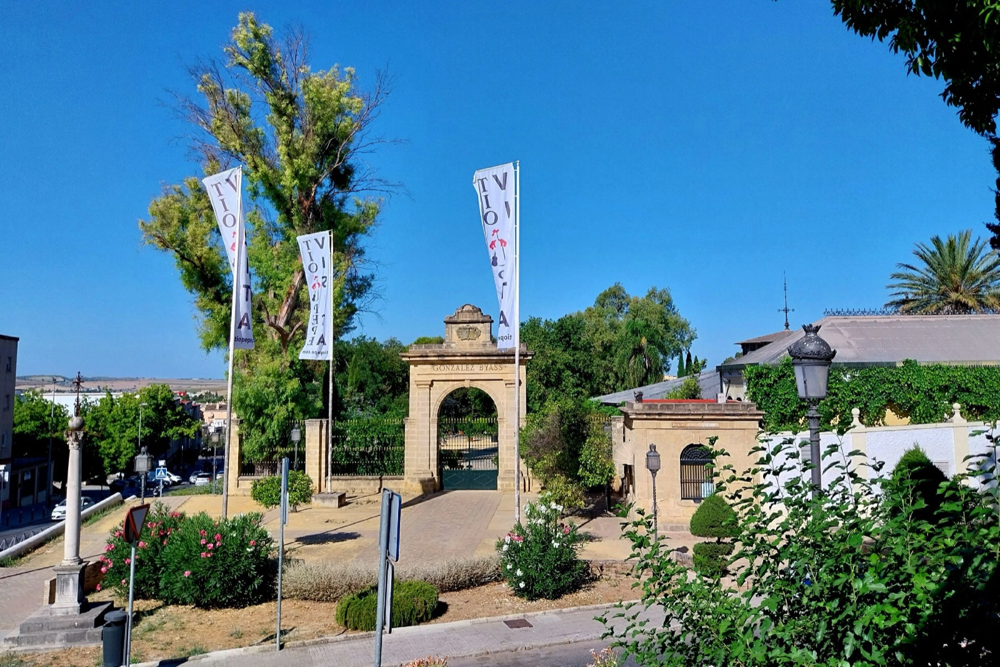

# Jerez

The wine-producing region of Jerez extends beyond its namesake city and the
three cities of the historic “Sherry triangle.” The wider *Marco de Jerez*
reaches from the Guadalquivir estuary past the Bay of Cádiz and inland toward
the Sierra de Cádiz. Its protected vineyard area now covers ten municipalities,
nine in Cádiz province and Lebrija in Seville province.[^1]

Two protected designations of origin (PDOs) overlap here.
Jerez-Xérès-Sherry covers several dry, sweet, biologically aged, and
oxidatively aged wines; Manzanilla-Sanlúcar de Barrameda protects biologically
aged dry wine matured specifically in Sanlúcar. They draw grapes from the same
delimited area and are administered by the same regulatory council, but they
are separate denominations with different ageing geographies. “Sherry” is
therefore one of the protected names of the Jerez PDO, not a generic name for
every wine made locally.

## Atlantic climate and varied soils

The region is warm, bright, and exposed, with most rain falling outside the
summer growing season. Dry, hot *levante* winds arrive from inland; humid
*poniente* winds and night breezes come from the ocean. Coastal vineyards and
Sanlúcar tend to experience more maritime moderation and humidity than sites
farther inland, while slope, exposure, distance from marsh or sea, and the
weather of a particular year create further differences. Airflow also matters
inside an ageing bodega, where temperature and humidity affect the survival
and activity of the surface yeast known as *flor*.

Albariza, the region's conspicuous white earth, encompasses a family of soft,
calcareous marl-derived soils. Their fine textures, abundant carbonate,
porosity, and sometimes deep profiles allow winter rain to enter and remain
available into the dry season. Measurements from Jerez vineyards show
substantial variation in available water and permeability among albariza
sites.[^2] Connections between chalk and wine run through soil depth, structure,
rooting, water supply, farming, and harvest timing.

Vines also grow on *barros* and *arenas*. Barros generally occupy lower ground
and contain more clay, sand, and organic matter than the palest albarizas.
Arenas are sand-dominant coastal soils with less limestone and are especially
important around Chipiona. These broad names simplify many local variations.
The traditional *pagos* provide a finer geography: they are named rural areas
defined by soil, relief, and mesoclimate and may contain several separate
vineyards. A pago is an origin, not a guarantee of one wine style or quality
level.

## Grapes and vineyard wine

Palomino—especially the locally named Palomino Fino or Listán Blanco—is the
principal grape and supplies most dry base wine. Its importance lies partly in
what happens after harvest: pressing choices, fermentation, fortification or
its omission, the development of flor, and years of maturation can reshape a
comparatively discreet young wine. Pedro Ximénez and Moscatel de Alejandría are
the other established grapes, particularly for sweet wines made from ripe or
sun-dried fruit. Moscatel has a strong association with the coastal sandy soils
around Chipiona, while Pedro Ximénez is now a much smaller local planting than
Palomino.

The current Jerez-Xérès-Sherry specification also authorizes Beba, Perruno,
and Vigiriega, although recent council reporting describes their presence as
minimal. Manzanilla is narrower in grape terms and permits only Palomino,
Palomino Fino/Listán Blanco.

Producers also make young, usually unfortified whites outside both PDOs, often
discussed as *vinos de pasto*. The phrase is a regional and historical usage,
not a category in the present Jerez or Manzanilla specifications. Qualifying
examples may carry the broader Vino de la Tierra de Cádiz protected
geographical indication, whose area and authorized grapes extend beyond the
Sherry denominations, or be sold without that indication.[^3] Fortification is
no longer universal for protected Jerez and Manzanilla: the current rules allow
a qualifying dry wine to be certified as wine rather than liqueur wine when it
reaches the required strength without added alcohol. Certification still
depends on meeting the denomination's wine type and ageing requirements.

## Vineyard and ageing geography

The historic triangle joins Jerez de la Frontera, El Puerto de Santa María,
and Sanlúcar de Barrameda. It remains central to the region's commercial
history and contains a large concentration of old bodegas and soleras. Before
the 2022 revision of the Jerez specification, the triangle also defined the
permitted ageing area for protected Jerez, though grapes and base wine could
come from the larger production area. That separation has ended for
Jerez-Xérès-Sherry. Production and ageing may now take place across the
delimited ten-municipality area, although wine labelled Jerez Fino may not be
aged in Sanlúcar.[^4]

Manzanilla preserves a different boundary. Its grapes may come from anywhere
in the shared production area, but it must undergo at least two years of
biological ageing in a registered bodega within Sanlúcar de Barrameda. The law
defines Manzanilla by the location of ageing as well as grape origin and
method. Sanlúcar's position beside the Guadalquivir estuary generally
brings higher humidity and more moderate temperatures than inland Jerez, but
the finished wine also depends on the bodega's architecture, position,
ventilation, cask management, and the behaviour of flor. Maritime location is
one influence alongside these cellar conditions.

The bodega itself shapes ageing. High ceilings, shaded walls, permeable floors,
and controlled ventilation help moderate heat and admit humid air. Wines
mature in seasoned oak *botas*, usually with headspace below the bung. Under
flor, yeasts consume wine constituents and restrict direct oxygen exposure;
without a stable veil, oxidative development becomes more important. The
seasoned casks chiefly support biological or oxidative [oak
maturation](../concepts/oak-maturation.md). Conspicuous new-oak flavour is
secondary.

Both static vintage ageing and the dynamic *criaderas y solera* system are
permitted. In the latter, periodic withdrawals from older casks are replaced
with younger wine through successive scales. Blending across vineyards and
years can foreground house style while grape source, coastal or inland cellar
conditions, and the decisions governing each ageing system remain distinct.
Understanding Jerez therefore requires two maps: vineyards and bodegas.

[^1]: Junta de Andalucía, current product specifications for
    Jerez-Xérès-Sherry and Manzanilla-Sanlúcar de Barrameda, sections D.
[^2]: G. Paneque et al., “The albarizas and the viticultural zoning of
    Jerez-Xérès-Sherry and Manzanilla-Sanlúcar de Barrameda registered
    appellations of origin,” *Terroir 2002*.
[^3]: Junta de Andalucía, *Pliego de Condiciones del Vino de la Tierra de
    “Cádiz”*, sections A, B, D, and F.
[^4]: Consejo Regulador, *Memoria de Actividades 2025*, pp. 17–18; current
    Jerez-Xérès-Sherry specification, section C.3.

## Related topics

- [Oak maturation](../concepts/oak-maturation.md)

## Sources

- Junta de Andalucía, [*Pliego de condiciones de la Denominación de Origen
  Protegida «Jerez-Xérès-Sherry»*](https://www.sherry.wine/documents/595/21052026_Pliego_Jerez.pdf),
  consolidated under the Order of 13 May 2026, accessed 1 September 2026.
- Junta de Andalucía, [*Pliego de condiciones de la Denominación de Origen
  Protegida «Manzanilla-Sanlúcar de
  Barrameda»*](https://www.sherry.wine/documents/596/21052026_Pliego_Manzanilla.pdf),
  consolidated under the Order of 13 May 2026, accessed 1 September 2026.
- Consejo Regulador de las Denominaciones de Origen Jerez-Xérès-Sherry,
  Manzanilla-Sanlúcar de Barrameda y Vinagre de Jerez, [*Memoria de
  Actividades 2025*](https://www.sherry.wine/documents/593/Memoria_2025_compressed_1.pdf),
  especially pp. 13–18.
- G. Paneque, M. Roca, C. Espino, C. Pardo, J. Aldecoa & P. Paneque, [“The
  albarizas and the viticultural zoning of Jerez-Xérès-Sherry and
  Manzanilla-Sanlúcar de Barrameda registered appellations of origin (Cadiz,
  Spain)”](https://ives-openscience.eu/10651/), *Proceedings of the 4th
  International Terroir Congress*, 2002.
- Junta de Andalucía, [*Pliego de Condiciones del Vino de la Tierra de
  “Cádiz”*](https://www.juntadeandalucia.es/export/drupaljda/VT_CADIZ.pdf),
  current product specification, accessed 1 September 2026.
- Shawn Hennessey, [“Exploring Sherry
  country”](https://www.decanter.com/magazine/exploring-sherry-country-534709/),
  *Decanter*, 31 July 2024.
