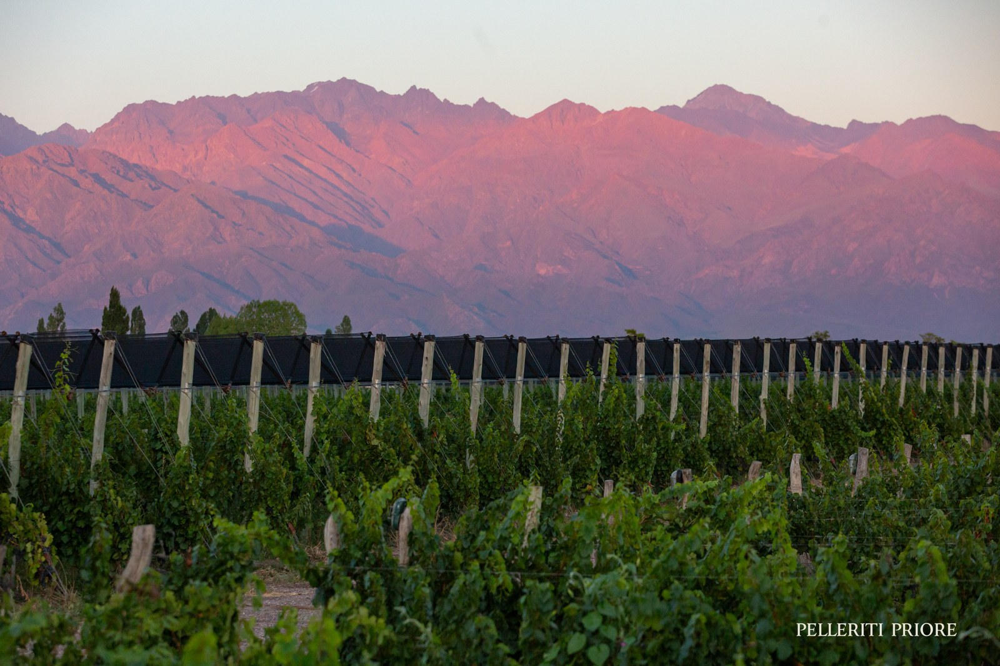

# Mendoza

Mendoza is Argentina's principal wine province, at the eastern foot of the
Andes. [Malbec](../grapes/malbec.md) is its most internationally recognizable
grape, but the province also supports substantial production from other
varieties and several distinct growing areas. A Mendoza label identifies a
broad origin, not one uniform climate or wine style.

## A province of different growing areas

Wines of Argentina distinguishes the Uco Valley, the traditional Luján de
Cuyo and Maipú area, and northern, eastern, and southern oases. Vineyard
height and proximity to the Andes vary considerably. Luján de Cuyo, Maipú,
Tupungato, Tunuyán, and San Rafael therefore supply useful geographical
context beyond the province name.

[Altitude](../concepts/altitude.md) affects temperature and radiation, while
local soils and exposure influence water supply and the conditions around
fruit. Higher ground can provide cooler conditions, but elevation alone
cannot predict the character or quality of the finished wine.

## Water and grape diversity

Water management is fundamental to the province's vineyard economy. The
Mendoza government identifies the wine sector as a major water user and
documents work between the Mendoza River Water Fund and Wines of Argentina
on water efficiency and watershed conservation. This places resource
management alongside grape and site selection in understanding the region's
future.

Malbec remains a central reference point, with
[Cabernet Sauvignon](../grapes/cabernet-sauvignon.md),
[Cabernet Franc](../grapes/cabernet-franc.md),
[Chardonnay](../grapes/chardonnay.md), and
[Sémillon](../grapes/semillon.md) among the other grapes grown. Bonarda and
pink-skinned varieties such as Cereza and Criolla Grande also form part of
the province's vineyard base.

Comparing wines from named districts and vineyards gives a clearer view of
Mendoza than treating every bottle as a rich, heavily oaked Malbec. Grape,
site, harvest decisions, and maturation all contribute to the range.

## Sources

- Wines of Argentina, [*Mendoza: Cuyo*, regional presentation using Instituto
  Nacional de Vitivinicultura data through
  2024.](https://api.winesofargentina.org/uploads/web/regiones/cuyo/mendoza/pdf/PROVINCE-MENDOZA-ENG.pdf)
- Gobierno de Mendoza, [“Wines of Argentina se suma como aliado al Fondo de
  Agua del Río Mendoza para impulsar la sostenibilidad hídrica en la
  vitivinicultura.”](https://www.mendoza.gov.ar/prensa/wines-of-argentina-se-suma-al-fondo-de-agua-del-rio-mendoza-para-impulsar-la-sostenibilidad-hidrica-en-la-vitivinicultura/)
