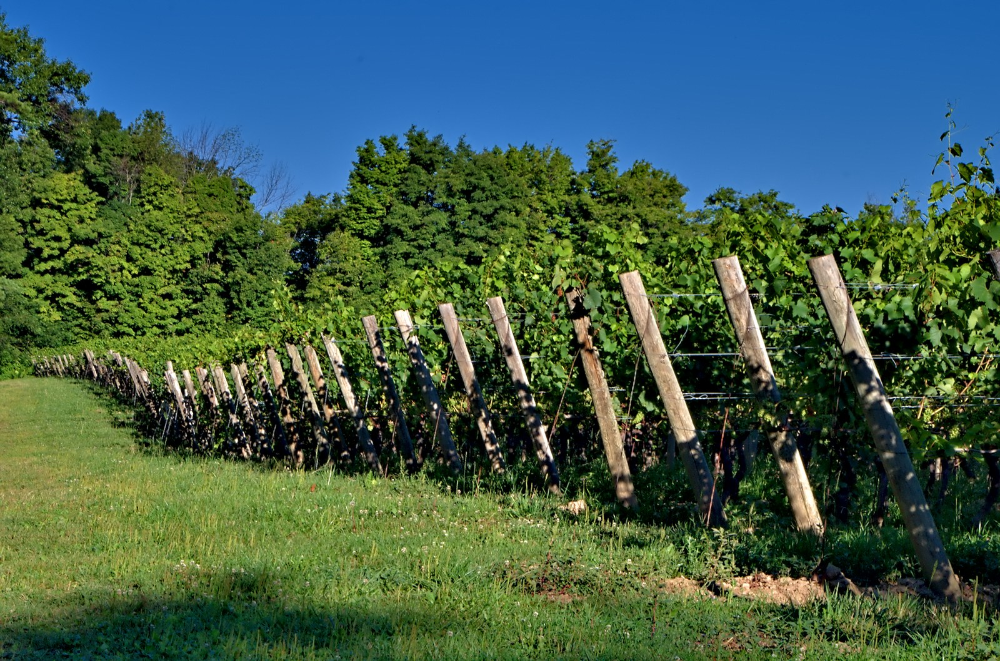

# Niagara Peninsula

The Niagara Peninsula is Ontario's largest winegrowing appellation, on the
Canadian side of the Niagara River and along Lake Ontario. Its vineyards
support dry still wines, sparkling wine, and sweet styles. The region's
importance extends well beyond a single grape or production method.

## The lake and the escarpment

Lake Ontario moderates nearby temperatures. Its water warms and cools more
slowly than the land, helping delay spring development and prolong autumn
ripening. The Niagara Escarpment influences how that air moves through the
vineyards. Distance from the lake, slope, and elevation therefore matter
alongside the regional climate.

The benchlands below the escarpment have varied slopes and soils containing
clay, silt, and other glacially deposited material. Streams cutting through
the slopes contribute further differences in drainage. The Ontario Wine
Appellation Authority groups Beamsville Bench, Twenty Mile Bench, and Short
Hills Bench within its Niagara Escarpment regional appellation.

## Grapes and wine styles

[Riesling](../grapes/riesling.md), [Chardonnay](../grapes/chardonnay.md),
[Pinot Noir](../grapes/pinot-noir.md),
[Cabernet Franc](../grapes/cabernet-franc.md), and
[Gamay](../grapes/gamay.md) are useful routes into Niagara's dry wines.
The contrast between grapes and sites is important: the peninsula contains
many growing environments, with warmer and cooler locations suited to
different harvest goals.

Niagara also provides a useful comparison with New York's
[Finger Lakes](finger-lakes.md). Both demonstrate the value of large bodies
of water in a continental setting, though their vineyard landscapes differ.
In either region, lake moderation reduces some climatic extremes while
leaving vintage weather and individual vineyard conditions consequential.

For readers, a more specific origin on the label can add useful context.
The broad Niagara Peninsula name encompasses a larger range of sites than
a named bench or other sub-appellation.

## Sources

- Ontario Wine Appellation Authority, [“Niagara Peninsula.”](https://vqaontario.ca/ontario-appellations/niagara-peninsula/)
- Ontario Wine Appellation Authority, [“Niagara Escarpment.”](https://vqaontario.ca/ontario-appellations/niagara-peninsula/niagara-escarpment/)
