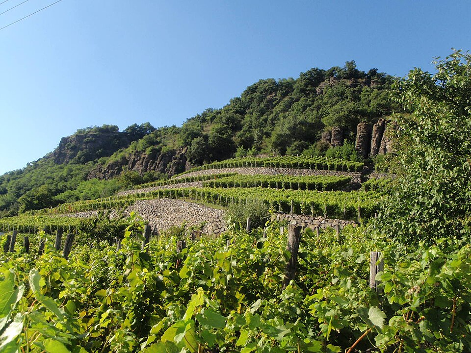

# Somló

Somló is a Hungarian wine district centered on an isolated volcanic hill
west of Lake [Balaton](balaton.md). It is especially associated with structured white wines
from [Juhfark](../grapes/juhfark.md), [Furmint](../grapes/furmint.md),
[Hárslevelű](../grapes/harslevelu.md), and
[Olaszrizling](../grapes/olaszrizling.md). Firm [acidity](../concepts/acidity.md) and the ability to
develop with maturation connect many of its wines, though producers differ
in ripeness, extraction, and use of wood.

## A hill with several exposures

Somló rises above the surrounding Marcal Basin. Basaltic material is prominent
on the hill, while loess, sand, and clay occur around and over parts of its
slopes. Vineyards occupy several exposures, including northern slopes as well
as the sunnier southern side. The hill's outline is compact, but the direction
and position of a parcel still alter its growing conditions.

The wider district also encompasses Ság Hill and Kis-Somlyó. Distinguishing
the central hill from the district helps readers interpret regional accounts
and the provenance of individual wines.

## Grapes and maturation

Juhfark supplies an especially recognizable connection with Somló. Furmint
and Hárslevelű also make substantial whites here, offering a useful comparison
with their better-known roles in [Tokaj](tokaj.md).

Somlói Apátsági Pince documents one traditional cellar approach: fermentation
and maturation in oak, followed by further time in bottle. The estate makes
Juhfark, Furmint, and Hárslevelű its principal varieties and describes a short
period of new oak for Juhfark. These choices can change texture and aroma
alongside the effects of the vineyard.

A helpful introduction is to compare the grapes within one producer's range,
then compare the same grape across producers. That separates varietal and
cellar differences more clearly than expecting every Somló white to share a
single “volcanic” flavor.

## Sources

- Hungarian Wine Marketing Agency, [“Somlói wine district,” *Magyar Bor*.](https://bor.hu/en/somloi-wine-district/)
- Somlói Apátsági Pince, [“About us.”](https://juhfark.hu/en/about-us/)
