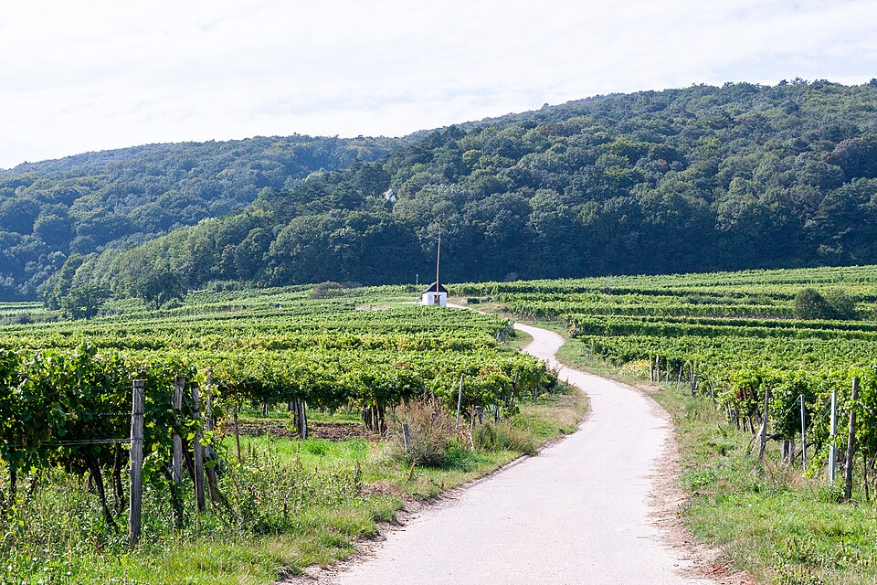

# Thermenregion

Thermenregion is a wine region south of Vienna, where the eastern edge of
the Alps meets the Vienna Basin. Its distinctive white grapes,
[Rotgipfler](../grapes/rotgipfler.md) and
[Zierfandler](../grapes/zierfandler.md), coexist with an important red-wine
tradition based on [Pinot Noir](../grapes/pinot-noir.md) and
[St. Laurent](../grapes/st-laurent.md).

## From hillside to basin

The northern part of the region has a stronger hillside character, while
the south opens into flatter or gently sloping country. White grapes are
particularly associated with the north; red grapes have a larger role farther
south. This is a useful broad pattern, with considerable variation among
individual vineyards.

The Vienna Woods provide shelter from prevailing western and northwestern
weather. Sunny exposures assist ripening, while cooler air from the wooded
hills can moderate evening conditions. Air movement also helps fruit dry
after rain. The regional association emphasizes this combination of warmth,
shelter, and ventilation in explaining the area's viticulture.

## Local whites and familiar reds

Rotgipfler and Zierfandler give Thermenregion an identity that is difficult to
encounter elsewhere at comparable depth. They can be bottled separately or
combined, allowing comparisons between the grapes and the producer's blend.
Their fuller expressions offer a different route into Austrian white wine
from the [Grüner Veltliner](../grapes/gruner-veltliner.md) associated with
regions such as the [Wachau](wachau.md).

Pinot Noir and St. Laurent broaden that picture. Choosing between a local
white, a blend of the two white specialties, and a varietal red reveals more
about Thermenregion than treating it as the home of a single signature wine.

## Sources

- Weinforum Thermenregion, [“Climate & Terms.”](https://www.thermenregiondac.at/en/region/climate-terms/)
- Weinforum Thermenregion, [“Wine,” varietal overview.](https://www.thermenregiondac.at/en/wine/)
